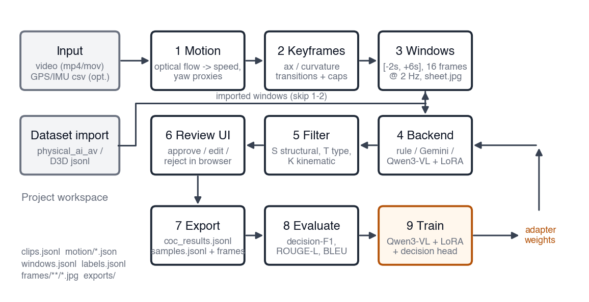
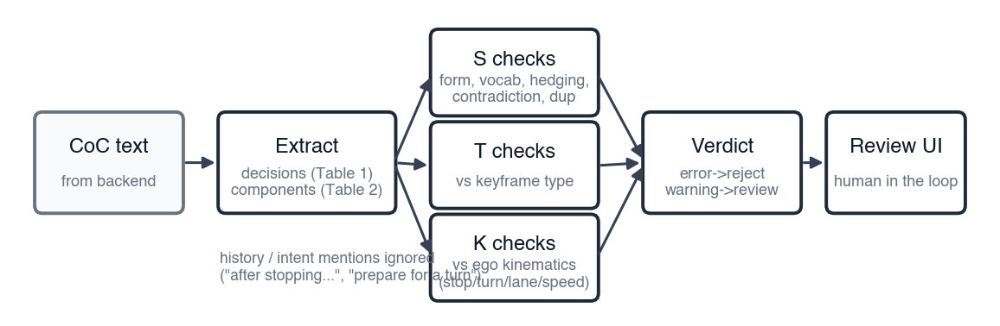
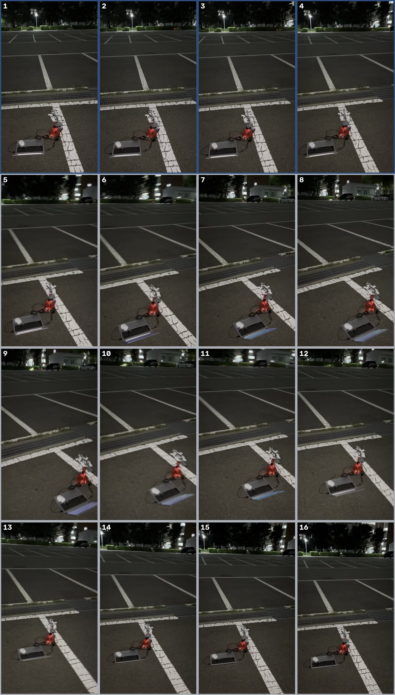
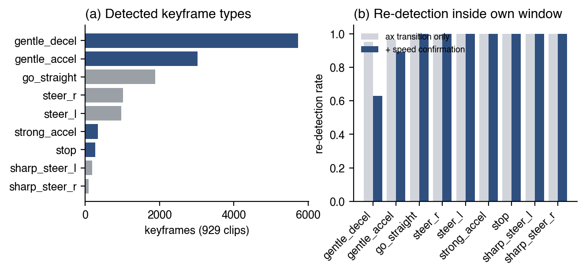
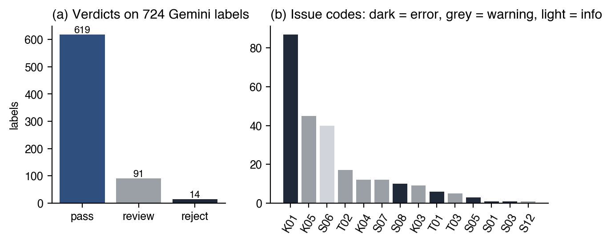
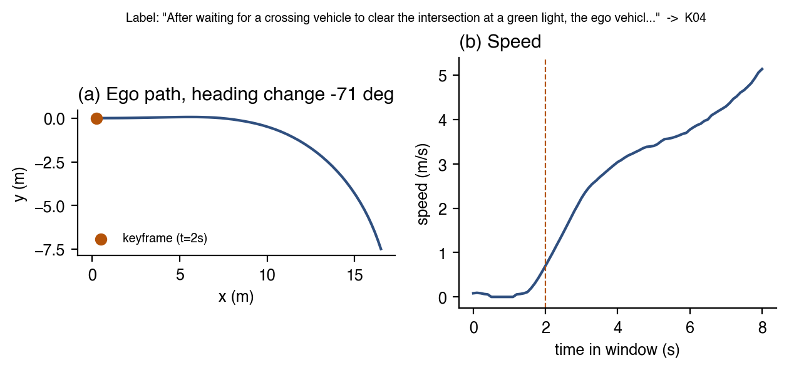
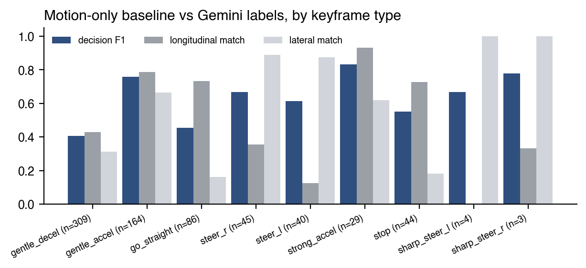
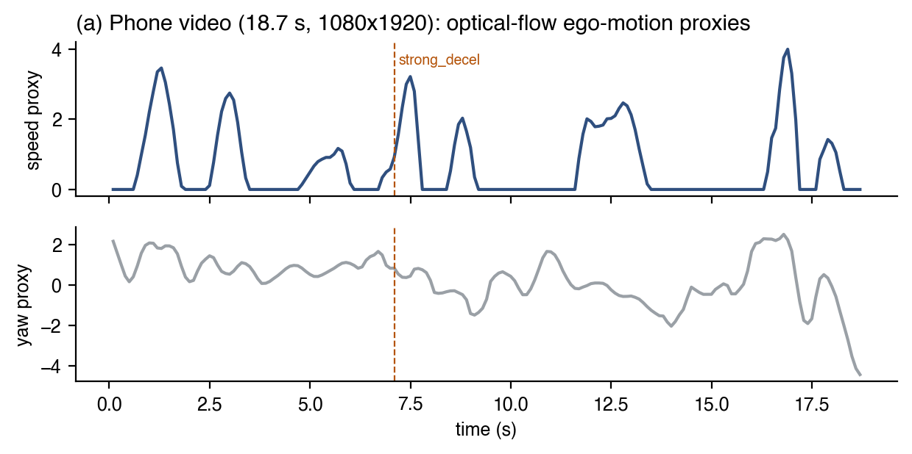
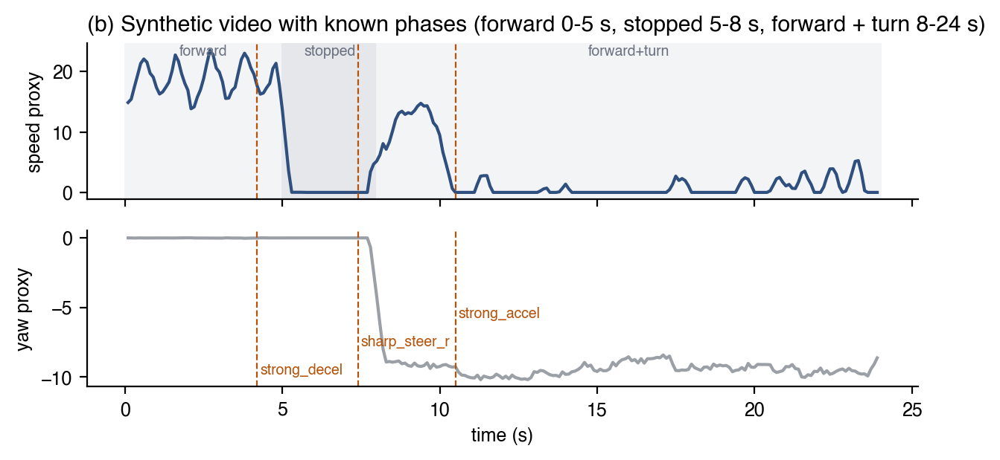

# 연구논문/작품 중간보고서 (2026학년도 제2학기)

- 제목: VLM과 LoRA를 활용한 자율주행 데이터셋 Autolabelling
- 논문/작품: 작품
- GitHub URL: https://github.com/churrosboy/Autolabel
- 팀원: 김동환 (2021313973)
- 지도교수: 허재필
- 2026년 9월 27일


## 요약

본 작품은 사용자가 직접 촬영한 주행 영상(대시캠·스마트폰)에 Alpamayo-R1이 제안한 Chain-of-Causation(CoC) 형식의 주행 인과 설명을 자동으로 부여하는 오토라벨링 애플리케이션 “Autolabel”을 구현한 것이다. 신청서의 진행계획 중 Ⅲ(CoC 오토라벨링 파이프라인 구현: 자동 추론 엔진과 품질 필터링)과 Ⅳ(정량적 평가)를 중간 단계에서 동작하는 소프트웨어로 완성하였고, Ⅱ(VLM LoRA 파인튜닝)는 오픈 VLM(Qwen3-VL)에 결정 분류 헤드 하나를 붙여 LoRA로 학습하는 파이프라인으로 구현하여 소형 모델 dry-run까지 검증하였다. 실제 모델 학습과 비교 평가는 GPU 환경에서 수행할 예정이다.

파이프라인은 (1) 영상에서 광학 흐름(optical flow)으로 ego-motion을 추정하고, (2) 종·횡방향 가속 및 곡률 전이로부터 주행 결정 시점(keyframe)을 검출하며, (3) keyframe 기준 [-2 s, +6 s] 윈도우의 16프레임을 추출하고, (4) 규칙 기반·Gemini·Qwen3-VL(+LoRA)·OpenAI 호환 서버 중 선택한 백엔드로 CoC 문장을 생성한 뒤, (5) 구조(S)·keyframe 정합(T)·운동학 정합(K)의 세 축 26개 규칙으로 품질을 검사하고, (6) 브라우저 검수 UI에서 승인·수정·기각한 뒤, (7) 학습용 데이터셋(JSONL + 프레임)으로 내보낸다.

정량 평가는 NVIDIA Physical AI AV 데이터셋 282개 클립에서 Gemini로 생성한 724개 CoC 라벨을 기준으로 수행하였다. 품질 필터는 라벨당 0.31 ms 만에 85.5%를 통과, 12.6%를 검수 대상, 1.9%를 기각으로 분류하였고, 운동학 검사(K04)는 차량이 70° 이상 회전했음에도 “직진”이라고 서술된 VLM 라벨 오류 12건을 실제로 검출하였다. 또한 기존 파이프라인의 가속도 기반 keyframe 중 감속 유형의 35%가 속도 감소를 동반하지 않는 잡음이며, 이 잘못된 메타 정보가 프롬프트를 통해 VLM 라벨에 그대로 전이되는 현상을 확인하고 속도 확인(speed confirmation) 단계를 추가하였다. 운동 정보만 사용하는 규칙 기반 백엔드는 결정 F1 0.548으로 파인튜닝 모델이 넘어야 할 하한 기준선을 제공한다. 27개 단위·통합 테스트가 모두 통과하며, 합성 영상 기준 실시간 대비 약 20.4배 속도로 처리된다.


## 서론


### 1.1 제안 배경 및 필요성

자율주행 인공지능은 “무엇이 보이는가”를 인식하는 단계에서 “왜 그렇게 행동하는가”를 설명하는 단계로 진화하고 있다. NVIDIA의 Alpamayo-R1 [1]은 주행 궤적과 함께 결정의 인과 근거를 자연어로 서술하는 Chain-of-Causation(CoC) 데이터를 제안하였고, 이러한 추론 데이터로 학습한 비전-언어-행동(VLA) 모델이 롱테일 상황에서 계획 정확도를 크게 높인다는 것을 보였다. DriveLM [4] 역시 그래프 형태의 시각 질의응답으로 인식-예측-계획의 추론 사슬을 데이터화하였다. 즉 “판단의 이유”가 담긴 데이터가 설명 가능하고 안전한 자율주행의 핵심 자산이 되고 있다.

문제는 비용이다. CoC 한 문장을 만들려면 8초 남짓의 영상을 보고 결정 이전 구간에서 원인이 되는 객체를 찾고, 결정 이후 구간에서 실제로 취해진 종·횡방향 결정을 통제 어휘로 분류한 뒤, 둘을 인과적으로 연결해야 한다. Alpamayo-R1 논문도 이를 사람이 모두 작성하지 않고, VLM 자동 라벨링과 사람 검수를 결합한 하이브리드 파이프라인으로 구축하였다 [1]. 국내에서도 학습 데이터 자동 생성 시스템 [12], 자동 레이블링 기반 영상 학습데이터 제작 시스템 [13], 자율주행 학습 데이터 수집·전처리 환경 [14] 등 라벨링 자동화 연구가 이어지고 있으나, 대부분 객체 검출용 박스·세그먼트 라벨을 대상으로 하며 자연어 인과 설명을 다루는 사례는 드물다.

범용 VLM(Gemini, GPT, Qwen 등)에 프롬프트만 주어 CoC를 생성하는 방식에는 두 가지 한계가 있다. 첫째, 주행 도메인 지식이 부족하여 “정지선”과 “차선”을 혼동하거나 통제 어휘(Table 1의 15개 결정)를 벗어난 표현을 사용한다. 둘째, 생성된 문장이 실제 차량의 움직임과 모순되어도 이를 스스로 걸러내지 못한다. 본 연구에서 기존 라벨을 분석한 결과, 차량이 70° 이상 회전하는 구간을 “직진을 유지한다”고 서술하거나, 프롬프트에 주어진 잘못된 메타 정보(감속 이벤트)를 영상보다 우선시하여 실제로는 가속하는 장면을 감속으로 설명하는 사례가 실제로 존재하였다(4.3절).

한 가지 더 중요한 배경은 데이터의 출처이다. 공개 데이터셋은 촬영 지역, 차량, 센서 구성이 고정되어 있어 국내 도로나 특정 환경을 반영하기 어렵고, ego-motion·LiDAR 같은 센서 정보가 함께 제공된다는 전제 위에 설계되어 있다. 반면 연구자나 개발자가 직접 확보할 수 있는 데이터는 대개 스마트폰이나 블랙박스로 찍은 “영상만 있는” 데이터이다. 따라서 오토라벨러가 실제로 쓸모 있으려면, 센서 없이 영상 파일만 넣어도 결정 시점을 찾고 CoC를 붙여 학습용 데이터셋으로 만들어 주는 애플리케이션 형태여야 한다.

요약하면 본 작품의 필요성은 (i) CoC 라벨 구축 비용의 절감, (ii) 범용 VLM 라벨의 신뢰도 문제 해결, (iii) 센서가 없는 사용자 촬영 영상까지 라벨링 대상으로 확장하는 것에 있다.


### 1.2 연구논문/작품의 목표

신청서에 제시한 진행계획(Ⅰ 데이터 전처리, Ⅱ LoRA 파인튜닝, Ⅲ 오토라벨링 파이프라인, Ⅳ 성능 검증)에 따라 본 중간 단계의 목표를 다음과 같이 설정하였다.

- 목표 1 (파이프라인 애플리케이션): 사용자가 촬영한 영상 파일을 입력으로 받아 ego-motion 추정, keyframe 검출, 윈도우 추출, CoC 생성, 품질 필터, 검수, 데이터셋 내보내기를 명령줄과 브라우저 UI로 수행하는 소프트웨어를 구현한다.
- 목표 2 (품질 필터링): 신청서 Ⅲ의 “문법적 오류나 주행 상식에 어긋나는 논리적 모순을 자동으로 검출”하는 후처리를 규칙 기반으로 구현하되, 텍스트만이 아니라 차량의 실제 운동(정지·회전·차로 변경·속도 추세)과 대조하는 물리적 정합성 검사를 포함한다.
- 목표 3 (정량적 평가): 기준(GT) 라벨과 생성 라벨을 통제 어휘 수준(결정 F1)과 문장 수준(ROUGE-L, BLEU)에서 비교하는 평가 도구를 만들고, 파인튜닝 전 기준선을 확보한다.
- 목표 4 (LoRA 오토라벨러): 오픈 VLM(Qwen3-VL)에 결정 분류 헤드를 붙여 CoC 라벨만 잘 생성하도록 LoRA로 학습하는 파이프라인을 구현하고, zero-shot 모델·규칙 기반 기준선과 같은 지표로 비교한다.


### 1.3 작품 전체 overview

그림 1은 작품의 전체 구성이다. 입력은 두 갈래이다. 사용자 영상(mp4/mov, 선택적으로 GPS/IMU CSV)은 1단계 모션 추정부터 시작하고, 이미 ego-motion과 윈도우가 정의된 공개 데이터셋(physical_ai_av, D3D 산출물)은 3단계 윈도우로 바로 들어온다. 이후 4단계 백엔드가 CoC를 생성하고 5단계 필터가 검사한 뒤 6단계 검수 UI를 거쳐 7단계로 내보내며, 8단계 평가 도구는 내보낸 라벨을 GT와 비교한다. 9단계 학습 모듈은 프로젝트의 윈도우·프레임·라벨로 Qwen3-VL에 LoRA와 결정 헤드를 학습시키고, 그 어댑터는 다시 4단계 Qwen 백엔드에 장착된다. 이 순환 구조가 “한정된 CoC 데이터 → 오토라벨러 → 더 많은 데이터 → 더 나은 오토라벨러”라는 신청서의 기대효과를 구현한다.



*그림 1. Autolabel 시스템 구성도. 1–3은 영상 처리, 4–5는 라벨 생성·검사, 6–8은 검수·산출·평가, 9는 오토라벨러 파인튜닝 단계이다.*

중간 결과를 요약하면 다음과 같다. 첫째, 전체 파이프라인이 GPU 없이 노트북에서 끝까지 동작한다(합성 24초 영상 기준 모션 추정 1.18초, 실시간 대비 20.4배). 둘째, 품질 필터가 기존 Gemini 라벨 724개 중 14개를 기각, 91개를 검수 대상으로 분류하였고, 그중 운동학 검사는 사람이 보아도 명백한 라벨 오류(회전 중 “직진”)를 잡아냈다. 셋째, 규칙 기반 기준선의 결정 F1은 0.548(95% 신뢰구간 0.521–0.576)로, 향후 LoRA 파인튜닝 모델이 넘어야 할 하한을 제공한다. 넷째, 기존 데이터의 keyframe 검출 잡음(감속 유형의 35%)을 발견하고 개선하였다. 다섯째, Qwen3-VL + 결정 헤드 + LoRA 학습 파이프라인이 데이터 구성부터 학습 스텝, 저장, 재로드, 추론, 필터 연동까지 소형 모델로 끝까지 동작함을 확인하였다.


### 1.4 보고서의 구성

2장은 추론 기반 자율주행, VLM과 LoRA, 자동 라벨링, 영상 기반 ego-motion 추정, 텍스트 평가 지표에 관한 관련 연구를 정리한다. 3장은 CoC의 구조와 결정 윈도우, keyframe 검출, 광학 흐름 기반 모션 추정, 품질 필터의 세 축이라는 이론적 배경과 시스템 구성·모듈·데이터 형식, 그리고 오토라벨러 파인튜닝 설계를 상세히 소개한다. 4장은 구현 환경과 여섯 가지 실험(E1 keyframe 검출, E2 품질 필터, E3 규칙 기반 기준선, E4 영상 입력, E5 필터 자기 일관성, E6 학습 파이프라인 dry-run)의 결과와 분석, 그리고 발견된 한계를 다룬다. 5장은 결론과 소감, 6장은 참고문헌이며, 부록에 사용법과 원천코드를 수록한다.


## 관련연구


### 2.1 추론 기반 자율주행과 Chain-of-Causation

대규모 언어모델에서 중간 추론 과정을 명시적으로 생성하게 하면 복잡한 문제의 정확도가 높아진다는 Chain-of-Thought 프롬프팅 [11]은 자율주행에도 이식되었다. DriveLM [4]은 nuScenes 위에 인식→예측→계획으로 이어지는 질의응답 그래프를 구축하여 VLM이 주행 결정을 단계적으로 설명하도록 하였다. Alpamayo-R1 [1]은 한 걸음 더 나아가 “원인 요소(critical component) → 주행 결정(driving decision)”의 인과 사슬을 8초 결정 윈도우 단위로 서술하는 CoC 데이터를 정의하고, 이를 Cosmos-Reason 기반 VLM과 확산(flow matching) 궤적 디코더로 구성된 10B 규모 VLA 모델의 지도학습·강화학습에 사용하였다. 특히 결정 어휘를 종방향 7종, 횡방향 8종의 통제 어휘(Table 1)로, 원인 요소를 7개 범주(Table 2)로 제한한 점이 라벨의 일관성과 자동 검증 가능성을 높였으며, 본 작품의 필터와 평가 지표는 이 통제 어휘를 그대로 채택한다. 후속 연구인 WorkDrive는 공사 구간에 특화된 CoC를, Cognitive Dual-Process Planning은 추론-행동 일관성의 검증 가능성을 다루어 CoC 계열 데이터가 하나의 흐름을 형성하고 있음을 보여 준다.


### 2.2 비전-언어 모델과 효율적 파인튜닝

Qwen3-VL [2]은 2B부터 235B까지의 밀집·MoE 변형을 제공하는 개방형 VLM으로, 이미지·비디오·텍스트가 섞인 256K 토큰 문맥을 처리한다. Alpamayo-R1의 공개 구현도 Qwen3-VL 계열 백본을 사용하며, 본 작품은 같은 계열의 Instruct 모델을 오토라벨러의 기반으로 삼는다. Gemini [10]는 본 연구에서 기준 라벨 생성에 사용한 폐쇄형 멀티모달 모델이다. LoRA [3]는 사전학습 가중치를 고정한 채 저차원 행렬 쌍만 학습하여 전체 파라미터의 1% 미만으로 도메인 적응을 달성하는 기법으로, 10B 규모 VLM을 단일 GPU에서 파인튜닝할 수 있게 한다. 국내에서도 LoRA를 교육용 LLM에 적용하여 BLEU를 크게 개선한 사례 [15]와, 커리큘럼 러닝으로 LoRA 미세조정 성능을 높이는 방법론 [16]이 보고되어, 소규모 도메인 데이터로 대형 모델을 특화하는 접근이 국내외에서 검증되고 있다.


### 2.3 자동 라벨링과 약지도 학습

사람이 규칙(labeling function)을 작성하고 그 출력을 확률적으로 결합하여 대량의 학습 라벨을 만드는 데이터 프로그래밍 [7]은 자동 라벨링의 이론적 토대이다. 본 작품의 규칙 기반 백엔드와 품질 필터는 이 관점에서 “운동학 규칙”을 라벨링 함수이자 검증 함수로 사용한다. 국내 연구로는 시뮬레이터에서 날씨·조도·차량 구성을 바꾸어 자율주행 학습 데이터를 자동 생성하는 시스템 [12], 반복적 수작업 레이블링을 자동화하는 영상 학습데이터 제작 시스템 [13], 자율주행 차량의 인공지능 학습용 데이터 수집 환경과 전처리 데이터 구축 연구 [14]가 있다. 이들은 주로 검출·분할 라벨을 다루며, 본 작품은 같은 문제의식을 자연어 인과 설명 라벨로 확장한다. 라벨링과 별개로, 사람이 최종 승인하는 human-in-the-loop 구조는 Alpamayo-R1 [1]의 데이터 구축과 동일한 원칙이다.


### 2.4 영상 기반 ego-motion 추정

센서 없이 영상만으로 차량의 움직임을 추정하는 문제는 시각 주행거리계(visual odometry)로 오래 연구되었다. 본 작품은 실시간성과 의존성 최소화를 위해 Farnebäck의 다항식 전개 기반 조밀 광학 흐름 [5]을 사용한다. 전진 운동은 소실점을 중심으로 한 흐름장의 방사형 팽창(divergence)으로, 회전은 원거리 영역의 수평 흐름으로 나타난다는 기하학적 사실을 이용하여 속도와 요(yaw) 대리 신호를 얻는다. 절대 스케일은 얻을 수 없으므로 신호를 강건 척도(MAD)로 정규화하고 임계값을 “표준편차 단위”로 두는 방식을 택하였다.


### 2.5 텍스트 생성 평가 지표

BLEU [8]는 n-gram 정밀도의 기하평균에 길이 페널티를 곱한 지표이고, ROUGE-L [6]은 최장 공통 부분수열 기반의 F-measure이다. 두 지표는 표현이 다양할 수 있는 CoC 문장의 “의미” 일치를 과소평가하므로, 본 작품은 통제 어휘로 정규화한 결정 집합의 정밀도·재현율·F1과 원인 요소 범주의 Jaccard를 주 지표로 하고 BLEU/ROUGE-L을 보조 지표로 사용한다.


### 2.6 데이터셋

NVIDIA Physical AI Autonomous Vehicles 데이터셋 [9]은 7개 카메라, 10 Hz ego-motion(위치·속도·가속도·곡률)이 포함된 20초 클립 모음으로, Alpamayo-R1 공개 모델의 추론 예제가 이 데이터에 맞추어 제공된다. 본 연구의 사전 작업(Gemini 라벨링 파이프라인)에서 이 데이터셋 929개 클립의 keyframe을 검출하고 282개 클립, 724개 윈도우에 Gemini로 CoC를 생성하였으며, 본 작품은 그 산출물을 평가 기준이자 파인튜닝 데이터로 사용한다.


## 제안 작품 소개


### 3.1 이론적 배경


#### 3.1.1 CoC 라벨의 구조와 결정 윈도우

CoC 한 건은 하나의 결정 윈도우에 대응한다(그림 2). keyframe(결정 시점) 이전 2초는 원인이 관찰되는 Stage I, 이후 6초는 결정이 실행되는 Stage II이며, 2 Hz로 총 16프레임을 샘플링한다. 라벨은 “The vehicle performs [결정] because [원인 요소] required this action to [결과]” 형식의 한 문장으로, 결정은 표 1의 통제 어휘에서 종·횡 각 최대 1개를 고른다. 인과 국소성(causal locality) 원칙에 따라 원인은 Stage I에서만 찾아야 하며, 이 원칙은 필터 규칙 S10(미래 프레임 인용 금지)으로 검사된다.

![그림 2. 결정 윈도우의 구조. keyframe 기준 [-2 s, +6 s] 구간을 2 Hz 16프레임으로 샘플링하고, 같은 구간의 10 Hz ego-motion(81개 샘플)이 운동학 검사에 사용된다.](figures/fig_window.png)

*그림 2. 결정 윈도우의 구조. keyframe 기준 [-2 s, +6 s] 구간을 2 Hz 16프레임으로 샘플링하고, 같은 구간의 10 Hz ego-motion(81개 샘플)이 운동학 검사에 사용된다.*

**표 1. CoC 결정 통제 어휘(Alpamayo-R1 Table 1)와 keyframe 유형별 기대 결정**

| 범주 | 결정 | 정의(요약) |
| --- | --- | --- |
| 종방향 | set speed tracking | 제약이 없을 때 목표 속도를 유지·도달 |
|  | lead obstacle following | 같은 흐름의 선행 차량과 안전 간격 유지 |
|  | speed adaptation | 곡선·과속방지턱 등 도로 특성에 맞춘 속도 조절 |
|  | gap-searching | 횡방향 기동을 위해 목표 흐름에 속도 맞춤 |
|  | acceleration for passing | 추월을 위한 가속 |
|  | yield | 보행자·교차 교통 등에 우선권 양보 |
|  | stop for static constraints | 정지선·적신호 등 통제 지점에서 감속·정지 |
| 횡방향 | lane keeping & centering | 차로 내 위치 유지 |
|  | merge / split | 진입로·분기 구간 전환 |
|  | out-of-lane / in-lane nudge | 장애물 회피를 위한 차로 밖/안 편향 |
|  | lane change | 인접 차로로 완전 이동 |
|  | pull-over / curb approach | 갓길·정차 구역 접근 |
|  | turn | 다른 도로 구간으로 진행 방향 변경 |
|  | lateral maneuver abort | 진행 중인 횡방향 기동 취소 |


#### 3.1.2 ego-motion으로부터의 keyframe 검출

주행 결정은 ego-motion의 상태 전이로 나타난다. 종방향은 이동평균한 종가속도 aₓ가 임계값을 넘는 순간(강가속 aₓ>3, 완가속 1.5<aₓ≤3, 완감속 −7≤aₓ<−1, 강감속 aₓ<−7 m/s²)과 0.5초 이상 속도 0.1 m/s 미만인 정지 시작을, 횡방향은 |곡률|의 전이(조향 0.02<|κ|≤0.15, 급조향 |κ|>0.15 m⁻¹, 직진 복귀 |κ|≤0.02)를 이벤트로 잡고, 결정이 전이보다 앞선다는 점을 반영해 keyframe을 전이 0.5초 전에 둔다. 여기에 세 가지 필터를 더한다. (i) 같은 유형이 3초 안에 반복되면 제거하는 cooldown, (ii) Alpamayo-R1의 데이터 구성 원칙대로 8초 윈도우당 종·횡 각 최대 1개만 남기는 cap, (iii) 윈도우가 클립 밖으로 나가는 keyframe 제거. 본 작품은 추가로 (iv) 속도 확인(speed confirmation)을 도입하였다. 가속도 신호가 감속 전이를 보고하더라도 이후 2초 안에 속도가 0.5 m/s 이상 실제로 줄지 않으면 이벤트를 버린다. 4.2절에서 보듯 기존 데이터의 감속 keyframe 중 3분의 1이 이 확인을 통과하지 못하는 잡음이었다.


#### 3.1.3 광학 흐름 기반 ego-motion 추정

센서가 없는 영상에서는 Farnebäck 조밀 광학 흐름 [5]으로 대리 신호를 만든다. 분석 해상도 320픽셀, 10 Hz로 연속 프레임 쌍의 흐름장 F(u,v)를 구한 뒤, 팬(pan)에 의한 전역 이동을 제거하기 위해 흐름의 중앙값을 뺀다. 속도 대리 신호는 하늘·보닛을 제외한 관심 영역에서 소실점 기준 방사 단위벡터와의 내적 평균, 즉 팽창률 s = mean⟨F − median(F), r̂⟩이고, 요 대리 신호는 원거리 띠(화면 높이 35–65%)의 수평 흐름 중앙값 y = median(Fₓ)이다. 우회전 시 장면이 왼쪽으로 흐르므로 y<0이 되어 곡률 부호 규약(좌회전 양수)과 일치한다. 두 신호를 0.5초 이동평균하고 강건 척도 1.4826·MAD로 나누어 무차원화하며, 가속도는 정규화 속도의 시간 미분이다. 영상 소스에는 이 단위에 맞춘 별도 임계값(강가속 2.5, 완가속 1.0, 완감속 −1.0, 조향 1.0, 급조향 2.5)을 적용한다. 정규화된 속도와 요를 적분한 추측 항법 경로는 회전각 검사에 쓰인다.


#### 3.1.4 품질 필터의 세 축

생성된 문장은 그림 3과 같이 세 축으로 검사된다. 먼저 통제 어휘의 정규식 사전으로 결정과 원인 요소를 추출하는데, 이때 “after stopping at the stop sign, it accelerates…”처럼 과거 맥락(history)에 등장한 결정과 “prepare for a planned right turn”처럼 의도(intent)만 언급된 회전은 결정으로 세지 않는다. 이 두 예외 처리가 없으면 정상 라벨의 15%가 모순으로 오판된다(4.3절). S 검사는 길이·언어·결정 부재·결정 개수·인과 연결어·상호 배타 쌍(예: 가속 추월 vs 정지)·헤징 표현·미래 프레임 인용·프롬프트 문구 누출·원인 요소 부재·중복·퇴화 반복을 본다. T 검사는 keyframe 유형과 결정의 정합성으로, 감속 이벤트에 “acceleration for passing”이 붙으면 오류, 기대 집합 밖이면 경고이다. K 검사는 윈도우의 ego-motion 요약(정지 여부, 최소·최종 속도, 회전각, 횡변위, 가속도 추세)과 결정을 대조한다. 정지를 주장했는데 감속조차 없으면 오류, 회전을 주장했는데 회전각이 15° 미만이거나 직진을 주장했는데 45°를 넘으면 경고를 낸다. 오류가 하나라도 있으면 기각, 경고만 있으면 검수, 아니면 통과이며 가중 감점으로 0–1 점수를 계산해 검수 우선순위를 정한다.



*그림 3. 품질 필터의 흐름. 통제 어휘 추출 후 구조(S), keyframe 정합(T), 운동학 정합(K) 검사를 병렬로 수행하고 판정을 검수 UI로 넘긴다.*


#### 3.1.5 평가 지표

생성 라벨 p와 기준 라벨 r에서 추출한 결정 집합을 각각 Dₚ, Dᵣ라 할 때 결정 정밀도 |Dₚ∩Dᵣ|/|Dₚ|, 재현율 |Dₚ∩Dᵣ|/|Dᵣ|, F1을 계산하고, 종·횡 첫 번째 결정의 일치 여부(lon/lat match), 원인 요소 범주의 Jaccard, ROUGE-L F1 [6], 평활화된 BLEU-4 [8]를 함께 보고한다. F1의 95% 신뢰구간은 1,000회 부트스트랩으로 구한다.


### 3.2 시스템 구성


#### 3.2.1 모듈 구성

작품은 Python 패키지로 구현되었으며(파이프라인은 numpy, OpenCV, Pillow만 필수, 파인튜닝은 torch, transformers, peft) 표 2의 모듈로 나뉜다. 백엔드·학습·UI를 포함해 약 4,800행이고, 27개의 단위·통합 테스트가 있다.

**표 2. 모듈 구성**

| 모듈 | 역할 | 핵심 구성 |
| --- | --- | --- |
| schemas.py | 데이터 구조 | EgoMotion, Clip, Keyframe, Window, Label, FilterReport (numpy 기반 dataclass) |
| motion.py | ego-motion 소스 | 영상 광학 흐름 추정, GPS/IMU CSV 로더, physical_ai_av 변환, 운동학 요약(회전각·횡변위·속도 추세) |
| keyframes.py | 결정 시점 검출 | 전이 검출, 속도 확인, cooldown, 8초 cap, 균등 분할 대체 |
| windows.py | 윈도우·프레임 | [-2, +6] s 윈도우, OpenCV 프레임 추출, 16장 컨택트 시트 |
| vocab.py | 통제 어휘 | Table 1/2 정규식 사전, history/intent 예외, 결정·요소 추출 |
| prompt.py | 프롬프트 | 2단계(Stage I/II) CoC 프롬프트, 궤적 텍스트, FINAL_COC 파싱 |
| backends/ | 라벨 생성기 | rule_based(모션 전용), gemini, qwen(+LoRA, PEFT), openai_compat(vLLM/Ollama) |
| filters.py | 품질 필터 | S/T/K 26개 규칙, 판정·점수, 통계 요약 |
| evaluate.py | 평가 | 결정 P/R/F1, 요소 Jaccard, ROUGE-L, BLEU-4, 부트스트랩 |
| pipeline.py | 워크스페이스 | Project(클립 등록, 단계 실행, 재개, 검수 상태, 내보내기, 통계) |
| ui/ | 검수 UI | 표준 라이브러리 HTTP 서버 + 단일 HTML(필터·검색·승인·수정·기각·내보내기) |
| training/ | 파인튜닝 | data(샘플·클립 분할·헤드 라벨), collate, model(Qwen3-VL+LoRA+헤드), train(루프·평가·체크포인트), fetch_frames |
| cli.py | 명령줄 | init/add/run/label/filter/review/export/eval/import-d3d/fetch-frames/train/stats |


#### 3.2.2 프로젝트 워크스페이스와 데이터 흐름

사용자는 프로젝트 디렉터리 하나로 작업한다. autolabel init으로 만든 디렉터리에 add로 영상(또는 폴더)을 등록하면 clips.jsonl에 경로·해상도·fps가 기록되고, run이 motion/<clip>.json(ego-motion), windows.jsonl(윈도우와 ego 조각), frames/<clip>/kfNNN/frame_XX.jpg(16프레임)와 sheet.jpg(컨택트 시트), labels.jsonl(라벨·필터 결과·검수 상태)을 차례로 만든다. 모든 단계는 재개 가능하여 이미 처리된 클립은 건너뛰고, --force로 다시 만든다. 라벨은 10건마다 저장되어 API 호출 중 중단되어도 손실이 없다. export는 검수에서 기각된 것과 필터 기각을 제외하고(옵션으로 승인된 것만) D3D 학습 코드가 읽는 coc_results.jsonl과, 프레임 경로·타임스탬프·백엔드·필터 점수·검수 상태를 담은 samples.jsonl을 exports/<이름>/에 쓴다.


#### 3.2.3 백엔드

모든 백엔드는 Window와 프레임 목록을 받아 원문 응답을 돌려주는 하나의 인터페이스를 구현하며, FINAL_COC 한 문장은 공통 파서가 추출한다(표 3). 규칙 기반 백엔드는 픽셀을 보지 않고 운동학 요약만으로 결정을 정하고 문장을 조립한다. 원인 객체를 알 수 없으므로 “a gentle decel event (speed 10.9 to 7.1 m/s, heading change −10 deg)”처럼 관측된 운동을 원인 자리에 적는다. 이 백엔드는 (i) GPU·API 없이 파이프라인 전체를 시험하는 대역, (ii) 운동학만으로 얻을 수 있는 성능의 하한 기준선, (iii) 필터의 K 검사가 참조하는 물리 사전이라는 세 역할을 한다.

**표 3. 라벨 생성 백엔드**

| 백엔드 | 입력 | 요구 사항 | 용도 |
| --- | --- | --- | --- |
| rule_based | ego-motion | 없음 | 오프라인 테스트, 기준선, 물리 사전 |
| gemini | 16프레임 + 프롬프트 | GEMINI_API_KEY | 기준 라벨 생성(D3D와 동일 프롬프트) |
| qwen | 16프레임 + 프롬프트 | torch, transformers, peft, GPU | Qwen3-VL zero-shot, 또는 LoRA 어댑터 + 결정 헤드(3.3절) 장착 |
| openai | 16프레임 + 프롬프트 | vLLM/Ollama 등 호환 서버 | GPU 서버에 띄운 파인튜닝 모델 원격 사용 |


#### 3.2.4 검수 UI와 내보내기

review 명령은 127.0.0.1의 로컬 HTTP 서버를 띄우고 브라우저를 연다. 각 라벨 카드는 컨택트 시트(과거 4장과 미래 12장을 테두리 색으로 구분), keyframe 유형, 백엔드, 필터 판정과 점수, 추출된 결정·원인 요소, 회전각·속도 요약, 이슈 목록, 편집 가능한 문장을 보여 주며 승인·수정 저장·기각 버튼으로 상태를 바꾼다. 판정·검수 상태·검색어로 필터링할 수 있어 “review로 분류된 것만” 빠르게 훑는 워크플로를 지원한다. 수정 이력은 라벨의 meta에 남는다. 그림 4은 실제 스마트폰 영상에서 추출된 컨택트 시트의 예이다.



*그림 4. 스마트폰 영상(1080×1920, 30 fps)에서 추출된 결정 윈도우 컨택트 시트. 1–4번은 결정 이전(Stage I), 5–16번은 결정 이후(Stage II) 프레임이다.*


### 3.3 오토라벨러 파인튜닝: Qwen3-VL + 결정 헤드 + LoRA

신청서 Ⅱ의 파인튜닝은 자율주행 정책 모델이 아니라 “라벨을 잘 쓰는 모델”을 목표로 하므로, 오픈 VLM에 라벨링에 필요한 최소한의 구조만 더한다. 기반 모델은 Qwen3-VL Instruct(노트북에서는 2B, GPU에서는 4B/8B)이고, 언어 모델의 어텐션·MLP 투영(q/k/v/o, gate/up/down)에 LoRA(r=16, α=32)를 붙이며 비전 인코더와 병합기는 고정한다. 여기에 결정 헤드(decision head) 하나를 추가한다. 프롬프트의 마지막 토큰 hidden state를 LayerNorm–MLP를 거쳐 종방향 결정 8클래스(Table 1의 7종 + none)와 횡방향 결정 9클래스(8종 + none)로 분류하는 작은 네트워크이다. 헤드의 정답은 CoC 문장에서 3.1.4절의 통제 어휘 추출기로 자동 생성되므로 추가 라벨링이 필요 없다.

목적함수는 L = CE_text + λ·(CE_lon + CE_lat), λ = 0.5이다. CE_text는 “FINAL_COC: …” 한 문장에 대한 토큰 교차 엔트로피(프롬프트 토큰은 마스킹)이고, 두 헤드 손실은 클래스 불균형을 완화하기 위해 역빈도의 제곱근으로 가중한다. 헤드는 두 가지 역할을 한다. 학습 시에는 모델이 문장을 쓰기 전에 하나의 통제 어휘 결정에 “약속”하도록 만드는 보조 신호이고, 추론 시에는 문장에서 추출한 결정과 헤드 예측이 다르면 필터가 H01 경고를 내는 자기 일관성 검사의 근거가 된다.

**표 4. 학습 설정(기본값)**

| 항목 | 값 |
| --- | --- |
| 기반 모델 | Qwen/Qwen3-VL-2B-Instruct (GPU: 4B/8B) |
| LoRA | r=16, α=32, dropout 0.05, 언어 모델 투영층 전체 |
| 결정 헤드 | LayerNorm → Linear(h, h/4) → GELU → Linear(8) / Linear(9) |
| 목적함수 | CE_text + 0.5 × (CE_lon + CE_lat), 헤드 손실 클래스 가중 |
| 입력 | 16프레임(최대 448px, 64–256 시각 토큰/장) + 2단계 프롬프트(FINAL_COC만 출력) |
| 최적화 | AdamW lr 1e-4, wd 0.01, 5% warmup 후 cosine, grad clip 1.0, 배치 1 × 누적 8, bf16 |
| 데이터 | 프로젝트의 windows/labels(또는 gt.json)/frames; 클립 단위 8:2 분할 |
| 평가 | epoch마다 val 클립에서 greedy 생성 → 결정 F1, 종·횡 일치, 헤드 정확도, 필터 통과율; 최고 F1 체크포인트 저장 |

데이터는 프로젝트 디렉터리에서 그대로 읽는다. 기존 Gemini 라벨을 학습에 쓰려면 import-d3d로 윈도우와 GT 문장을 들여온 뒤 fetch-frames가 Physical AI AV 데이터셋에서 각 윈도우의 16프레임을 Gemini가 보았던 것과 같은 4카메라 2×2 그리드로 내려받는다. 사용자가 촬영한 영상은 run으로 만든 프레임과 검수를 마친 라벨이 그대로 학습 샘플이 된다. 학습 스크립트는 zero-shot 평가(epoch 0)부터 시작해 epoch마다 검증 지표를 기록하고, 학습이 끝나면 label --backend qwen --backend-args '{"adapter_path": …}'로 어댑터와 헤드를 장착한 모델이 라벨러가 된다. scripts/run_finetune.sh는 import → 프레임 → zero-shot 평가 → 학습 → 파인튜닝 평가 → 비교 표·그림까지를 한 번에 수행한다.


## 구현 및 결과분석


### 4.1 구현 환경과 실험 설계

구현은 macOS(Apple Silicon), Python 3.9, numpy 2.0, OpenCV 4.x 환경에서 이루어졌고 GPU와 외부 API를 사용하지 않았다. 평가 데이터는 사전 작업의 Gemini 라벨링 파이프라인이 NVIDIA Physical AI AV 데이터셋에서 만든 산출물이다. 929개 클립의 keyframe 목록(13,531개), 그중 282개 클립 724개 윈도우의 10 Hz ego-motion, 그리고 같은 윈도우에 Gemini(gemini-3.1-pro-preview, temperature 0.2, 4카메라 2×2 그리드 16프레임 입력)가 생성한 724개 CoC 문장(평균 145자)이다. 표 5에 여섯 실험을 정리하였다. E1–E5의 수치는 scripts/run_experiments.py 한 번으로, E6은 pytest tests/test_training.py로 재현된다.

**표 5. 실험 구성**

| 실험 | 질문 | 데이터 |
| --- | --- | --- |
| E1 keyframe 검출 | 검출기가 기존 keyframe을 재검출하는가, 속도 확인이 무엇을 거르는가 | 724 윈도우 ego-motion, 929 클립 keyframe |
| E2 품질 필터 | 기존 Gemini 라벨을 어떻게 판정하며 무엇을 잡아내는가 | 724 GT 라벨 + ego-motion |
| E3 규칙 기반 기준선 | 운동학만으로 GT와 얼마나 일치하는가 | 724 윈도우 |
| E4 영상 입력 | 센서 없는 영상에서 결정 시점을 찾는가, 처리 속도는 | 스마트폰 영상 18.7 s, 합성 영상 24 s |
| E5 필터 자기 일관성 | 운동학으로 만든 라벨이 K 검사를 통과하는가 | 724 규칙 기반 라벨 |
| E6 학습 파이프라인 dry-run | 데이터→학습→저장→재로드→추론→필터가 끝까지 도는가 | 합성 영상 2클립, 소형 무작위 모델 |


### 4.2 E1: keyframe 검출

그림 5(a)는 929개 클립에서 검출된 13,531개 keyframe의 유형 분포이다. 클립당 평균 14.6개(중앙값 13개)로, 완감속(5735)과 완가속(3019)이 전체의 65%를 차지하고 정지·급조향은 드물다. 이 불균형은 라벨 데이터에도 그대로 이어져 GT 724개 중 gentle_decel이 309개이다.

(b)는 각 GT 윈도우의 ego-motion 8초 구간만 넣었을 때 본 작품의 검출기가 keyframe 시각(t = 2 s) ±1.5 s 안에서 같은 범주의 이벤트를 다시 찾는 비율이다. 가속도 전이만 쓰면 97.1%(같은 유형 96.8%)로 기존 구현과 사실상 동일함을 확인하였다. 속도 확인을 켜면 전체 81.6%로 떨어지는데, 감소분은 거의 전부 gentle_decel(62.8%)과 gentle_accel(89.0%)에서 나온다. 직접 세어 보면 감속 keyframe 309개 중 109개(35.3%)는 이후 6초 동안 속도가 1 m/s도 줄지 않았고, 가속은 193개 중 10개(5.2%)만 그러하다. 즉 데이터셋의 종가속도 채널은 속도 채널과 일치하지 않는 순간적 잡음을 포함하며, 이를 그대로 쓰면 “감속하지 않은 감속 이벤트”가 대량으로 라벨링 대상이 된다. 속도 확인은 이 잡음을 제거하는 대신 재검출률을 낮추는 것이 아니라, 잘못된 keyframe을 걸러내는 것이므로 기본값으로 켜 두었다.



*그림 5. (a) 929개 클립의 keyframe 유형 분포(진한 색 종방향, 연한 색 횡방향). (b) 윈도우 내 재검출률. 속도 확인은 완감속·완가속의 잡음 이벤트를 걸러낸다.*


### 4.3 E2: 품질 필터


#### 4.3.1 판정 결과

그림 6은 필터를 724개 GT 라벨에 적용한 결과이다. 통과 619개(85.5%), 검수 91개(12.6%), 기각 14개(1.9%)이며 724개를 처리하는 데 0.225초가 걸렸다. 결정 어휘 추출 커버리지는 99.6%로, 결정을 하나도 찾지 못한 라벨은 3개뿐이다. 표 6는 이슈 코드별 빈도이다.



*그림 6. (a) 724개 Gemini 라벨에 대한 필터 판정. (b) 이슈 코드 빈도. 진한 색은 오류(기각), 회색은 경고(검수), 연한 색은 정보.*

**표 6. 이슈 코드별 검출 건수(724개 GT 라벨)**

| 코드 | 내용 | 건수 | 비율 |
| --- | --- | --- | --- |
| K01 | 정지 주장 vs 운동(감속 중이면 정보, 감속 없으면 오류) | 87 | 12.0% |
| K05 | 감속 서술 vs 속도 상승 | 45 | 6.2% |
| S06 | 범주당 결정 2개 이상(정보) | 40 | 5.5% |
| T02 | keyframe 범주의 결정 부재 | 17 | 2.3% |
| K04 | 직진 주장 vs 45° 이상 회전 | 12 | 1.7% |
| S07 | 인과 연결어 부재 | 12 | 1.7% |
| S08 | 상호 배타 결정 쌍 | 10 | 1.4% |
| K03 | 회전 주장 vs 15° 미만 회전각 | 9 | 1.2% |
| T01 | keyframe 유형과 모순되는 결정 | 6 | 0.8% |
| T03 | keyframe 유형에 드문 결정 | 5 | 0.7% |
| S05 | Table-1 결정 부재 | 3 | 0.4% |
| S01 | 너무 짧음 | 1 | 0.1% |
| S03 | INSUFFICIENT_EVIDENCE | 1 | 0.1% |
| S12 | 원인 요소 부재 | 1 | 0.1% |


#### 4.3.2 필터가 잡아낸 실제 오류

가장 의미 있는 검출은 K04(직진 주장 vs 큰 회전각) 12건이다. 그림 7은 그중 한 사례로, 라벨은 “교차로에서 교차 차량이 지나가길 기다린 뒤 가속하여 직진한다(proceed straight)”고 서술하지만 ego 경로는 6초 동안 71° 회전한다. 정지 상태에서 출발하는 저속 구간이라 사람이 프레임만 보아도 놓치기 쉬운 오류이며, 텍스트만 검사하는 필터로는 원리적으로 잡을 수 없다. 12건 모두 같은 양상(정지 후 출발하며 회전)이었다.



*그림 7. K04로 기각된 라벨의 ego 경로(a)와 속도(b). 라벨은 직진을 서술하지만 차량은 좌회전한다.*

두 번째는 K05(감속 서술 vs 속도 상승) 45건이다. 예를 들어 “following a lead vehicle …, it applies gentle deceleration”이라는 라벨의 윈도우에서 속도는 5.2 m/s에서 11.5 m/s로 단조 증가한다. 원인은 4.2절의 keyframe 잡음이다. 프롬프트에 “TARGET META ACTION: [gentle_decel]”이 주어지면 VLM은 영상보다 이 메타 정보를 우선하여 존재하지 않는 감속을 서술한다. 즉 keyframe 검출 오류가 라벨 오류로 전이되며, 이것이 속도 확인 단계와 K 검사를 함께 두어야 하는 이유이다.

T01·S08(각 6, 10건)은 가속 keyframe에 “stop for static constraints”가 함께 추출되어 모순으로 판정된 경우로, 문장이 “정지선에서 정지한 뒤 출발하며 속도를 회복한다”처럼 과거 정지와 현재 가속을 함께 서술한 것이다. 이는 결정 어휘의 정의상 한 윈도우에 결정이 둘 담긴 셈이라 검수 대상으로 남겨 두는 것이 타당하다. S05(3건)는 “applies gentle deceleration to prepare for a planned right turn”처럼 통제 어휘 없이 서술된 라벨이고, S03 1건은 Gemini가 INSUFFICIENT_EVIDENCE를 출력했음에도 기존 파이프라인이 저장한 것이다.


#### 4.3.3 필터의 반복 개선

필터는 GT 라벨에 대한 오탐 분석을 세 차례 반복하며 다듬었다(표 7). 첫 버전은 108개를 기각했는데, 그 대부분이 오탐이었다. “has stopped at the stop sign”의 과거 정지를 현재 결정으로 추출하거나, “stop sign”의 stop을 정지 동사로 세거나, “prepare for a planned right turn”의 의도를 회전 실행으로 보거나, 정지 판정을 “6초 안에 완전 정지”로만 두어 정지선을 향해 감속 중인 정상 라벨을 기각한 것이다. history/intent 예외, 정지 동사의 형태 제한, 감속 추세가 있으면 정지 주장을 허용하는 완화, 저속 구간에서 노이즈에 강한 회전각 계산(첫·끝 1 m 이동 방향 기준)을 적용하면서 기각은 14개, 검수는 91개로 줄었고 남은 기각의 대부분은 4.3.2절과 같은 실제 문제이다.

**표 7. 필터 개선 반복에 따른 판정 변화(724개 GT 라벨)**

| 버전 | 주요 변경 | 통과 | 검수 | 기각 |
| --- | --- | --- | --- | --- |
| v1 | 초기 규칙 | 457 | 159 | 108 |
| v2 | history/intent 예외, 정지 동사 제한, K01 완화, 회전각 계산 개선 | 584 | 112 | 28 |
| v3 | 단수형·완전정지 표현 추가, 정지 후 출발 케이스 K05 예외, S06 정보 강등 | 619 | 91 | 14 |

E5에서 규칙 기반 라벨 724개에 같은 필터를 적용하면 720개가 통과하고 3개 검수, 1개 기각으로, 운동학에서 만든 문장은 운동학 검사와 일관됨을 확인하였다. 남은 몇 건은 keyframe 유형과 실제 운동이 어긋난 데이터(T 검사)이다.


### 4.4 E3: 규칙 기반 기준선

표 8와 그림 8은 픽셀을 전혀 보지 않는 규칙 기반 백엔드의 라벨을 Gemini 라벨과 비교한 결과이다. 결정 F1 0.548(정밀도 0.519, 재현율 0.617), 종방향 첫 결정 일치 56.1%, 횡방향 45.3%, 결정이 하나라도 겹치는 비율 75.4%이다. 문장 지표는 ROUGE-L 0.212, BLEU-4 0.077로 낮은데, 원인 요소를 서술할 수 없는 기준선이 GT와 표현을 공유할 수 없으므로 당연한 결과이며 이 지표의 의미가 결정 F1보다 약함을 보여 준다.

**표 8. keyframe 유형별 규칙 기반 기준선 성능**

| 유형 | n | 결정 F1 | 종방향 일치 | 횡방향 일치 | ROUGE-L |
| --- | --- | --- | --- | --- | --- |
| gentle_decel | 309 | 0.41 | 0.43 | 0.31 | 0.21 |
| gentle_accel | 164 | 0.76 | 0.79 | 0.66 | 0.21 |
| go_straight | 86 | 0.45 | 0.73 | 0.16 | 0.22 |
| steer_r | 45 | 0.67 | 0.36 | 0.89 | 0.18 |
| steer_l | 40 | 0.61 | 0.13 | 0.88 | 0.19 |
| strong_accel | 29 | 0.83 | 0.93 | 0.62 | 0.23 |
| stop | 44 | 0.55 | 0.73 | 0.18 | 0.24 |
| sharp_steer_l | 4 | 0.67 | 0.00 | 1.00 | 0.20 |
| sharp_steer_r | 3 | 0.78 | 0.33 | 1.00 | 0.18 |
| 전체 | 724 | 0.55 | 0.56 | 0.45 | 0.21 |



*그림 8. keyframe 유형별 규칙 기반 기준선과 Gemini 라벨의 일치도.*

유형별로 보면 횡방향 이벤트(steer_l/r, sharp_steer)에서 횡방향 일치가 0.88–1.0으로 높다. 회전은 경로에서 직접 관측되기 때문이다. 반대로 gentle_decel의 결정 F1이 0.41로 가장 낮은데, 이 유형의 GT 종방향 결정이 stop(110), lead following(91), speed adaptation(67), yield(35)로 넓게 퍼져 있고, 이 넷을 가르는 것은 “왜 감속했는가”라는 시각 정보이기 때문이다. 즉 운동학이 결정의 절반가량을 설명하고 나머지는 시각적 원인 이해가 필요하며, 이 간극이 VLM(과 LoRA 파인튜닝)이 기여해야 할 부분이다. 기준선의 처리 시간은 라벨당 0.84 ms이다.


### 4.5 E4: 사용자 영상 입력

센서가 없는 영상에 대한 검증은 두 가지로 하였다. 첫째, 실제 스마트폰 영상(1080×1920, 30 fps, 18.7초, 야간 주차장에서 이동하며 촬영)을 등록·실행하여 파이프라인 전체(모션 추정 → keyframe → 프레임 추출 → 규칙 기반 라벨 → 필터 → 내보내기)가 끝까지 동작함을 확인하였다. 모션 추정은 4.6초(실시간 대비 약 4배)가 걸렸고 187개 샘플에서 1개 keyframe(strong_decel)이 검출되었다(그림 9(a)). 다만 이 영상은 차량 주행이 아니라 사람이 들고 걸은 것이어서 속도 대리 신호가 걸음마다 진동하며, 주행 의미의 결정 시점으로 해석할 수는 없다. 실제 주행 영상 확보가 최종 보고서까지의 과제이다.



*그림 9. 스마트폰 영상에서 추정한 속도·요 대리 신호와 검출된 keyframe(점선).*

둘째, 정답을 아는 합성 영상으로 검출 정확성을 확인하였다. 원근 투영된 텍스처 평면 위를 카메라가 6 m/s로 전진(0–5초), 정지(5–8초), 전진하며 0.35 rad/s 우회전(8–24초)하도록 렌더링한 24초 영상(240×160, 20 fps)에서, 검출기는 4.2 s strong_decel, 7.4 s sharp_steer_r, 10.5 s strong_accel을 찾았다(그림 10(b)). 정지 시작(5.0 s)과 회전 시작(8.0 s)이 각각 0.5초 선행 규칙에 맞게 검출되었고, 회전 방향(우회전)도 요 부호로 올바르게 구분되었다. 처리 시간은 모션 추정 1.18초(실시간 대비 20.4배), keyframe·프레임 추출 0.07초였으며 3개 윈도우 중 2개가 필터를 통과해 내보내졌다. 한편 회전이 시작되면 속도 대리 신호가 크게 감소하는 현상이 보이는데, 회전 중에는 수평 흐름이 지배적이 되어 팽창률 추정이 불안정해지기 때문이다. 이로 인해 회전 구간에서 거짓 가속·감속 이벤트가 생길 수 있어, 특징점 기반 시각 주행거리계로 대체하거나 회전 중 종방향 임계값을 높이는 개선이 필요하다.



*그림 10. 합성 주행 영상의 속도·요 대리 신호. 회색 구간은 전진, 붉은 구간은 정지이며 점선이 검출된 keyframe이다.*


### 4.6 E6: 파인튜닝 파이프라인 dry-run

이 맥(16 GB, GPU 없음)에서는 실제 Qwen3-VL을 학습할 수 없으므로, 기반 모델의 구조(설정 파일과 프로세서만 내려받음)를 hidden 64, 2층으로 축소한 무작위 초기화 모델(약 1천만 파라미터)로 학습 파이프라인 전체를 검증하였다. 합성 주행 영상 2클립을 프로젝트에 넣어 규칙 기반 라벨을 만든 뒤 클립 단위로 분할하고, LoRA와 결정 헤드를 붙여 2 스텝 학습, 어댑터·헤드 저장, 검증 클립에서 생성·평가, 최고 체크포인트 저장까지 수행하였다. 이어서 저장된 어댑터를 qwen 백엔드로 다시 읽어 한 윈도우를 라벨링하고, 헤드 예측이 라벨의 meta에 실려 필터의 H01 검사에 전달되는 것을 확인하였다. 전 과정은 CPU에서 약 50초가 걸렸고 pytest로 자동화되어 있다. 실제 모델로의 실행은 HF 토큰(프레임 다운로드)과 GPU가 있는 환경에서 scripts/run_finetune.sh로 수행하며, 결과 비교 표와 그림은 compare_backends.py가 생성한다.


### 4.7 종합 분석과 한계

- 달성: 신청서 Ⅲ의 자동 추론 엔진(4종 백엔드 인터페이스)과 품질 필터링(26개 규칙), Ⅳ의 정량 평가 도구를 동작하는 애플리케이션으로 구현하였고, 24개 테스트와 재현 스크립트로 검증하였다.
- 발견 1: 기존 CoC 데이터의 감속 keyframe 35%가 속도 변화 없는 잡음이며, 이 메타 정보가 프롬프트를 통해 VLM 라벨의 오류로 전이된다. 속도 확인과 K 검사가 이를 차단한다.
- 발견 2: 텍스트만 보는 검사로는 잡을 수 없는 “회전 중 직진” 유형의 라벨 오류가 GT의 1.7%에 존재하며, 운동학 대조가 이를 검출한다.
- 발견 3: 운동학만으로 결정의 약 55%를 맞힐 수 있으나 감속의 원인(정지선·선행차·곡선·양보)은 구분할 수 없어, 시각 이해가 필요한 나머지가 VLM 파인튜닝의 목표 영역이다.
- 한계 1: 파인튜닝 파이프라인은 구현·검증되었으나 실제 Qwen3-VL 학습과 zero-shot 대비 비교는 GPU 환경에서 수행할 예정이다. 기준 라벨 자체가 Gemini 출력이므로 “모델 대 사람” 정확도는 아직 측정되지 않았다.
- 한계 2: 실제 차량 주행 영상으로의 검증이 없다. 광학 흐름 대리 신호는 정지·출발·회전 시작 검출에는 충분하지만 회전 중 속도 추정이 불안정하다.
- 한계 3: 필터는 영어 통제 어휘에 특화되어 있어 다른 언어나 자유 서술에는 정규식 사전을 확장해야 한다.


## 결론 및 소감

본 중간보고서는 사용자가 직접 촬영한 주행 영상에 CoC 인과 설명을 자동으로 붙이는 오토라벨링 애플리케이션 Autolabel의 설계·구현·검증 결과를 정리하였다. 영상만으로 결정 시점을 찾는 모션 추정기, 통제 어휘에 기반한 결정·원인 추출기, 텍스트와 실제 운동을 대조하는 품질 필터, 검수 UI, 학습 데이터 내보내기, 정량 평가 도구를 하나의 파이프라인으로 완성하였고, 기존 데이터를 재분석하여 keyframe 잡음과 VLM 라벨 오류라는 두 가지 실질적인 데이터 품질 문제를 찾아 대응하였다. 남은 기간에는 (1) GPU 환경에서 run_finetune.sh로 Qwen3-VL LoRA 학습을 실행하고, (2) zero-shot Qwen·Gemini·규칙 기반·파인튜닝 모델을 같은 평가 틀에서 비교하며, (3) 실제 주행 영상을 촬영해 센서 없는 입력에 대한 검증을 완료하고, (4) 회전 중 속도 추정을 보강할 계획이다.

소감으로, 이번 단계에서 가장 크게 배운 것은 “라벨을 만드는 것”보다 “라벨을 의심하는 것”이 어렵고 중요하다는 점이다. 처음에는 VLM이 만든 문장을 정답으로 두고 필터를 만들었지만, 필터의 첫 버전이 108개를 기각했을 때 그 대부분은 필터의 오탐이었고 소수는 진짜 라벨 오류였다. 둘을 가르기 위해 문장을 하나씩 읽고 차량의 경로를 그려 보는 과정에서, 규칙을 세 번 갈아엎으며 과거 맥락과 의도 표현이라는 언어적 미묘함을 코드로 옮기는 경험을 했다. 또한 가속도 신호가 속도와 모순되는 데이터셋의 특성을 발견했을 때, 상류(keyframe) 오류가 하류(라벨)로 조용히 전파된다는 사실이 데이터 파이프라인 전체를 하나의 시스템으로 보아야 하는 이유를 실감하게 했다. 외부 API와 GPU 없이도 재현 가능한 실험을 먼저 갖추어 두니 이후 모델을 바꾸어도 같은 잣대로 비교할 수 있게 되었다는 점도 값진 성과라 생각한다.


## 참고문헌

[1] Y. Wang, W. Luo, J. Bai, et al., "Alpamayo-R1: Bridging Reasoning and Action Prediction for Generalizable Autonomous Driving in the Long Tail," arXiv:2511.00088, 2025.

[2] S. Bai, Y. Cai, R. Chen, et al., "Qwen3-VL Technical Report," arXiv:2511.21631, 2025.

[3] E. J. Hu, Y. Shen, P. Wallis, Z. Allen-Zhu, Y. Li, S. Wang, L. Wang, and W. Chen, "LoRA: Low-Rank Adaptation of Large Language Models," in Proc. ICLR, 2022.

[4] C. Sima, K. Renz, K. Chitta, L. Chen, H. Zhang, C. Xie, J. Beißwenger, P. Luo, A. Geiger, and H. Li, "DriveLM: Driving with Graph Visual Question Answering," in Proc. ECCV, 2024.

[5] G. Farnebäck, "Two-Frame Motion Estimation Based on Polynomial Expansion," in Proc. Scandinavian Conf. on Image Analysis (SCIA), LNCS 2749, pp. 363-370, 2003.

[6] C.-Y. Lin, "ROUGE: A Package for Automatic Evaluation of Summaries," in Proc. ACL Workshop on Text Summarization Branches Out, pp. 74-81, 2004.

[7] A. Ratner, S. H. Bach, H. Ehrenberg, J. Fries, S. Wu, and C. Ré, "Snorkel: Rapid Training Data Creation with Weak Supervision," Proc. VLDB Endowment, vol. 11, no. 3, pp. 269-282, 2017.

[8] K. Papineni, S. Roukos, T. Ward, and W.-J. Zhu, "BLEU: a Method for Automatic Evaluation of Machine Translation," in Proc. ACL, pp. 311-318, 2002.

[9] NVIDIA, "Physical AI Autonomous Vehicles Dataset," Hugging Face, https://huggingface.co/datasets/nvidia/PhysicalAI-Autonomous-Vehicles, 2025.

[10] Gemini Team, Google, "Gemini: A Family of Highly Capable Multimodal Models," arXiv:2312.11805, 2023.

[11] J. Wei, X. Wang, D. Schuurmans, M. Bosma, B. Ichter, F. Xia, E. Chi, Q. Le, and D. Zhou, "Chain-of-Thought Prompting Elicits Reasoning in Large Language Models," in Proc. NeurIPS, 2022.

[12] 윤승제, 정지원, 홍준, 임경일, 김재환, 김형주, "자율주행 차량의 학습 데이터 자동 생성 시스템 개발," 한국ITS학회 논문지, 제19권, 제5호, pp. 162-177, 2020.

[13] 이용, 장래영, 박민우, 이건우, 최명석, "자동-레이블링 기반 영상 학습데이터 제작 시스템," 한국콘텐츠학회논문지, 제21권, 제6호, pp. 701-715, 2021.

[14] 사의환, 최경수, 조성현, 김성진, "자율주행 차량의 인공지능 학습용 데이터 수집 환경 및 전처리 데이터 구축에 관한 연구," 제어로봇시스템학회 국내학술대회 논문집, pp. 536-537, 2022.

[15] 이태오, 김택국, "LoRA 기반 파인튜닝을 활용한 초등 경제 교육용 대규모 언어모델 개발 및 성능 평가," 사물인터넷융복합논문지, 제12권, 제1호, pp. 17-23, 2026.

[16] 김대건, 김남규, "LoRA 미세조정 성능 향상을 위한 커리큘럼 러닝 기반 방법론," 한국컴퓨터정보학회논문지, 제29권, 제3호, pp. 43-54, 2024.

[17] NVlabs, "alpamayo: NVIDIA Alpamayo 1 Nano open 10B reasoning VLA model," GitHub, https://github.com/NVlabs/alpamayo, 2025.


## 부록 A. 사용법

설치와 실행은 다음과 같다. 규칙 기반 백엔드는 추가 의존성이 없고, Gemini는 API 키, Qwen은 GPU와 torch/transformers/peft가 필요하다.

```bash
(내 영상 라벨링)


python -m autolabel init  myproj --uniform 8        # 이벤트가 없으면 8초마다 윈도우
python -m autolabel add   myproj ~/Videos/drive1.mp4   # 폴더를 주면 안의 모든 영상 등록
python -m autolabel run   myproj --backend rule_based  # 모션 추정 → keyframe → 프레임 → 라벨 → 필터
python -m autolabel review myproj                      # http://127.0.0.1:8765 검수 UI
python -m autolabel export myproj --name v1            # myproj/exports/v1/


VLM 백엔드:


export GEMINI_API_KEY=...
python -m autolabel label myproj --backend gemini --force
python -m autolabel label myproj --backend qwen                                             # zero-shot Qwen3-VL
python -m autolabel label myproj --backend qwen --backend-args '{"adapter_path": "runs/qwen2b/best"}'   # fine-tuned (LoRA + head)
python -m autolabel label myproj --backend openai --backend-args '{"base_url": "http://localhost:8000/v1", "model": "Qwen/Qwen3-VL-8B-Instruct"}'


GPS/IMU 로그가 있으면 `add ... --csv log.csv` (time, speed, ax, yaw_rate/curvature 열 인식).
```


## 부록 B. 원천코드

핵심 모듈의 원천코드이다(테스트·UI·실험 스크립트는 저장소 참조).


#### autolabel/schemas.py

```python
"""Plain dataclasses shared across the pipeline (no torch / pandas dependency)."""
from __future__ import annotations

from dataclasses import dataclass, field, asdict
from typing import Any, Optional

import numpy as np


@dataclass
class EgoMotion:
    """Ego-motion samples on a uniform time grid.

    Arrays are (N,) for timestamps/curvatures and (N, 3) for the rest.
    velocities/accelerations are in the ego frame (x = forward, y = left).

    ``source`` says where the numbers came from:
      * "sensor"  : GPS/IMU or dataset egomotion (metric units)
      * "video"   : estimated from optical flow (relative units, see motion.py)
    """

    timestamps_us: np.ndarray
    positions: np.ndarray
    velocities: np.ndarray
    accelerations: np.ndarray
    curvatures: np.ndarray
    source: str = "sensor"

    def __post_init__(self) -> None:
        self.timestamps_us = np.asarray(self.timestamps_us, dtype=np.int64)
        self.positions = np.asarray(self.positions, dtype=np.float64).reshape(-1, 3)
        self.velocities = np.asarray(self.velocities, dtype=np.float64).reshape(-1, 3)
        self.accelerations = np.asarray(self.accelerations, dtype=np.float64).reshape(-1, 3)
        self.curvatures = np.asarray(self.curvatures, dtype=np.float64).reshape(-1)
        n = len(self.timestamps_us)
        for name in ("positions", "velocities", "accelerations", "curvatures"):
            if len(getattr(self, name)) != n:
                raise ValueError(f"{name} has {len(getattr(self, name))} rows, expected {n}")

    @property
    def n(self) -> int:
        return int(len(self.timestamps_us))

    @property
    def time_step_s(self) -> float:
        if self.n < 2:
            return 0.1
        return float(np.median(np.diff(self.timestamps_us))) / 1e6

    @property
    def speed(self) -> np.ndarray:
        return np.linalg.norm(self.velocities, axis=1)

    @property
    def ax(self) -> np.ndarray:
        return self.accelerations[:, 0]

    @property
    def duration_s(self) -> float:
        if self.n < 2:
            return 0.0
        return float(self.timestamps_us[-1] - self.timestamps_us[0]) / 1e6

    def slice(self, start_us: int, end_us: int) -> "EgoMotion":
        m = (self.timestamps_us >= start_us) & (self.timestamps_us <= end_us)
        return EgoMotion(
            self.timestamps_us[m],
            self.positions[m],
            self.velocities[m],
            self.accelerations[m],
            self.curvatures[m],
            source=self.source,
        )

    def to_dict(self) -> dict[str, Any]:
        return {
            "source": self.source,
            "timestamps_us": self.timestamps_us.tolist(),
            "positions": self.positions.tolist(),
            "velocities": self.velocities.tolist(),
            "accelerations": self.accelerations.tolist(),
            "curvatures": self.curvatures.tolist(),
        }

    @classmethod
    def from_dict(cls, d: dict[str, Any]) -> "EgoMotion":
        return cls(
            d["timestamps_us"],
            d["positions"],
            d["velocities"],
            d["accelerations"],
            d["curvatures"],
            source=d.get("source", "sensor"),
        )


@dataclass
class Clip:
    """A registered input clip (usually one user-recorded video file)."""

    clip_id: str
    path: Optional[str] = None          # video file path (None for sensor-only datasets)
    duration_s: float = 0.0
    fps: float = 0.0
    width: int = 0
    height: int = 0
    meta: dict[str, Any] = field(default_factory=dict)

    def to_dict(self) -> dict[str, Any]:
        return asdict(self)

    @classmethod
    def from_dict(cls, d: dict[str, Any]) -> "Clip":
        return cls(**{k: d.get(k) for k in cls.__dataclass_fields__ if k in d})


@dataclass
class Keyframe:
    timestamp_us: int
    type: str            # e.g. gentle_decel, steer_r, stop, go_straight
    magnitude: float
    category: str        # longitudinal | lateral

    def to_dict(self) -> dict[str, Any]:
        return asdict(self)

    @classmethod
    def from_dict(cls, d: dict[str, Any]) -> "Keyframe":
        return cls(int(d["timestamp_us"]), d["type"], float(d["magnitude"]), d["category"])


@dataclass
class Window:
    """An 8-second decision window around a keyframe."""

    clip_id: str
    index: int
    keyframe: Keyframe
    start_us: int
    end_us: int
    ego: EgoMotion
    frame_timestamps_us: list[int] = field(default_factory=list)   # 16 sample points @2Hz
    history_frames: int = 4                                           # first N frames are history

    @property
    def keyframe_type(self) -> str:
        return self.keyframe.type

    def to_dict(self, include_ego: bool = False) -> dict[str, Any]:
        d = {
            "clip_id": self.clip_id,
            "index": self.index,
            "keyframe": self.keyframe.to_dict(),
            "start_us": int(self.start_us),
            "end_us": int(self.end_us),
            "frame_timestamps_us": [int(t) for t in self.frame_timestamps_us],
            "history_frames": self.history_frames,
        }
        if include_ego:
            d["ego"] = self.ego.to_dict()
        return d

    @classmethod
    def from_dict(cls, d: dict[str, Any]) -> "Window":
        return cls(
            clip_id=d["clip_id"],
            index=int(d["index"]),
            keyframe=Keyframe.from_dict(d["keyframe"]),
            start_us=int(d["start_us"]),
            end_us=int(d["end_us"]),
            ego=EgoMotion.from_dict(d["ego"]),
            frame_timestamps_us=[int(t) for t in d.get("frame_timestamps_us", [])],
            history_frames=int(d.get("history_frames", 4)),
        )


@dataclass
class Label:
    """One CoC label produced by a backend (plus review state)."""

    clip_id: str
    index: int
    keyframe_type: str
    first_frame_timestamp_us: int
    keyframe_timestamp_us: int
    coc: str
    backend: str
    raw: Optional[str] = None            # full model output (with THOUGHT_PROCESS etc.)
    latency_s: float = 0.0
    filter: dict[str, Any] = field(default_factory=dict)   # FilterReport.to_dict()
    review: str = "unreviewed"           # unreviewed | approved | rejected | edited
    meta: dict[str, Any] = field(default_factory=dict)

    def to_dict(self) -> dict[str, Any]:
        return asdict(self)

    @classmethod
    def from_dict(cls, d: dict[str, Any]) -> "Label":
        known = {k: d.get(k) for k in cls.__dataclass_fields__ if k in d}
        known.setdefault("meta", {})
        known.setdefault("filter", {})
        return cls(**known)


@dataclass
class Issue:
    code: str
    severity: str      # error | warning | info
    message: str

    def to_dict(self) -> dict[str, Any]:
        return asdict(self)


@dataclass
class FilterReport:
    verdict: str                  # pass | review | reject
    score: float                  # 0..1 (1 = clean)
    issues: list[Issue] = field(default_factory=list)
    decisions: dict[str, list[str]] = field(default_factory=dict)   # {"longitudinal": [...], "lateral": [...]}
    components: list[str] = field(default_factory=list)
    kinematics: dict[str, float] = field(default_factory=dict)

    def to_dict(self) -> dict[str, Any]:
        return {
            "verdict": self.verdict,
            "score": round(self.score, 4),
            "issues": [i.to_dict() for i in self.issues],
            "decisions": self.decisions,
            "components": self.components,
            "kinematics": {k: round(float(v), 4) for k, v in self.kinematics.items()},
        }

    @property
    def codes(self) -> list[str]:
        return [i.code for i in self.issues]

```


#### autolabel/motion.py

```python
"""Ego-motion sources.

Three ways to get an :class:`EgoMotion` for a clip:

* :func:`estimate_from_video`  - optical-flow based estimate from a plain
  dashcam video (no sensors needed).  Units are *relative*: speed is a
  scene-expansion proxy, curvature is a normalised yaw proxy.  The keyframe
  detector uses adaptive thresholds for ``source == "video"``.
* :func:`load_sensor_csv`      - GPS/IMU log (phone apps, CAN loggers).
* :func:`from_physical_ai_window` - windows exported by the D3D pipeline.
"""
from __future__ import annotations

import csv
import math
from dataclasses import dataclass
from pathlib import Path
from typing import Optional

import numpy as np

from .schemas import EgoMotion


# --------------------------------------------------------------------------- #
# Smoothing helpers
# --------------------------------------------------------------------------- #
def moving_average(x: np.ndarray, window: int) -> np.ndarray:
    if window <= 1 or len(x) < window:
        return np.asarray(x, dtype=np.float64)
    kernel = np.ones(window) / window
    pad = window // 2
    xp = np.pad(np.asarray(x, dtype=np.float64), (pad, window - 1 - pad), mode="edge")
    return np.convolve(xp, kernel, mode="valid")


def robust_scale(x: np.ndarray) -> float:
    """1.4826 * MAD (falls back to std, then to 1)."""
    x = np.asarray(x, dtype=np.float64)
    x = x[np.isfinite(x)]
    if len(x) == 0:
        return 1.0
    mad = np.median(np.abs(x - np.median(x))) * 1.4826
    if mad > 1e-9:
        return float(mad)
    s = float(np.std(x))
    return s if s > 1e-9 else 1.0


# --------------------------------------------------------------------------- #
# 1) Video -> ego-motion proxy via dense optical flow
# --------------------------------------------------------------------------- #
@dataclass
class VideoMotionConfig:
    sample_fps: float = 10.0        # analysis rate (Hz)
    width: int = 320                # analysis resolution
    smooth_window: int = 5          # samples (0.5 s at 10 Hz)
    roi_top: float = 0.35           # ignore sky / hood: analyse rows in [roi_top, roi_bottom]
    roi_bottom: float = 0.95
    yaw_band: tuple[float, float] = (0.35, 0.65)   # rows used for yaw estimate (far field)
    max_frames: Optional[int] = None


def _open_video(path: str):
    try:
        import cv2  # noqa: WPS433
    except ImportError as exc:  # pragma: no cover
        raise RuntimeError("opencv-python is required for video motion estimation") from exc
    cap = cv2.VideoCapture(str(path))
    if not cap.isOpened():
        raise FileNotFoundError(f"cannot open video: {path}")
    return cv2, cap


def probe_video(path: str) -> dict:
    cv2, cap = _open_video(path)
    fps = cap.get(cv2.CAP_PROP_FPS) or 30.0
    n = int(cap.get(cv2.CAP_PROP_FRAME_COUNT) or 0)
    w = int(cap.get(cv2.CAP_PROP_FRAME_WIDTH) or 0)
    h = int(cap.get(cv2.CAP_PROP_FRAME_HEIGHT) or 0)
    cap.release()
    return {"fps": float(fps), "frames": n, "width": w, "height": h, "duration_s": (n / fps) if fps else 0.0}


def estimate_from_video(path: str, cfg: VideoMotionConfig | None = None) -> EgoMotion:
    """Estimate forward-speed / yaw proxies from dense optical flow.

    * speed proxy  : mean radial expansion (divergence) of the flow field in the
      lower ROI. Positive when the camera moves forward.
    * yaw proxy    : median horizontal flow in the far-field band.  The scene
      flows left (negative x) when turning right, so the raw sign already
      matches the curvature convention used elsewhere (left turn positive).
    * curvature    : yaw proxy normalised by its robust scale.  The radial
      (speed) estimate is computed after subtracting the global median flow so
      that panning does not leak into the expansion term.
    """
    cfg = cfg or VideoMotionConfig()
    cv2, cap = _open_video(path)
    src_fps = cap.get(cv2.CAP_PROP_FPS) or 30.0
    step = max(1, int(round(src_fps / cfg.sample_fps)))
    eff_fps = src_fps / step

    prev_gray = None
    times, spd, yaw = [], [], []
    frame_idx = 0
    grid_cache = None
    while True:
        ok, frame = cap.read()
        if not ok:
            break
        if frame_idx % step == 0:
            h0, w0 = frame.shape[:2]
            scale = cfg.width / float(w0)
            small = cv2.resize(frame, (cfg.width, int(round(h0 * scale))), interpolation=cv2.INTER_AREA)
            gray = cv2.cvtColor(small, cv2.COLOR_BGR2GRAY)
            if prev_gray is not None:
                flow = cv2.calcOpticalFlowFarneback(
                    prev_gray, gray, None, 0.5, 3, 15, 3, 5, 1.2, 0
                )
                H, W = gray.shape
                if grid_cache is None or grid_cache[0].shape != (H, W):
                    yy, xx = np.mgrid[0:H, 0:W].astype(np.float32)
                    cx, cy = W / 2.0, H * 0.5
                    dx, dy = xx - cx, yy - cy
                    norm = np.sqrt(dx * dx + dy * dy) + 1e-6
                    grid_cache = (dx / norm, dy / norm)
                ux, uy = grid_cache
                b0, b1 = int(H * cfg.yaw_band[0]), int(H * cfg.yaw_band[1])
                yaw_proxy = float(np.median(flow[b0:b1, :, 0]))       # left turn -> positive
                # remove global translation (pan/tilt) before measuring expansion
                fx = flow[..., 0] - float(np.median(flow[..., 0]))
                fy = flow[..., 1] - float(np.median(flow[..., 1]))
                r0, r1 = int(H * cfg.roi_top), int(H * cfg.roi_bottom)
                radial = (fx * ux + fy * uy)[r0:r1]
                speed_proxy = float(np.mean(radial))
                times.append(frame_idx / src_fps)
                spd.append(speed_proxy)
                yaw.append(yaw_proxy)
            prev_gray = gray
        frame_idx += 1
        if cfg.max_frames and frame_idx >= cfg.max_frames:
            break
    cap.release()

    if len(times) < 3:
        raise ValueError(f"video too short for motion estimation: {path}")

    t = np.asarray(times)
    spd = moving_average(np.asarray(spd), cfg.smooth_window)
    yaw = moving_average(np.asarray(yaw), cfg.smooth_window)
    spd = np.clip(spd, 0.0, None)                       # camera does not reverse (assumption)
    dt = 1.0 / eff_fps
    acc = np.gradient(spd, dt)
    acc = moving_average(acc, cfg.smooth_window)

    # normalise to unit robust scale so thresholds can be shared across videos
    s_scale = max(robust_scale(spd), 1e-6)
    spd_n = spd / s_scale
    acc_n = acc / s_scale
    y_scale = max(robust_scale(yaw), 1e-6)
    curv_n = yaw / y_scale

    # dead-reckoned path in relative units (for plots / turn-angle checks)
    heading = np.cumsum(curv_n * dt) * 0.35   # ~rad; scale chosen so |curv_n|=1 for 1s ≈ 20°
    x = np.cumsum(spd_n * np.cos(heading) * dt)
    y = np.cumsum(spd_n * np.sin(heading) * dt)
    positions = np.stack([x, y, np.zeros_like(x)], axis=1)
    velocities = np.stack([spd_n, np.zeros_like(spd_n), np.zeros_like(spd_n)], axis=1)
    accelerations = np.stack([acc_n, np.zeros_like(acc_n), np.zeros_like(acc_n)], axis=1)

    return EgoMotion(
        timestamps_us=(t * 1e6).astype(np.int64),
        positions=positions,
        velocities=velocities,
        accelerations=accelerations,
        curvatures=curv_n,
        source="video",
    )


# --------------------------------------------------------------------------- #
# 2) Sensor CSV (GPS / IMU)
# --------------------------------------------------------------------------- #
_TIME_KEYS = ("timestamp_us", "time_us", "t_us", "timestamp", "time", "time_s", "t")
_SPEED_KEYS = ("speed", "speed_mps", "v", "velocity")
_AX_KEYS = ("ax", "accel_x", "acceleration_x", "a_x")
_YAW_KEYS = ("yaw_rate", "yawrate", "gyro_z", "gz", "omega")
_CURV_KEYS = ("curvature", "curv", "kappa")
_LAT_KEYS = ("lat", "latitude")
_LON_KEYS = ("lon", "lng", "longitude")


def _pick(row_keys: list[str], candidates: tuple[str, ...]) -> Optional[str]:
    lower = {k.lower().strip(): k for k in row_keys}
    for c in candidates:
        if c in lower:
            return lower[c]
    return None


def load_sensor_csv(path: str, time_step_s: float = 0.1) -> EgoMotion:
    """Load a GPS/IMU CSV and resample to a uniform grid.

    Recognised columns (case-insensitive): time (s or us), speed (m/s),
    ax (m/s^2), yaw_rate (rad/s) or curvature (1/m), optional lat/lon.
    Missing ax / curvature are derived.
    """
    rows = list(csv.DictReader(open(path, newline="")))
    if not rows:
        raise ValueError(f"empty csv: {path}")
    keys = list(rows[0].keys())
    tk = _pick(keys, _TIME_KEYS)
    if tk is None:
        raise ValueError(f"no time column in {path}; columns={keys}")
    t = np.asarray([float(r[tk]) for r in rows])
    if tk.lower() in ("timestamp_us", "time_us", "t_us") or t.max() > 1e7:
        t_s = t / 1e6
    else:
        t_s = t
    t_s = t_s - t_s[0]

    def col(cands):
        k = _pick(keys, cands)
        return None if k is None else np.asarray([float(r[k] or "nan") for r in rows])

    speed = col(_SPEED_KEYS)
    latc, lonc = col(_LAT_KEYS), col(_LON_KEYS)
    if speed is None and latc is not None and lonc is not None:
        # haversine distance between consecutive fixes
        R = 6371000.0
        phi = np.radians(latc)
        dphi = np.diff(phi)
        dl = np.radians(np.diff(lonc))
        a = np.sin(dphi / 2) ** 2 + np.cos(phi[:-1]) * np.cos(phi[1:]) * np.sin(dl / 2) ** 2
        d = 2 * R * np.arcsin(np.sqrt(a))
        dt = np.diff(t_s)
        speed = np.concatenate([[0.0], d / np.maximum(dt, 1e-3)])
    if speed is None:
        raise ValueError("csv needs a speed column or lat/lon")

    ax = col(_AX_KEYS)
    curv = col(_CURV_KEYS)
    yaw = col(_YAW_KEYS)

    grid = np.arange(0.0, t_s[-1] + 1e-9, time_step_s)
    sp = np.interp(grid, t_s, np.nan_to_num(speed))
    sp = moving_average(sp, 3)
    if ax is None:
        axg = np.gradient(sp, time_step_s)
    else:
        axg = np.interp(grid, t_s, np.nan_to_num(ax))
    if curv is None:
        if yaw is not None:
            yg = np.interp(grid, t_s, np.nan_to_num(yaw))
            curvg = yg / np.maximum(sp, 0.5)
        else:
            curvg = np.zeros_like(sp)
    else:
        curvg = np.interp(grid, t_s, np.nan_to_num(curv))

    heading = np.cumsum(curvg * sp * time_step_s)
    x = np.cumsum(sp * np.cos(heading) * time_step_s)
    y = np.cumsum(sp * np.sin(heading) * time_step_s)
    return EgoMotion(
        timestamps_us=(grid * 1e6).astype(np.int64),
        positions=np.stack([x, y, np.zeros_like(x)], axis=1),
        velocities=np.stack([sp, np.zeros_like(sp), np.zeros_like(sp)], axis=1),
        accelerations=np.stack([axg, np.zeros_like(axg), np.zeros_like(axg)], axis=1),
        curvatures=curvg,
        source="sensor",
    )


# --------------------------------------------------------------------------- #
# 3) D3D / physical_ai_av exported windows
# --------------------------------------------------------------------------- #
def from_physical_ai_window(d: dict) -> EgoMotion:
    return EgoMotion(
        timestamps_us=d["timestamps_us"],
        positions=d["positions"],
        velocities=d["velocities"],
        accelerations=d["accelerations"],
        curvatures=d["curvatures"],
        source="sensor",
    )


# --------------------------------------------------------------------------- #
# Kinematic summaries (shared by rule-based labeler and filter)
# --------------------------------------------------------------------------- #
def heading_change_deg(ego: EgoMotion, start_us: int, end_us: int, min_travel_m: float = 1.0) -> float:
    """Signed heading change (deg, left positive) between two timestamps.

    Headings are taken from the first and last ``min_travel_m`` of travelled
    path (not from single noisy steps), so stop-and-go segments do not produce
    spurious turns.  Falls back to integrated curvature for very short paths.
    """
    seg = ego.slice(start_us, end_us)
    if seg.n < 4:
        return 0.0
    p = seg.positions[:, :2]
    step = np.linalg.norm(np.diff(p, axis=0), axis=1)
    cum = np.concatenate([[0.0], np.cumsum(step)])
    total = float(cum[-1])
    if ego.source == "video":
        min_travel_m = max(0.05 * total, 1e-3)
    if total < 2.0 * min_travel_m:
        ds = seg.speed[:-1] * seg.time_step_s
        return float(np.degrees(np.sum(seg.curvatures[:-1] * ds)))
    i0 = int(np.searchsorted(cum, min_travel_m))
    i1 = int(np.searchsorted(cum, total - min_travel_m))
    i0 = min(max(i0, 1), seg.n - 1)
    i1 = min(max(i1, 0), seg.n - 2)
    v0 = p[i0] - p[0]
    v1 = p[-1] - p[i1]
    if np.linalg.norm(v0) < 1e-6 or np.linalg.norm(v1) < 1e-6:
        return 0.0
    h0 = math.atan2(v0[1], v0[0])
    h1 = math.atan2(v1[1], v1[0])
    dh = (h1 - h0 + math.pi) % (2 * math.pi) - math.pi
    return float(math.degrees(dh))


def lateral_offset_m(ego: EgoMotion, start_us: int, end_us: int, min_travel_m: float = 1.0) -> float:
    """Lateral displacement (m, left positive) of the end point w.r.t. the initial heading."""
    seg = ego.slice(start_us, end_us)
    if seg.n < 4:
        return 0.0
    p = seg.positions[:, :2]
    step = np.linalg.norm(np.diff(p, axis=0), axis=1)
    cum = np.concatenate([[0.0], np.cumsum(step)])
    if cum[-1] < 2.0 * min_travel_m:
        return 0.0
    i0 = min(max(int(np.searchsorted(cum, min_travel_m)), 1), seg.n - 1)
    h = p[i0] - p[0]
    if np.linalg.norm(h) < 1e-6:
        return 0.0
    h = h / np.linalg.norm(h)
    left = np.array([-h[1], h[0]])
    return float(np.dot(p[-1] - p[0], left))


def summarize_window(ego: EgoMotion, kf_us: int, before_s: float = 2.0, after_s: float = 6.0) -> dict[str, float]:
    """Numbers the filter and the rule-based labeler reason about."""
    hist = ego.slice(kf_us - int(before_s * 1e6), kf_us)
    fut = ego.slice(kf_us, kf_us + int(after_s * 1e6))
    if hist.n == 0 or fut.n == 0:
        return {}
    sp_h, sp_f = hist.speed, fut.speed
    return {
        "speed_before": float(np.mean(sp_h[-5:])),
        "speed_after_2s": float(np.mean(sp_f[min(fut.n - 1, 15):min(fut.n, 25)])) if fut.n > 15 else float(sp_f[-1]),
        "speed_end": float(np.mean(sp_f[-5:])),
        "speed_min_future": float(np.min(sp_f)),
        "speed_max_future": float(np.max(sp_f)),
        "ax_mean_future_2s": float(np.mean(fut.ax[:min(fut.n, 20)])),
        "ax_min_future": float(np.min(fut.ax)),
        "ax_max_future": float(np.max(fut.ax)),
        "curv_abs_max_future": float(np.max(np.abs(fut.curvatures))),
        "heading_change_deg": heading_change_deg(ego, kf_us, kf_us + int(after_s * 1e6)),
        "lateral_offset_m": lateral_offset_m(ego, kf_us, kf_us + int(after_s * 1e6)),
        "stopped_frac_future": float(np.mean(sp_f < 0.3)),
        "speed_drop": float(np.mean(sp_h[-5:]) - np.min(sp_f)),
        "dist_future_m": float(np.sum(sp_f[:-1] * fut.time_step_s)) if fut.n > 1 else 0.0,
    }

```


#### autolabel/keyframes.py

```python
"""Keyframe (high-level driving decision) detection from ego-motion.

The detector looks for *state transitions* of the smoothed longitudinal
acceleration and of the smoothed |curvature|, then applies three filters:

1. cooldown        - same action type within ``cooldown_s`` is dropped,
2. per-window cap  - at most one longitudinal + one lateral decision per
                     ``window_s`` window (Alpamayo-R1 data recipe),
3. margin          - keyframes whose [-before, +after] window would fall
                     outside the clip are dropped.

Sensor data uses metric thresholds; video-estimated motion (``source ==
"video"``) uses thresholds in robust-scale units (see motion.py).
"""
from __future__ import annotations

from dataclasses import dataclass, replace

import numpy as np

from .motion import moving_average
from .schemas import EgoMotion, Keyframe
from .vocab import KEYFRAME_CATEGORY


@dataclass
class KeyframeConfig:
    # longitudinal thresholds (m/s^2 for sensor, robust-scale units for video)
    strong_accel: float = 3.0
    gentle_accel: float = 1.5
    gentle_decel: float = -1.0
    strong_decel: float = -7.0
    stop_speed: float = 0.1            # m/s
    stop_min_s: float = 0.5
    # lateral thresholds (1/m for sensor, robust units for video)
    steer: float = 0.02
    sharp_steer: float = 0.15
    # smoothing / timing
    smooth_window: int = 2             # samples
    lead_s: float = 0.5                # place keyframe this long before the transition
    cooldown_s: float = 3.0
    window_s: float = 8.0
    per_window_cap: bool = True
    confirm_with_speed: bool = True    # drop accel/decel events the speed trace does not confirm
    confirm_horizon_s: float = 2.0
    confirm_delta: float = 0.5         # m/s (sensor) or robust units (video)
    before_s: float = 2.0
    after_s: float = 6.0
    start_offset_s: float = 1.0

    @classmethod
    def for_source(cls, source: str) -> "KeyframeConfig":
        if source == "video":
            # signals are normalised by their robust scale (MAD): thresholds in "sigmas"
            return cls(
                strong_accel=2.5, gentle_accel=1.0, gentle_decel=-1.0, strong_decel=-2.5,
                stop_speed=0.15, stop_min_s=0.8,
                steer=1.0, sharp_steer=2.5,
                smooth_window=5, lead_s=0.5, cooldown_s=3.0, confirm_delta=0.3,
            )
        return cls()


def _speed_confirms(speed: np.ndarray, i: int, sign: int, cfg: KeyframeConfig, dt: float) -> bool:
    """True if the speed trace moves in ``sign`` direction within the horizon after index i."""
    if not cfg.confirm_with_speed:
        return True
    h = int(round(cfg.confirm_horizon_s / dt))
    seg = speed[i : i + h + 1]
    if len(seg) < 3:
        return True
    ref = float(np.mean(speed[max(0, i - 2) : i + 1]))
    if sign < 0:
        return float(np.min(seg)) < ref - cfg.confirm_delta
    return float(np.max(seg)) > ref + cfg.confirm_delta


def _detect_longitudinal(ts: np.ndarray, ax: np.ndarray, speed: np.ndarray, cfg: KeyframeConfig, dt: float):
    out = []
    lead = int(round(cfg.lead_s / dt))
    a = moving_average(ax, cfg.smooth_window)
    for i in range(1, len(a)):
        p, c = a[i - 1], a[i]
        j = max(0, i - lead)
        if c > cfg.strong_accel >= p and _speed_confirms(speed, i, +1, cfg, dt):
            out.append((int(ts[j]), "strong_accel", float(c)))
        elif cfg.gentle_accel < c <= cfg.strong_accel and p <= cfg.gentle_accel and _speed_confirms(speed, i, +1, cfg, dt):
            out.append((int(ts[j]), "gentle_accel", float(c)))
        elif cfg.strong_decel <= c < cfg.gentle_decel and p >= cfg.gentle_decel and _speed_confirms(speed, i, -1, cfg, dt):
            out.append((int(ts[j]), "gentle_decel", float(abs(c))))
        elif c < cfg.strong_decel <= p and _speed_confirms(speed, i, -1, cfg, dt):
            out.append((int(ts[j]), "strong_decel", float(abs(c))))
    n_stop = max(1, int(round(cfg.stop_min_s / dt)))
    for i in range(0, len(speed) - n_stop + 1):
        if np.all(speed[i:i + n_stop] < cfg.stop_speed) and (i == 0 or speed[i - 1] >= cfg.stop_speed):
            j = max(0, i - lead)
            out.append((int(ts[j]), "stop", 0.0))
    return out


def _detect_lateral(ts: np.ndarray, curv: np.ndarray, cfg: KeyframeConfig, dt: float):
    out = []
    lead = int(round(cfg.lead_s / dt))
    ca = moving_average(np.abs(curv), cfg.smooth_window)
    for i in range(1, len(ca)):
        p, c = ca[i - 1], ca[i]
        j = max(0, i - lead)
        side = "l" if curv[i] > 0 else "r"
        if c > cfg.sharp_steer >= p:
            out.append((int(ts[j]), f"sharp_steer_{side}", float(c)))
        elif cfg.steer < c <= cfg.sharp_steer and p <= cfg.steer:
            out.append((int(ts[j]), f"steer_{side}", float(c)))
        elif c <= cfg.steer < p:
            out.append((int(ts[j]), "go_straight", 0.0))
    return out


def filter_cooldown(kfs: list[tuple[int, str, float]], cooldown_us: int):
    last: dict[str, int] = {}
    out = []
    for ts, typ, mag in sorted(kfs, key=lambda k: k[0]):
        if typ in last and ts - last[typ] < cooldown_us:
            continue
        out.append((ts, typ, mag))
        last[typ] = ts
    return out


def filter_per_window(kfs: list[tuple[int, str, float]], window_us: int):
    """Keep the strongest longitudinal and lateral event per fixed window."""
    buckets: dict[int, dict[str, list]] = {}
    for k in kfs:
        b = buckets.setdefault(k[0] // window_us, {"longitudinal": [], "lateral": []})
        b[KEYFRAME_CATEGORY.get(k[1], "longitudinal")].append(k)
    out = []
    for b in buckets.values():
        for cat in ("longitudinal", "lateral"):
            if b[cat]:
                out.append(max(b[cat], key=lambda k: k[2]))
    return sorted(out, key=lambda k: k[0])


def detect_keyframes(ego: EgoMotion, cfg: KeyframeConfig | None = None) -> list[Keyframe]:
    cfg = cfg or KeyframeConfig.for_source(ego.source)
    if ego.n < 5:
        return []
    dt = ego.time_step_s
    t0 = int(ego.timestamps_us[0] + cfg.start_offset_s * 1e6)
    m = ego.timestamps_us >= t0
    ts = ego.timestamps_us[m]
    if len(ts) < 5:
        return []
    ax, speed, curv = ego.ax[m], ego.speed[m], ego.curvatures[m]

    kfs = _detect_longitudinal(ts, ax, speed, cfg, dt) + _detect_lateral(ts, curv, cfg, dt)
    kfs = filter_cooldown(kfs, int(cfg.cooldown_s * 1e6))
    if cfg.per_window_cap:
        kfs = filter_per_window(kfs, int(cfg.window_s * 1e6))
    lo = int(ego.timestamps_us[0] + cfg.before_s * 1e6)
    hi = int(ego.timestamps_us[-1] - cfg.after_s * 1e6)
    kfs = [k for k in kfs if lo <= k[0] <= hi]
    return [Keyframe(ts, typ, mag, KEYFRAME_CATEGORY.get(typ, "longitudinal")) for ts, typ, mag in kfs]


def uniform_keyframes(ego: EgoMotion, every_s: float = 8.0, cfg: KeyframeConfig | None = None) -> list[Keyframe]:
    """Fallback for clips with no detectable events: one window every ``every_s``."""
    cfg = cfg or KeyframeConfig.for_source(ego.source)
    lo = int(ego.timestamps_us[0] + cfg.before_s * 1e6)
    hi = int(ego.timestamps_us[-1] - cfg.after_s * 1e6)
    out = []
    t = lo
    while t <= hi:
        out.append(Keyframe(int(t), "go_straight", 0.0, "lateral"))
        t += int(every_s * 1e6)
    return out


def relabel_lateral_side(kf: Keyframe, ego: EgoMotion, cfg: KeyframeConfig) -> Keyframe:
    """Fix the l/r suffix using the sign of curvature after the keyframe (sensor data only)."""
    if not kf.type.startswith(("steer", "sharp_steer")):
        return kf
    seg = ego.slice(kf.timestamp_us, kf.timestamp_us + int(2e6))
    if seg.n == 0:
        return kf
    side = "l" if float(np.mean(seg.curvatures)) > 0 else "r"
    base = "sharp_steer" if kf.type.startswith("sharp") else "steer"
    return replace(kf, type=f"{base}_{side}")

```


#### autolabel/windows.py

```python
"""Decision windows and frame extraction."""
from __future__ import annotations

from pathlib import Path
from typing import Optional

import numpy as np

from .schemas import EgoMotion, Keyframe, Window


def make_windows(
    clip_id: str,
    ego: EgoMotion,
    keyframes: list[Keyframe],
    before_s: float = 2.0,
    after_s: float = 6.0,
    n_frames: int = 16,
    history_frames: int = 4,
) -> list[Window]:
    out = []
    lo, hi = int(ego.timestamps_us[0]), int(ego.timestamps_us[-1])
    for i, kf in enumerate(keyframes):
        start = max(kf.timestamp_us - int(before_s * 1e6), lo)
        end = min(kf.timestamp_us + int(after_s * 1e6), hi)
        if end - start < int(0.5 * (before_s + after_s) * 1e6):
            continue
        frames = np.linspace(start, end, n_frames).astype(np.int64).tolist()
        out.append(
            Window(
                clip_id=clip_id,
                index=i,
                keyframe=kf,
                start_us=int(start),
                end_us=int(end),
                ego=ego.slice(start, end),
                frame_timestamps_us=[int(t) for t in frames],
                history_frames=history_frames,
            )
        )
    return out


# --------------------------------------------------------------------------- #
# Frame extraction from video files
# --------------------------------------------------------------------------- #
class FrameReader:
    """Random-access frame reader with a tiny cache (OpenCV)."""

    def __init__(self, video_path: str, max_side: int = 768):
        import cv2

        self.cv2 = cv2
        self.path = str(video_path)
        self.cap = cv2.VideoCapture(self.path)
        if not self.cap.isOpened():
            raise FileNotFoundError(video_path)
        self.fps = self.cap.get(cv2.CAP_PROP_FPS) or 30.0
        self.n = int(self.cap.get(cv2.CAP_PROP_FRAME_COUNT) or 0)
        self.max_side = max_side

    def close(self) -> None:
        self.cap.release()

    def read_at(self, timestamp_us: int) -> np.ndarray:
        idx = int(round(timestamp_us / 1e6 * self.fps))
        idx = min(max(idx, 0), max(self.n - 1, 0))
        self.cap.set(self.cv2.CAP_PROP_POS_FRAMES, idx)
        ok, frame = self.cap.read()
        if not ok:
            raise RuntimeError(f"failed to read frame {idx} of {self.path}")
        h, w = frame.shape[:2]
        s = self.max_side / float(max(h, w))
        if s < 1.0:
            frame = self.cv2.resize(frame, (int(w * s), int(h * s)), interpolation=self.cv2.INTER_AREA)
        return self.cv2.cvtColor(frame, self.cv2.COLOR_BGR2RGB)

    def read_many(self, timestamps_us: list[int]) -> list[np.ndarray]:
        return [self.read_at(t) for t in timestamps_us]


def contact_sheet(frames: list[np.ndarray], cols: int = 4, thumb_w: int = 320, history_frames: int = 4) -> np.ndarray:
    """Tile frames into a grid; history frames get a dark (navy) border, future frames a light grey one."""
    import cv2

    if not frames:
        return np.zeros((10, 10, 3), dtype=np.uint8)
    thumbs = []
    for i, f in enumerate(frames):
        h, w = f.shape[:2]
        th = int(round(h * thumb_w / float(w)))
        t = cv2.resize(f, (thumb_w, th), interpolation=cv2.INTER_AREA)
        color = (47, 79, 127) if i < history_frames else (170, 175, 182)
        t = cv2.copyMakeBorder(t, 4, 4, 4, 4, cv2.BORDER_CONSTANT, value=color)
        cv2.putText(t, f"{i + 1}", (10, 28), cv2.FONT_HERSHEY_SIMPLEX, 0.8, (255, 255, 255), 2, cv2.LINE_AA)
        thumbs.append(t)
    th = max(t.shape[0] for t in thumbs)
    tw = max(t.shape[1] for t in thumbs)
    rows = int(np.ceil(len(thumbs) / cols))
    sheet = np.zeros((rows * th, cols * tw, 3), dtype=np.uint8)
    for i, t in enumerate(thumbs):
        r, c = divmod(i, cols)
        sheet[r * th : r * th + t.shape[0], c * tw : c * tw + t.shape[1]] = t
    return sheet


def save_image(path: str | Path, rgb: np.ndarray, quality: int = 85) -> None:
    import cv2

    Path(path).parent.mkdir(parents=True, exist_ok=True)
    cv2.imwrite(str(path), cv2.cvtColor(rgb, cv2.COLOR_RGB2BGR), [cv2.IMWRITE_JPEG_QUALITY, quality])


def extract_window_frames(
    video_path: str,
    window: Window,
    out_dir: Optional[str | Path] = None,
    max_side: int = 768,
    reader: Optional[FrameReader] = None,
) -> tuple[list[np.ndarray], list[str]]:
    """Decode the window's 16 frames; optionally save them + a contact sheet."""
    own = reader is None
    reader = reader or FrameReader(video_path, max_side=max_side)
    try:
        frames = reader.read_many(window.frame_timestamps_us)
    finally:
        if own:
            reader.close()
    paths: list[str] = []
    if out_dir is not None:
        d = Path(out_dir) / window.clip_id / f"kf{window.index:03d}"
        for i, f in enumerate(frames):
            p = d / f"frame_{i:02d}.jpg"
            save_image(p, f)
            paths.append(str(p))
        save_image(d / "sheet.jpg", contact_sheet(frames, history_frames=window.history_frames))
    return frames, paths

```


#### autolabel/vocab.py

```python
"""Controlled vocabulary for CoC labels (Alpamayo-R1, Table 1 & Table 2).

Everything that reads or checks a CoC sentence goes through this module so the
prompt, the quality filter and the evaluator agree on the same canonical terms.
"""
from __future__ import annotations

import re
from typing import Iterable

# --------------------------------------------------------------------------- #
# Table 1: driving decisions
# --------------------------------------------------------------------------- #
LONGITUDINAL = [
    "set speed tracking",
    "lead obstacle following",
    "speed adaptation",
    "gap-searching",
    "acceleration for passing",
    "yield",
    "stop for static constraints",
]
LATERAL = [
    "lane keeping & centering",
    "merge / split",
    "out-of-lane nudge",
    "in-lane nudge",
    "lane change",
    "pull-over / curb approach",
    "turn",
    "lateral maneuver abort",
]
DECISIONS = LONGITUDINAL + LATERAL

DECISION_DEFINITIONS = {
    "set speed tracking": "Maintain/reach target speed when unconstrained.",
    "lead obstacle following": "Maintain safe gap to lead entity moving in same traffic flow.",
    "speed adaptation": "Adjust speed for road features (curves, bumps, etc.), independent of a lead.",
    "gap-searching": "Adjust speed to match target stream for planned lateral maneuver.",
    "acceleration for passing": "Increase speed to pass slower lead with lateral plan.",
    "yield": "Slow/stop to concede priority to agents (pedestrians, cross-traffic, cut-ins).",
    "stop for static constraints": "Decelerate/hold at control points (stop lines, red lights).",
    "lane keeping & centering": "Maintain position within lane boundaries.",
    "merge / split": "Transition between facilities (on-ramp, weave segments).",
    "out-of-lane nudge": "Brief intentional lane-line crossing to clear hazard, then return.",
    "in-lane nudge": "Temporary offset within lane to clear hazard.",
    "lane change": "Full adjacent-lane transition with gap negotiation.",
    "pull-over / curb approach": "Move toward edge/shoulder or stop area.",
    "turn": "Planned path onto different road segment with heading change.",
    "lateral maneuver abort": "Cancel ongoing lateral maneuver and re-center.",
}

# Regex patterns (case-insensitive) that map free text -> canonical decision.
# Order matters only within a category: the first pattern that matches wins,
# but several decisions may match a single sentence.
_DECISION_PATTERNS: dict[str, list[str]] = {
    "set speed tracking": [
        r"set[- ]speed[- ]tracking",
        r"maintain(?:s|ing|ed)? (?:its |the |a )?(?:target |set |current |constant |cruising )?speed",
        r"resum(?:e|es|ing|ed) (?:its |the )?(?:target |set |cruising )?speed",
        r"accelerat\w* (?:back )?(?:up )?to (?:its |the )?(?:target |set |desired |cruising )?speed",
        r"reach(?:es|ing)? (?:its |the )?(?:target |set |desired )?speed",
        r"proceed\w* at (?:its |the )?(?:target |set |current )?speed",
        r"track\w* (?:its |the )?(?:set |target |desired )?speed",
        r"\bset speed\b",
        r"accelerat\w* (?:to )?(?:proceed|continue) (?:straight|forward|through)",
        r"\baccelerat(?:es|ing|e)\b(?! (?:for passing|to pass|to overtake|in order to pass))",
    ],
    "lead obstacle following": [
        r"lead[- ]obstacle[- ]following",
        r"lead[- ]vehicle[- ]following",
        r"follow(?:s|ing|ed)? (?:the |a |its )?(?:lead|leading|preceding|slower|front)\b",
        r"follow(?:s|ing|ed)? (?:the |a )?vehicle (?:ahead|in front)",
        r"maintain(?:s|ing|ed)? (?:a |an )?(?:safe |adequate |appropriate )?(?:following )?(?:gap|distance|headway)",
        r"keep(?:s|ing)? (?:a |an )?(?:safe )?(?:distance|gap) (?:from|to|behind)",
        r"(?:stop|slow|brak|decelerat|wait)\w* (?:down )?(?:behind|for) (?:the |a |an )?(?:stationary |stopped |slowing |slow |slower |queued |lead |leading )*(?:vehicle|car|truck|bus|van|traffic)",
        r"\bqueue\w* behind",
    ],
    "speed adaptation": [
        r"speed[- ]adaptation",
        r"adapt(?:s|ing|ed)? (?:its |the )?speed",
        r"adjust(?:s|ing|ed)? (?:its |the )?speed (?:for|to|in)",
        r"slow(?:s|ing|ed)? (?:down )?(?:for|to (?:safely )?(?:navigate|negotiate|handle|take)) (?:the |a |an )?(?:curve|bend|turn|bump|intersection|roundabout|corner|wet)",
        r"(?:decelerat|slow|brak)\w* (?:down )?(?:for|to prepare for|in preparation for|ahead of|before|to (?:safely )?(?:navigate|negotiate|execute|make|take|perform)) (?:the |a |an |its )?(?:planned |upcoming |sharp |gradual |left |right |right-hand |left-hand )*(?:turn|curve|bend|corner|roundabout|bump|intersection|road curvature|curvature)",
        r"(?:decelerat|slow|reduc)\w* (?:its |the )?(?:speed )?(?:for|due to|because of) (?:the |a |an )?(?:road |upcoming )?(?:curvature|curve|bend|bump|narrowing|wet road|geometry)",
    ],
    "gap-searching": [
        r"gap[- ]search\w*",
        r"search(?:es|ing)? for (?:a |an )?(?:suitable |adequate )?gap",
    ],
    "acceleration for passing": [
        r"accelerat\w* for passing",
        r"accelerat\w* (?:in order )?to (?:pass|overtake)",
        r"\bovertak\w*",
        r"\bpass(?:es|ing)? (?:the |a )?(?:slower |slow |stopped |parked )?(?:lead |leading )?(?:vehicle|car|truck|bus)",
    ],
    "yield": [
        r"\byield\w*",
        r"giv(?:e|es|ing) way",
        r"conced\w* (?:priority|right[- ]of[- ]way)",
        r"(?:stop|slow|wait)\w* (?:for|to let) (?:the |a |an )?(?:pedestrian|cyclist|crossing|cross[- ]traffic|oncoming|cut[- ]in)",
    ],
    "stop for static constraints": [
        r"stop\w* for (?:the |a )?static constraints?",
        r"\bstop(?:s|ping)? (?:at|for|before|due to) (?:the |a |an )?(?:red (?:traffic )?light|red signal|stop line|stop sign|traffic (?:light|signal)|crosswalk|stop[- ]line|intersection)",
        r"compl(?:y|ies|ying) with (?:the |a )?(?:stop sign|stop line|red (?:traffic )?light|traffic (?:light|signal))",
        r"(?:decelerat|slow|brak)\w* (?:down )?(?:for|at|due to|because of) (?:the |a |an )?(?:red (?:traffic )?light|red signal|stop sign|stop line)",
        r"(?:come|comes|coming|came|decelerat\w*|slow\w*|brak\w*) to a (?:complete |full |controlled )?stop\b",
        r"to a (?:complete |full |controlled )?stop\b",
        r"hold\w* (?:its )?position at (?:the |a )?(?:stop line|light|intersection)",
        r"remain\w* (?:stopped|stationary|at a standstill)",
        r"(?:full|complete) stop\b",
        r"\bstop(?:s|ping)?\b(?! sign| line|-line| ?controlled| signal| light)(?=.*\b(?:red (?:traffic )?light|stop sign|stop line|red signal|traffic (?:light|signal))\b)",
    ],
    "lane keeping & centering": [
        r"lane[- ]keeping",
        r"lane[- ]cent(?:e|re)ring",
        r"keep(?:s|ing)? (?:to |within )?(?:its |the |the current )?lane",
        r"stay(?:s|ing)? (?:in|within|centered in) (?:its |the |the current )?lane",
        r"maintain(?:s|ing|ed)? (?:its |the )?(?:current )?(?:lane|position within (?:its |the )?lane|trajectory|heading|course)",
        r"continu(?:e|es|ing) (?:straight|in its lane|along its lane|forward)",
        r"proceed(?:s|ing)? straight",
        r"remain\w* (?:in|within|centered in) (?:its |the )?lane",
        r"centered in (?:its |the )?lane",
    ],
    "merge / split": [
        r"\bmerg(?:e|es|ing|ed)\b",
        r"merge ?/ ?split",
        r"\bsplit\b",
        r"on[- ]ramp|off[- ]ramp|weav(?:e|es|ing)",
    ],
    "out-of-lane nudge": [
        r"out[- ]of[- ]lane[- ]nudge",
        r"nudg\w* (?:out of|outside|beyond|across) (?:its |the )?lane",
        r"cross(?:es|ing)? (?:the )?lane (?:line|marking)",
    ],
    "in-lane nudge": [
        r"in[- ]lane[- ]nudge",
        r"nudg\w* (?:within|inside|in) (?:its |the )?lane",
        r"(?:slight|small|brief|minor|lateral)\w* (?:offset|shift|nudge)",
        r"\bnudg\w*",
    ],
    "lane change": [
        r"lane[- ]chang\w*",
        r"chang(?:e|es|ing|ed) (?:into |to )?(?:the |a )?(?:left |right |adjacent )?lanes?",
        r"mov(?:e|es|ing|ed) (?:in)?to (?:the |an? )?(?:adjacent|left|right|next|neighbo\w+) lane",
        r"(?:enter|shift)(?:s|ing|ed)? (?:in)?to (?:the |an? )?(?:adjacent|left|right|next|neighbo\w+) lane",
        r"transition\w* (?:in)?to (?:the |an? )?(?:adjacent|left|right|next) lane",
    ],
    "pull-over / curb approach": [
        r"pull(?:s|ing|ed)?[- ]?over",
        r"curb[- ]approach",
        r"approach\w* (?:the )?(?:curb|shoulder|kerb)",
        r"mov(?:e|es|ing)? (?:toward|towards|to) (?:the )?(?:shoulder|curb|kerb|road edge|side of the road)",
    ],
    "turn": [
        r"(?<!in )\b(?:left|right|u)[- ]turn(?:s|ing)?\b",
        r"\bturn(?:s|ing|ed)? (?:left|right|onto|into|at|toward|towards|to the (?:left|right))\b",
        r"execut\w* (?:a |the )?(?:planned |sharp |gradual |left |right )?turn",
        r"perform\w* (?:a |the )?(?:planned |sharp |gradual |left |right )?turn",
        r"(?:complet|initiat|mak|negotiat|navigat)\w* (?:a |the |its )?(?:planned |sharp |gradual |left |right )?turn\b",
        r"\[turn\]",
        r"\bturn(?:s|ing|ed)?\b(?! signal| lane| indicator| ?-?taking)",
    ],
    "lateral maneuver abort": [
        r"maneuver[- ]abort",
        r"abort\w* (?:the |its |an? )?(?:lateral |lane[- ]change |ongoing )?(?:maneuver|lane change)",
        r"re[- ]?cent(?:e|re)r\w* after abort",
    ],
}

_COMPILED: dict[str, list[re.Pattern]] = {
    k: [re.compile(p, re.IGNORECASE) for p in v] for k, v in _DECISION_PATTERNS.items()
}


def category_of(decision: str) -> str:
    if decision in LONGITUDINAL:
        return "longitudinal"
    if decision in LATERAL:
        return "lateral"
    return "unknown"


# A decision mention preceded by one of these is *history/context*, not the decision
# taken after the keyframe ("after stopping at the stop sign, it accelerates...").
_HISTORY_PREFIX = re.compile(
    r"(?:\b(?:after|having|has|have|had|was|were|been|already|once|since|following|previously|initially|while)\s+(?:been\s+|just\s+|previously\s+|initially\s+|fully\s+|completely\s+)?"
    r"|\bfrom (?:a |the )?(?:complete |full )?)\s*$",
    re.I,
)
# "prepare for a planned right turn" is routing intent, not a turn being executed
_TURN_INTENT_PREFIX = re.compile(
    r"(?:prepar\w* (?:for|to)|in anticipation of|anticipat\w*|approach\w*|intend\w* (?:to )?(?:make |execute |perform )?|upcoming|before (?:making |the |executing |initiating )?|ahead of|designated|planned upcoming|prior to|for (?:an? |the )?(?:upcoming |planned |imminent )?)\s*(?:an? |the |its )?(?:planned |upcoming |imminent |sharp |gradual |gentle |left |right |slight )*$",
    re.I,
)


def _is_history(text: str, start: int) -> bool:
    prefix = text[max(0, start - 40):start]
    return bool(_HISTORY_PREFIX.search(prefix))


def _is_turn_intent(text: str, start: int) -> bool:
    prefix = text[max(0, start - 60):start]
    return bool(_TURN_INTENT_PREFIX.search(prefix)) or bool(re.search(r"^(?:s|ing|ed)?\s+(?:lane|signal|indicator)\b", text[start + 4:start + 14], re.I))


def _first_valid_match(decision: str, patterns: list[re.Pattern], text: str):
    best = None
    for pat in patterns:
        for m in pat.finditer(text):
            if _is_history(text, m.start()):
                continue
            if decision == "turn" and _is_turn_intent(text, m.start()):
                continue
            if best is None or m.start() < best:
                best = m.start()
            break
    return best


def extract_decisions(text: str) -> dict[str, list[str]]:
    """Return canonical decisions found in ``text`` grouped by category.

    Longitudinal / lateral lists keep the order of first appearance in the
    sentence so the "primary" decision is the first element.  Mentions that
    are clearly *history* ("after stopping at the stop sign, ...") or *intent*
    ("prepares for a planned right turn") are ignored.
    """
    found: list[tuple[int, str]] = []
    for decision, patterns in _COMPILED.items():
        best = _first_valid_match(decision, patterns, text)
        if best is not None:
            found.append((best, decision))
    found.sort()
    out = {"longitudinal": [], "lateral": []}
    for _, d in found:
        out[category_of(d)].append(d)
    # "in-lane nudge" generic pattern also fires on "out-of-lane nudge"
    if "out-of-lane nudge" in out["lateral"] and "in-lane nudge" in out["lateral"]:
        if not re.search(r"in[- ]lane[- ]nudge|nudg\w* (?:within|inside|in) ", text, re.I):
            out["lateral"].remove("in-lane nudge")
    # "turn" generic pattern fires inside "lane change ... turn signal" etc.; keep as-is
    return out


# --------------------------------------------------------------------------- #
# Table 2: critical components
# --------------------------------------------------------------------------- #
COMPONENTS = [
    "critical objects",
    "traffic lights",
    "yield/stop control",
    "road events",
    "lane/lanelines",
    "routing intent",
    "odd constraints",
]

_COMPONENT_PATTERNS: dict[str, str] = {
    "critical objects": r"\b(?:vehicle|car|truck|bus|van|suv|pedestrian|cyclist|bicycle|bike|motorcycl\w*|scooter|agent|obstacle|lead|cut[- ]in|oncoming|cross[- ]traffic|traffic ahead|animal|debris|cone)s?\b",
    "traffic lights": r"\b(?:traffic (?:light|signal)|red (?:light|signal)|green (?:light|signal|arrow)|yellow (?:light|signal)|amber|signal turn\w*|light turn\w*)\b",
    "yield/stop control": r"\b(?:stop sign|yield sign|stop line|yield line|give[- ]way|all[- ]way stop|crosswalk|zebra)\b",
    "road events": r"\b(?:curve|curvature|bend|corner|speed bump|bump|hump|narrow\w*|intersection|junction|roundabout|ramp|slope|hill|uphill|downhill|road geometry|road feature|wet road|pothole)\b",
    "lane/lanelines": r"\b(?:lane|lanes|laneline|lane line|lane marking|lane boundary|dashed line|solid line|road marking|median|divider)s?\b",
    "routing intent": r"\b(?:routing|route|intend\w*|intent|planned|plan|navigation|destination|target lane|to turn (?:left|right)|heading (?:to|toward|left|right)|through)\b",
    "odd constraints": r"\b(?:weather|rain\w*|wet|snow\w*|fog\w*|ice|icy|night|dark\w*|glare|low visibility|construction|work zone|school bus|school zone|emergency vehicle|parking lot|gravel)\b",
}
_COMPONENT_COMPILED = {k: re.compile(v, re.IGNORECASE) for k, v in _COMPONENT_PATTERNS.items()}


def extract_components(text: str) -> list[str]:
    return [k for k, pat in _COMPONENT_COMPILED.items() if pat.search(text)]


# --------------------------------------------------------------------------- #
# Keyframe types (from ego-motion) and what decisions they are compatible with
# --------------------------------------------------------------------------- #
KEYFRAME_TYPES = [
    "strong_accel", "gentle_accel", "gentle_decel", "strong_decel", "stop",
    "sharp_steer_l", "sharp_steer_r", "steer_l", "steer_r", "go_straight",
]

KEYFRAME_CATEGORY = {
    **{t: "longitudinal" for t in ["strong_accel", "gentle_accel", "gentle_decel", "strong_decel", "stop"]},
    **{t: "lateral" for t in ["sharp_steer_l", "sharp_steer_r", "steer_l", "steer_r", "go_straight"]},
}

# decisions we EXPECT for a keyframe type (soft) and decisions that CONTRADICT it (hard)
KEYFRAME_EXPECTED: dict[str, set[str]] = {
    "gentle_decel": {"yield", "stop for static constraints", "lead obstacle following", "speed adaptation", "gap-searching"},
    "strong_decel": {"yield", "stop for static constraints", "lead obstacle following", "speed adaptation"},
    "stop": {"stop for static constraints", "yield", "lead obstacle following"},
    "gentle_accel": {"set speed tracking", "acceleration for passing", "gap-searching", "lead obstacle following", "speed adaptation"},
    "strong_accel": {"set speed tracking", "acceleration for passing", "gap-searching"},
    "steer_l": {"turn", "lane change", "merge / split", "out-of-lane nudge", "in-lane nudge", "pull-over / curb approach", "speed adaptation"},
    "steer_r": {"turn", "lane change", "merge / split", "out-of-lane nudge", "in-lane nudge", "pull-over / curb approach", "speed adaptation"},
    "sharp_steer_l": {"turn", "lane change", "merge / split", "out-of-lane nudge"},
    "sharp_steer_r": {"turn", "lane change", "merge / split", "out-of-lane nudge"},
    "go_straight": {"lane keeping & centering", "set speed tracking", "lateral maneuver abort", "turn", "lane change"},
}
KEYFRAME_CONTRADICTS: dict[str, set[str]] = {
    "gentle_decel": {"acceleration for passing"},
    "strong_decel": {"acceleration for passing", "set speed tracking"},
    "stop": {"acceleration for passing", "set speed tracking"},
    "gentle_accel": {"stop for static constraints"},
    "strong_accel": {"stop for static constraints", "yield"},
    "steer_l": set(),
    "steer_r": set(),
    "sharp_steer_l": {"lane keeping & centering"},
    "sharp_steer_r": {"lane keeping & centering"},
    "go_straight": set(),
}

# Mutually exclusive decision pairs inside one label
CONTRADICTORY_PAIRS: list[tuple[str, str]] = [
    ("acceleration for passing", "stop for static constraints"),
    ("acceleration for passing", "yield"),
    ("set speed tracking", "stop for static constraints"),
    ("lane keeping & centering", "lane change"),
    ("lane keeping & centering", "turn"),
    ("lane keeping & centering", "merge / split"),
    ("lane keeping & centering", "out-of-lane nudge"),
    ("lane keeping & centering", "pull-over / curb approach"),
    ("lane change", "lateral maneuver abort"),
]

# Generic motion verbs (used for kinematic consistency checks)
DECEL_WORDS = re.compile(r"\b(?:decelerat\w*|slow(?:s|ing)?(?: down)?(?! lead| vehicle| traffic|-moving)|brak(?:e|es|ing)|reduc\w* (?:its |the )?speed|comes? to a (?:complete |full )?stop|(?<!has )(?<!having )(?<!after )(?<!its )(?<!their )stop(?:s|ping)?\b(?! sign| line|-line| ?controlled| signal| light)|halts?)\b", re.I)
ACCEL_WORDS = re.compile(r"\b(?:accelerat\w*|speed(?:s|ed|ing)? up|increas\w* (?:its |the )?speed|picks? up speed)\b", re.I)
STOP_WORDS = re.compile(r"\b(?:comes? to a (?:complete |full |controlled )?stop|(?<!has )(?<!having )(?<!after )(?<!its )(?<!their )stop(?:s|ping)?\b(?! sign| line|-line| ?controlled| signal| light)|halts?|remains? (?:stopped|stationary|at a standstill)|holds? (?:its )?position)\b", re.I)

HEDGE_WORDS = re.compile(r"\b(?:maybe|perhaps|possibly|probably|likely|might|may be|appears? to|seems? to|unclear|cannot (?:be )?determine\w*|not (?:clearly )?visible|hard to (?:tell|see)|uncertain|ambiguous|i think|i believe)\b", re.I)
FUTURE_EVIDENCE = re.compile(r"\b(?:frames? (?:5|6|7|8|9|1[0-6])\b|later frames?|future frames?|subsequent frames?|outcome frames?|stage (?:ii|2))", re.I)
META_LEAK = re.compile(r"(?:THOUGHT_PROCESS|FINAL_COC|Stage [12I]+|\bframes? \d|\[[^\]]*<[^\]]*\]|<[^>]{2,40}>)", re.I)
CAUSAL_CONNECTIVES = re.compile(
    r"\b(?:because|since|due to|as a result|owing to|in response to|given(?: that)?|so (?:that|it|the)|in order to|therefore|thus|hence|"
    r"in anticipation of|to prepare for|guided by|observing|noting|detecting|seeing|after (?:observing|noting|detecting|seeing|waiting|yielding|stopping|confirming|checking)|"
    r"dictat\w*|necessitat\w*|prompt\w*|trigger\w*|caus\w*|lead\w* (?:it |the vehicle )?to|result\w* in|forc\w*|requir\w*|as (?:the|a|an|it|there)\b|for (?:lead|speed|set|gap|lane|yield|stop|static|following|passing|merging|turning)|decision to|"
    r"to (?:safely |gently |gradually )?(?:avoid|maintain|ensure|prepare|comply|respect|allow|let|clear|follow|keep|reach|make|execute|proceed|navigate|negotiate|stop|yield|complete|pass|merge|continue|slow|adapt|adjust|hold|remain|stay|come|perform|accommodate|conform|resume|reduce|meet|match|transition|handle|track|wait|respond|initiate|approach|enter|exit|cross|travel|drive|go|turn|decelerate|accelerate|brake|give|concede|manage|preserve|secure|create|obtain|gain|prevent|halt|position|react|respond|clear)\b)",
    re.I,
)


def compact_decision_list(decisions: dict[str, list[str]]) -> list[str]:
    return list(decisions.get("longitudinal", [])) + list(decisions.get("lateral", []))


def all_terms() -> Iterable[str]:
    return DECISIONS

```


#### autolabel/prompt.py

```python
"""Prompt construction and output parsing for VLM backends."""
from __future__ import annotations

import re
from typing import Optional

import numpy as np

from .schemas import Window
from .vocab import DECISION_DEFINITIONS, LATERAL, LONGITUDINAL

SYSTEM_PROMPT = "You are an expert autonomous driving reasoning analyst."


def trajectory_text(window: Window, n_points: int = 16) -> str:
    ego = window.ego
    if ego.n == 0:
        return "Trajectory data not provided."
    idx = np.linspace(0, ego.n - 1, min(n_points, ego.n)).astype(int)
    if ego.source == "video":
        rows = [f"t={ego.timestamps_us[i]/1e6 - window.start_us/1e6:.1f}s speed={ego.speed[i]:.2f} yaw={ego.curvatures[i]:+.2f}" for i in idx]
        head = "Ego-motion estimated from the video (relative units: speed ~ scene expansion, yaw>0 = turning left):"
    else:
        rows = [f"t={ego.timestamps_us[i]/1e6 - window.start_us/1e6:.1f}s speed={ego.speed[i]:.1f}m/s ax={ego.ax[i]:+.2f} curv={ego.curvatures[i]:+.3f}" for i in idx]
        head = "Ego-vehicle motion synchronised with the frames (t=0 is frame 1, keyframe at t=2s):"
    return head + "\n" + "\n".join(rows)


def build_prompt(window: Window, include_trajectory: bool = True, n_frames: int = 16, history_frames: int = 4, concise: bool = False) -> str:
    """Two-stage CoC prompt. ``concise=True`` asks for the FINAL_COC line only (fine-tuned model)."""
    lon = "\n".join(f"- {k.title() if k != 'gap-searching' else 'Gap-searching'}: {DECISION_DEFINITIONS[k]}" for k in LONGITUDINAL)
    lat = "\n".join(f"- {k.title()}: {DECISION_DEFINITIONS[k]}" for k in LATERAL)
    traj = trajectory_text(window) if include_trajectory else ""
    fut_first = history_frames + 1
    return (
        f"{SYSTEM_PROMPT} Your task is to generate a structured 'Chain-of-Causation (CoC)' trace "
        f"based on the provided dashcam video frames.\n\n"
        f"### INPUT VIDEO STRUCTURE ({n_frames} frames total, sampled at 2Hz)\n"
        f"- HISTORY WINDOW (Stage I): Frames 1-{history_frames} (0-2s PRIOR to decision). Contains observable causal factors.\n"
        f"- FUTURE WINDOW (Stage II): Frames {fut_first}-{n_frames} (2-8s AFTER decision). Shows the outcome and driving decision.\n"
        f"- TARGET META ACTION (from ego-motion): [{window.keyframe_type}]\n\n"
        + (f"### EGO-VEHICLE MOTION\n{traj}\n\n" if traj else "")
        + "### STRICT REASONING PROCESS\n"
        f"1. STAGE I (Analyze History): Observe Frames 1-{history_frames} ONLY. Identify 'Critical Components'. Rank their importance and retain ONLY the factors that directly and inevitably cause the decision.\n"
        f"2. STAGE II (Resolve Decision): Observe Frames {fut_first}-{n_frames}. Identify the exact post-keyframe 'Driving Decision' using the strict definitions below. Select at most ONE Longitudinal and/or ONE Lateral decision.\n"
        f"3. SYNTHESIS: Verify causal locality. ALL evidence used MUST originate strictly from Frames 1-{history_frames}.\n\n"
        "### DEFINITIONS: DRIVING DECISIONS (Table 1)\nChoose ONLY from these exact terms if applicable:\n"
        f"[Longitudinal]:\n{lon}\n[Lateral]:\n{lat}\n\n"
        "### DEFINITIONS: CRITICAL COMPONENTS (Table 2)\nExtract only decision-relevant attributes from these categories:\n"
        "- Critical objects: Type (veh/ped/cyclist), relative pose (in-path, oncoming), motion (stopped, slowing).\n"
        "- Traffic lights: State (R/Y/G), visibility.\n"
        "- Yield/Stop control: Signs, stop/yield line.\n"
        "- Road events: Curvature, speed bump, narrowing.\n"
        "- Lane/lanelines: Lane count, line type.\n"
        "- Routing intent: Target lane/turn (L/R/through).\n"
        "- ODD constraints: Weather, construction, school bus rules.\n\n"
        + ("### OUTPUT FORMAT\nOutput exactly one line:\nFINAL_COC: The vehicle performs <Driving Decision> because <Critical Component(s)> required this action to <Safety or Goal Outcome>.\n"
           f"If the historical evidence (Frames 1-{history_frames}) is completely insufficient, output exactly:\nFINAL_COC: INSUFFICIENT_EVIDENCE\n" if concise else
        "### OUTPUT FORMAT\nGenerate the output EXACTLY in the following structure:\n"
        "THOUGHT_PROCESS:\n"
        f"- Stage 1 (Causal Factors in Frames 1-{history_frames}): <List relevant components & attributes>\n"
        f"- Stage 2 (Driving Decision in Frames {fut_first}-{n_frames}): <Identify explicit Longitudinal/Lateral decision>\n"
        "- Causal Link: <Explain how Stage 1 forced Stage 2>\n"
        "FINAL_COC: The vehicle performs <Driving Decision> because <Critical Component(s)> required this action to <Safety or Goal Outcome>.\n\n"
        f"If the historical evidence (Frames 1-{history_frames}) is completely insufficient, output exactly:\n"
        "FINAL_COC: INSUFFICIENT_EVIDENCE\n")
    )


_FINAL = re.compile(r"FINAL_COC\s*:\s*(.+?)(?:\n\s*\n|\Z)", re.S | re.I)


def parse_final_coc(text: str) -> Optional[str]:
    """Extract the one-sentence CoC from a full model response."""
    if not text:
        return None
    m = _FINAL.search(text)
    if m:
        coc = m.group(1).strip()
    else:
        # fall back: last non-empty line
        lines = [l.strip() for l in text.strip().splitlines() if l.strip()]
        coc = lines[-1] if lines else ""
    coc = re.sub(r"\s+", " ", coc).strip().strip("*").strip()
    coc = re.sub(r"^\[?this is a \[[^\]]*\]\s*scenario\.\s*", "", coc, flags=re.I)
    return coc or None

```


#### autolabel/backends/base.py

```python
"""Backend interface: turn a Window (+ optional frames) into a CoC label."""
from __future__ import annotations

import time
from abc import ABC, abstractmethod
from typing import Optional

import numpy as np

from ..prompt import parse_final_coc
from ..schemas import Label, Window


class LabelBackend(ABC):
    name: str = "base"
    needs_frames: bool = False

    @abstractmethod
    def generate(self, window: Window, frames: Optional[list[np.ndarray]] = None) -> str:
        """Return the *raw* model text (may contain THOUGHT_PROCESS...)."""

    def label(self, window: Window, frames: Optional[list[np.ndarray]] = None) -> Label:
        if self.needs_frames and not frames:
            raise ValueError(f"backend '{self.name}' needs frames but none were given")
        t0 = time.time()
        self._meta = {}
        raw = self.generate(window, frames)
        coc = parse_final_coc(raw) or ""
        return Label(
            clip_id=window.clip_id,
            index=window.index,
            keyframe_type=window.keyframe_type,
            first_frame_timestamp_us=int(window.frame_timestamps_us[0]) if window.frame_timestamps_us else int(window.start_us),
            keyframe_timestamp_us=int(window.keyframe.timestamp_us),
            coc=coc,
            backend=self.name,
            raw=raw,
            latency_s=round(time.time() - t0, 3),
            meta=dict(getattr(self, "_meta", {}) or {}),
        )

    def close(self) -> None:  # pragma: no cover
        pass

```


#### autolabel/backends/rule_based.py

```python
"""Motion-only rule-based labeler.

It never looks at pixels, so it cannot name the *cause* (a red light, a
pedestrian...).  It exists for three reasons:

1. an offline test double so the whole pipeline runs on a laptop,
2. a floor baseline for the evaluation section (what you get from kinematics
   alone),
3. a "physics prior": its decision is what the quality filter compares VLM
   labels against.
"""
from __future__ import annotations

from typing import Optional

import numpy as np

from ..motion import summarize_window
from ..schemas import Window
from .base import LabelBackend


def infer_decisions(window: Window) -> tuple[Optional[str], Optional[str], dict[str, float]]:
    """Return (longitudinal, lateral, kinematics) inferred from the ego-motion."""
    ego = window.ego
    k = summarize_window(ego, window.keyframe.timestamp_us)
    if not k:
        return None, None, {}
    video = ego.source == "video"
    kt = window.keyframe_type

    # ---- longitudinal -------------------------------------------------------
    stop_thr = 0.15 if video else 0.5
    slow_thr = 0.35 if video else 1.0
    lon: Optional[str]
    if k["speed_min_future"] < stop_thr and k["stopped_frac_future"] > 0.1:
        lon = "stop for static constraints"
    elif k["speed_end"] < k["speed_before"] - slow_thr or kt in ("gentle_decel", "strong_decel"):
        lon = "speed adaptation" if (k["curv_abs_max_future"] > (1.0 if video else 0.02)) else "lead obstacle following"
    elif k["speed_end"] > k["speed_before"] + slow_thr or kt in ("gentle_accel", "strong_accel"):
        lon = "set speed tracking"
    elif k["speed_before"] > (0.3 if video else 3.0):
        lon = "set speed tracking"
    else:
        lon = None
    # lateral keyframes: only report a longitudinal decision if speed really changed
    if kt.startswith(("steer", "sharp_steer", "go_straight")) and lon not in ("stop for static constraints",):
        d_speed = k["speed_end"] - k["speed_before"]
        if abs(d_speed) < (0.5 if video else 2.0):
            lon = None if kt != "go_straight" else "set speed tracking"

    # ---- lateral ------------------------------------------------------------
    hc = abs(k["heading_change_deg"])
    lat: Optional[str]
    if hc > (25.0 if video else 35.0):
        lat = "turn"
    elif (not video) and abs(k["lateral_offset_m"]) > 2.0 and hc < 20.0:
        lat = "lane change"
    elif kt.startswith(("steer", "sharp_steer")) and hc > (12.0 if video else 15.0):
        lat = "turn"
    else:
        lat = "lane keeping & centering"
    return lon, lat, k


class RuleBasedBackend(LabelBackend):
    name = "rule_based"
    needs_frames = False

    def generate(self, window: Window, frames: Optional[list[np.ndarray]] = None) -> str:
        lon, lat, k = infer_decisions(window)
        if lon is None and lat is None:
            return "FINAL_COC: INSUFFICIENT_EVIDENCE"
        kt = window.keyframe_type.replace("_", " ")
        parts = [d for d in (lon, lat) if d]
        decision = " and ".join(parts)
        video = window.ego.source == "video"
        if video:
            evidence = f"a {kt} event in the estimated ego-motion (heading change {k.get('heading_change_deg', 0):+.0f} deg)"
        else:
            evidence = (
                f"a {kt} event (speed {k.get('speed_before', 0):.1f} to {k.get('speed_end', 0):.1f} m/s, "
                f"heading change {k.get('heading_change_deg', 0):+.0f} deg)"
            )
        if lon == "stop for static constraints":
            outcome = "come to a controlled stop at the constraint ahead"
        elif lon in ("lead obstacle following", "speed adaptation"):
            outcome = "keep a safe speed for the situation ahead"
        elif lat == "turn":
            outcome = "follow the planned route through the turn"
        elif lat == "lane change":
            outcome = "complete the lane transition safely"
        else:
            outcome = "continue safely along the road"
        raw = (
            "THOUGHT_PROCESS:\n"
            f"- Stage 1: motion-only labeler; no visual components available.\n"
            f"- Stage 2: {decision}.\n"
            f"- Causal Link: {evidence}.\n"
            f"FINAL_COC: The vehicle performs {decision} because {evidence} on the road ahead required this action to {outcome}."
        )
        return raw

```


#### autolabel/backends/gemini.py

```python
"""Gemini (google-genai) VLM backend."""
from __future__ import annotations

import os
import time
from typing import Optional

import numpy as np

from ..prompt import build_prompt
from ..schemas import Window
from .base import LabelBackend


class GeminiBackend(LabelBackend):
    name = "gemini"
    needs_frames = True

    def __init__(
        self,
        api_key: Optional[str] = None,
        model: Optional[str] = None,
        temperature: float = 0.2,
        max_side: int = 768,
        retries: int = 3,
        sleep_s: float = 1.0,
    ):
        try:
            from google import genai  # type: ignore
            from google.genai import types  # type: ignore
        except ImportError as exc:  # pragma: no cover
            raise RuntimeError("pip install google-genai to use the gemini backend") from exc
        key = api_key or os.environ.get("GEMINI_API_KEY")
        if not key:
            raise RuntimeError("GEMINI_API_KEY not set")
        self._types = types
        self.client = genai.Client(api_key=key)
        self.model = model or os.environ.get("AUTOLABEL_GEMINI_MODEL", "gemini-3.1-pro-preview")
        self.temperature = temperature
        self.max_side = max_side
        self.retries = retries
        self.sleep_s = sleep_s
        self.name = f"gemini:{self.model}"

    def _to_pil(self, frames: list[np.ndarray]):
        from PIL import Image

        out = []
        for f in frames:
            img = Image.fromarray(f)
            img.thumbnail((self.max_side, self.max_side))
            out.append(img)
        return out

    def generate(self, window: Window, frames: Optional[list[np.ndarray]] = None) -> str:
        prompt = build_prompt(window, n_frames=len(frames or []), history_frames=window.history_frames)
        cfg = self._types.GenerateContentConfig(
            temperature=self.temperature,
            safety_settings=[
                self._types.SafetySetting(category=c, threshold="BLOCK_NONE")
                for c in (
                    "HARM_CATEGORY_HARASSMENT",
                    "HARM_CATEGORY_HATE_SPEECH",
                    "HARM_CATEGORY_SEXUALLY_EXPLICIT",
                    "HARM_CATEGORY_DANGEROUS_CONTENT",
                )
            ],
        )
        images = self._to_pil(frames or [])
        last_err: Optional[Exception] = None
        for attempt in range(self.retries):
            try:
                resp = self.client.models.generate_content(model=self.model, contents=images + [prompt], config=cfg)
                time.sleep(self.sleep_s)
                return (resp.text or "").strip()
            except Exception as exc:  # noqa: BLE001
                last_err = exc
                msg = str(exc).lower()
                if "429" in msg or "quota" in msg or "exhausted" in msg or "503" in msg:
                    time.sleep(2 ** attempt)
                    continue
                raise
        raise RuntimeError(f"gemini failed after {self.retries} retries: {last_err}")

```


#### autolabel/backends/qwen.py

```python
"""Local Qwen3-VL backend: zero-shot, or fine-tuned with the Autolabel LoRA adapter + decision head.

    get_backend("qwen")                                   # zero-shot base model
    get_backend("qwen", adapter_path="runs/qwen2b/best")  # LoRA + decision head (autolabel.training)

With an adapter the concise prompt (FINAL_COC only) used in training is sent,
and the decision head's prediction is stored in label.meta["head_decisions"]
so the quality filter can cross-check it against the sentence (rule H01).
"""
from __future__ import annotations

import os
from typing import Optional

import numpy as np

from ..prompt import build_prompt
from ..schemas import Window
from .base import LabelBackend


class QwenLoRABackend(LabelBackend):
    name = "qwen"
    needs_frames = True

    def __init__(
        self,
        base_model: Optional[str] = None,
        adapter_path: Optional[str] = None,
        device: Optional[str] = None,
        max_new_tokens: int = 200,
        temperature: float = 0.0,
        min_pixels: int = 64 * 28 * 28,
        max_pixels: int = 256 * 28 * 28,
        image_max_side: int = 448,
        concise: Optional[bool] = None,
        tiny: bool = False,
    ):
        try:
            import torch
            from transformers import AutoProcessor
        except ImportError as exc:  # pragma: no cover
            raise RuntimeError("pip install torch transformers peft to use the qwen backend") from exc
        from ..training.collate import Collator
        from ..training.model import AutolabelModel
        from ..training.train import pick_device

        self.torch = torch
        self.adapter_path = adapter_path or os.environ.get("AUTOLABEL_QWEN_ADAPTER")
        self.base_model = base_model or os.environ.get("AUTOLABEL_QWEN_MODEL", "Qwen/Qwen3-VL-2B-Instruct")
        self.device = pick_device(device)
        dtype = torch.float32 if self.device.type == "cpu" else (torch.bfloat16 if self.device.type == "cuda" else torch.float16)
        tiny_vlm = None
        if tiny:                                    # smoke tests: random weights, same architecture
            from ..training.model import make_tiny_vlm

            tiny_vlm = make_tiny_vlm(self.base_model)
            dtype = torch.float32
        if self.adapter_path:
            self.model = AutolabelModel.load(self.adapter_path, base_model=self.base_model, dtype=dtype, vlm=tiny_vlm).to(self.device)
            self.base_model = self.model.vlm.peft_config["default"].base_model_name_or_path or self.base_model
            self.name = "qwen+lora"
            self.concise = True if concise is None else concise
        else:
            from transformers import AutoModelForImageTextToText

            vlm = (tiny_vlm or AutoModelForImageTextToText.from_pretrained(self.base_model, dtype=dtype, low_cpu_mem_usage=True)).to(self.device)
            self.model = None
            self.vlm = vlm
            self.name = "qwen"
            self.concise = False if concise is None else concise
        self.processor = AutoProcessor.from_pretrained(self.base_model, min_pixels=min_pixels, max_pixels=max_pixels)
        self.collate = Collator(self.processor, image_max_side=image_max_side, with_target=False)
        self.max_new_tokens = max_new_tokens
        self.temperature = temperature
        self.image_max_side = image_max_side
        (self.model.vlm if self.model else self.vlm).eval()

    def generate(self, window: Window, frames: Optional[list[np.ndarray]] = None) -> str:
        from PIL import Image

        from ..training.collate import build_messages, to_device

        prompt = build_prompt(window, n_frames=len(frames or []), history_frames=window.history_frames, concise=self.concise)
        images = []
        for f in frames or []:
            im = Image.fromarray(f)
            im.thumbnail((self.image_max_side, self.image_max_side))
            images.append(im)
        inputs = self.processor.apply_chat_template(build_messages(prompt, images), tokenize=True, add_generation_prompt=True, return_dict=True, return_tensors="pt")
        inputs = to_device(dict(inputs), self.device)
        gen = {"max_new_tokens": self.max_new_tokens, "do_sample": self.temperature > 0}
        if self.temperature > 0:
            gen["temperature"] = self.temperature
        vlm = self.model.vlm if self.model else self.vlm
        with self.torch.no_grad():
            out = vlm.generate(**inputs, **gen)
        text = self.processor.tokenizer.decode(out[0, inputs["input_ids"].shape[1]:], skip_special_tokens=True).strip()
        if self.model is not None:
            inputs["prompt_last_idx"] = self.torch.tensor([inputs["input_ids"].shape[1] - 1], device=self.device)
            lon, lat = self.model.predict_head(inputs)
            self._meta = {"head_decisions": {"longitudinal": lon[0], "lateral": lat[0]}, "adapter": str(self.adapter_path)}
        return text

```


#### autolabel/backends/openai_compat.py

```python
"""OpenAI-compatible chat backend (vLLM / Ollama / LM Studio serving a VLM).

Uses only the standard library so it works without extra packages.  Point it
at a server that hosts e.g. ``Qwen/Qwen3-VL-8B-Instruct`` (with or without a
merged LoRA) and it becomes the local auto-labeler.
"""
from __future__ import annotations

import base64
import io
import json
import os
import urllib.request
from typing import Optional

import numpy as np

from ..prompt import build_prompt
from ..schemas import Window
from .base import LabelBackend


class OpenAICompatBackend(LabelBackend):
    name = "openai_compat"
    needs_frames = True

    def __init__(
        self,
        base_url: Optional[str] = None,
        model: Optional[str] = None,
        api_key: Optional[str] = None,
        temperature: float = 0.1,
        max_tokens: int = 400,
        max_side: int = 640,
        timeout_s: float = 180.0,
    ):
        self.base_url = (base_url or os.environ.get("AUTOLABEL_OPENAI_BASE_URL", "http://localhost:8000/v1")).rstrip("/")
        self.model = model or os.environ.get("AUTOLABEL_OPENAI_MODEL", "Qwen/Qwen3-VL-8B-Instruct")
        self.api_key = api_key or os.environ.get("OPENAI_API_KEY", "EMPTY")
        self.temperature = temperature
        self.max_tokens = max_tokens
        self.max_side = max_side
        self.timeout_s = timeout_s
        self.name = f"openai:{self.model}"

    def _data_url(self, frame: np.ndarray) -> str:
        from PIL import Image

        img = Image.fromarray(frame)
        img.thumbnail((self.max_side, self.max_side))
        buf = io.BytesIO()
        img.save(buf, format="JPEG", quality=85)
        return "data:image/jpeg;base64," + base64.b64encode(buf.getvalue()).decode()

    def generate(self, window: Window, frames: Optional[list[np.ndarray]] = None) -> str:
        prompt = build_prompt(window, n_frames=len(frames or []), history_frames=window.history_frames)
        content = [{"type": "image_url", "image_url": {"url": self._data_url(f)}} for f in (frames or [])]
        content.append({"type": "text", "text": prompt})
        body = {
            "model": self.model,
            "messages": [{"role": "user", "content": content}],
            "temperature": self.temperature,
            "max_tokens": self.max_tokens,
        }
        req = urllib.request.Request(
            f"{self.base_url}/chat/completions",
            data=json.dumps(body).encode(),
            headers={"Content-Type": "application/json", "Authorization": f"Bearer {self.api_key}"},
        )
        with urllib.request.urlopen(req, timeout=self.timeout_s) as r:
            data = json.loads(r.read().decode())
        return data["choices"][0]["message"]["content"].strip()

```


#### autolabel/filters.py

```python
"""Quality filter for generated CoC labels.

Three families of checks:

* **S** structural / linguistic  - length, language, vocabulary, causal form,
  hedging, meta-text leakage, degenerate repetition, duplicates.
* **T** keyframe-type consistency - the decision must be compatible with the
  ego-motion event that triggered the window.
* **K** kinematic consistency    - the decision must be compatible with what
  the ego actually did in the 6 s after the keyframe (stop / turn / lane
  change / speed trend).

Each issue has a severity.  ``error`` -> reject, ``warning`` -> review,
otherwise pass.  ``score`` is a 0..1 cleanliness number for ranking.
"""
from __future__ import annotations

import re
from dataclasses import dataclass, field
from typing import Iterable, Optional

from .motion import summarize_window
from .schemas import FilterReport, Issue, Window
from .vocab import (
    ACCEL_WORDS,
    CAUSAL_CONNECTIVES,
    CONTRADICTORY_PAIRS,
    DECEL_WORDS,
    FUTURE_EVIDENCE,
    HEDGE_WORDS,
    KEYFRAME_CATEGORY,
    KEYFRAME_CONTRADICTS,
    KEYFRAME_EXPECTED,
    META_LEAK,
    STOP_WORDS,
    extract_components,
    extract_decisions,
)

WEIGHTS = {"error": 0.4, "warning": 0.15, "info": 0.03}


@dataclass
class FilterConfig:
    min_chars: int = 25
    max_chars: int = 500
    max_non_ascii_ratio: float = 0.05
    require_component: bool = True
    require_causal: bool = True
    # kinematic thresholds (sensor units)
    stop_speed_mps: float = 1.0
    lane_change_min_m: float = 1.0
    turn_min_deg: float = 15.0
    lane_keep_max_deg: float = 45.0
    speed_trend_mps: float = 1.5
    # kinematic thresholds (video / robust units)
    video_stop_speed: float = 0.2
    video_turn_min_deg: float = 10.0
    video_lane_keep_max_deg: float = 40.0
    disabled: set[str] = field(default_factory=set)


_REPEAT = re.compile(r"\b(\w+(?:\s+\w+){1,3})\b(?:\s+\1\b){2,}", re.I)


class QualityFilter:
    def __init__(self, cfg: Optional[FilterConfig] = None):
        self.cfg = cfg or FilterConfig()

    # ------------------------------------------------------------------ #
    def check(
        self,
        coc: str,
        keyframe_type: Optional[str] = None,
        window: Optional[Window] = None,
        siblings: Optional[Iterable[str]] = None,
        head: Optional[dict] = None,
    ) -> FilterReport:
        """``head``: optional {"longitudinal": <decision|none>, "lateral": ...} predicted by the
        fine-tuned model's decision head; disagreement with the sentence is flagged (H01)."""
        issues: list[Issue] = []
        text = (coc or "").strip()
        add = lambda code, sev, msg: issues.append(Issue(code, sev, msg))  # noqa: E731

        # ---------------- S: structure ----------------
        if len(text) < self.cfg.min_chars:
            add("S01", "error", f"label too short ({len(text)} chars)")
        if len(text) > self.cfg.max_chars:
            add("S02", "warning", f"label too long ({len(text)} chars)")
        if "INSUFFICIENT_EVIDENCE" in text.upper():
            add("S03", "error", "model reported insufficient evidence")
        if text:
            non_ascii = sum(1 for ch in text if ord(ch) > 127) / len(text)
            if non_ascii > self.cfg.max_non_ascii_ratio:
                add("S04", "error", f"non-English characters ({non_ascii:.0%})")
        decisions = extract_decisions(text)
        n_lon, n_lat = len(decisions["longitudinal"]), len(decisions["lateral"])
        if n_lon + n_lat == 0 and text:
            add("S05", "error", "no Table-1 driving decision found")
        if n_lon > 2 or n_lat > 2:
            add("S06", "warning", f"too many decisions per category (lon={n_lon}, lat={n_lat})")
        elif n_lon > 1 or n_lat > 1:
            add("S06", "info", f"more than one decision per category (lon={n_lon}, lat={n_lat})")
        if self.cfg.require_causal and text and not CAUSAL_CONNECTIVES.search(text):
            add("S07", "warning", "no causal connective (because / due to / to ...)")
        flat = decisions["longitudinal"] + decisions["lateral"]
        for a, b in CONTRADICTORY_PAIRS:
            if a in flat and b in flat:
                add("S08", "error", f"contradictory decisions: '{a}' vs '{b}'")
        if HEDGE_WORDS.search(text):
            add("S09", "warning", f"hedging language: '{HEDGE_WORDS.search(text).group(0)}'")
        if FUTURE_EVIDENCE.search(text):
            add("S10", "warning", "cites future frames as evidence (causal locality)")
        if META_LEAK.search(text):
            add("S11", "warning", f"prompt/meta text leaked: '{META_LEAK.search(text).group(0)[:30]}'")
        components = extract_components(text)
        if self.cfg.require_component and text and not components:
            add("S12", "warning", "no Table-2 critical component mentioned")
        if siblings is not None:
            norm = re.sub(r"\W+", " ", text.lower()).strip()
            for s in siblings:
                if s and re.sub(r"\W+", " ", s.lower()).strip() == norm:
                    add("S13", "warning", "duplicate of another label in the same clip")
                    break
        if _REPEAT.search(text):
            add("S14", "error", "degenerate repetition")

        # ---------------- T: keyframe-type consistency ----------------
        if keyframe_type and keyframe_type in KEYFRAME_CATEGORY and flat:
            bad = KEYFRAME_CONTRADICTS.get(keyframe_type, set()) & set(flat)
            if bad:
                add("T01", "error", f"decision {sorted(bad)} contradicts keyframe type '{keyframe_type}'")
            cat = KEYFRAME_CATEGORY[keyframe_type]
            same_cat = decisions[cat]
            if not same_cat:
                add("T02", "warning", f"no {cat} decision although keyframe is {cat} ('{keyframe_type}')")
            elif not (set(same_cat) & KEYFRAME_EXPECTED.get(keyframe_type, set())):
                add("T03", "warning", f"{cat} decision {same_cat} unusual for keyframe '{keyframe_type}'")
            if keyframe_type in ("gentle_decel", "strong_decel", "stop") and ACCEL_WORDS.search(text) and not DECEL_WORDS.search(text):
                add("T04", "warning", "describes acceleration for a deceleration keyframe")
            if keyframe_type in ("gentle_accel", "strong_accel") and STOP_WORDS.search(text) and not ACCEL_WORDS.search(text):
                add("T05", "warning", "describes stopping for an acceleration keyframe")

        # ---------------- K: kinematic consistency ----------------
        kin: dict[str, float] = {}
        if window is not None and window.ego.n > 5 and text:
            kin = summarize_window(window.ego, window.keyframe.timestamp_us)
            if kin:
                video = window.ego.source == "video"
                c = self.cfg
                stop_thr = c.video_stop_speed if video else c.stop_speed_mps
                turn_thr = c.video_turn_min_deg if video else c.turn_min_deg
                keep_thr = c.video_lane_keep_max_deg if video else c.lane_keep_max_deg
                hc = abs(kin["heading_change_deg"])
                sev = "warning" if video else "error"
                decel_evident = kin.get("speed_drop", 0.0) > (0.3 if video else 1.5) or kin["ax_min_future"] < (-1.0 if video else -1.0)
                if "stop for static constraints" in flat and kin["speed_min_future"] > stop_thr:
                    if decel_evident:
                        add("K01", "info", f"claims stop; ego is decelerating but has not stopped within the window (vmin={kin['speed_min_future']:.1f})")
                    else:
                        add("K01", sev, f"claims stop but ego neither stops nor decelerates (vmin={kin['speed_min_future']:.1f}, drop={kin.get('speed_drop', 0):.1f})")
                if (not video) and "lane change" in flat and abs(kin["lateral_offset_m"]) < c.lane_change_min_m and hc < 10:
                    add("K02", "warning", f"claims lane change but lateral offset = {kin['lateral_offset_m']:.2f} m")
                if "turn" in flat and hc < turn_thr:
                    add("K03", "warning", f"claims turn but heading change = {hc:.0f} deg")
                curve_words = re.search(r"curv|bend|winding|corner|road geometry", text, re.I)
                if "lane keeping & centering" in flat and hc > keep_thr and "turn" not in flat and not curve_words and "speed adaptation" not in flat:
                    add("K04", "warning", f"claims lane keeping but heading change = {hc:.0f} deg")
                if not video:
                    d_speed = kin["speed_end"] - kin["speed_before"]
                    never_slowed = kin["speed_min_future"] > max(kin["speed_before"] - 0.5, c.stop_speed_mps) and kin["speed_before"] > 2.0
                    if DECEL_WORDS.search(text) and not ACCEL_WORDS.search(text) and d_speed > c.speed_trend_mps and never_slowed:
                        add("K05", "warning", f"describes slowing but speed only rose ({d_speed:+.1f} m/s)")
                    if (ACCEL_WORDS.search(text) or "acceleration for passing" in flat) and not DECEL_WORDS.search(text) and d_speed < -c.speed_trend_mps and kin["speed_max_future"] < kin["speed_before"] + 0.5:
                        add("K06", "warning", f"describes accelerating but speed only fell ({d_speed:+.1f} m/s)")
                    if STOP_WORDS.search(text) and "stop for static constraints" not in flat and "yield" not in flat and kin["speed_min_future"] > 3.0 and not decel_evident:
                        add("K07", "info", f"mentions stopping but ego never slowed below {kin['speed_min_future']:.1f} m/s")

        # ---------------- H: decision-head consistency ----------------
        if head and text:
            for cat in ("longitudinal", "lateral"):
                hp = head.get(cat)
                if hp is None:
                    continue
                txt = decisions[cat][0] if decisions[cat] else "none"
                if hp != txt:
                    add("H01", "warning", f"{cat}: head predicts '{hp}' but sentence says '{txt}'")

        issues = [i for i in issues if i.code not in self.cfg.disabled]
        score = max(0.0, 1.0 - sum(WEIGHTS[i.severity] for i in issues))
        if any(i.severity == "error" for i in issues):
            verdict = "reject"
        elif any(i.severity == "warning" for i in issues):
            verdict = "review"
        else:
            verdict = "pass"
        return FilterReport(verdict=verdict, score=score, issues=issues, decisions=decisions, components=components, kinematics=kin)


def summarize_reports(reports: Iterable[FilterReport]) -> dict:
    from collections import Counter

    verdicts, codes = Counter(), Counter()
    n = 0
    for r in reports:
        n += 1
        verdicts[r.verdict] += 1
        for c in set(r.codes):
            codes[c] += 1
    return {"n": n, "verdicts": dict(verdicts), "issue_codes": dict(codes.most_common())}

```


#### autolabel/evaluate.py

```python
"""Metrics for comparing generated CoC labels with reference labels.

* decision-level  : precision / recall / F1 over canonical Table-1 decisions,
                    plus exact-match of the primary longitudinal / lateral
                    decision.
* component-level : Jaccard over Table-2 categories.
* text-level      : ROUGE-L F1 and smoothed BLEU-4 (pure python).
"""
from __future__ import annotations

import math
import re
from collections import Counter
from typing import Iterable, Optional

from .vocab import extract_components, extract_decisions

_TOK = re.compile(r"[a-z0-9]+(?:'[a-z]+)?|[&/-]")


def tokenize(text: str) -> list[str]:
    return _TOK.findall((text or "").lower())


# --------------------------------------------------------------------------- #
def _lcs(a: list[str], b: list[str]) -> int:
    if not a or not b:
        return 0
    prev = [0] * (len(b) + 1)
    for x in a:
        cur = [0]
        for j, y in enumerate(b, 1):
            cur.append(prev[j - 1] + 1 if x == y else max(prev[j], cur[j - 1]))
        prev = cur
    return prev[-1]


def rouge_l(pred: str, ref: str) -> float:
    p, r = tokenize(pred), tokenize(ref)
    l = _lcs(p, r)
    if l == 0:
        return 0.0
    prec, rec = l / len(p), l / len(r)
    return 2 * prec * rec / (prec + rec)


def bleu(pred: str, ref: str, max_n: int = 4) -> float:
    p, r = tokenize(pred), tokenize(ref)
    if not p or not r:
        return 0.0
    logs = []
    for n in range(1, max_n + 1):
        pn = Counter(tuple(p[i : i + n]) for i in range(len(p) - n + 1))
        rn = Counter(tuple(r[i : i + n]) for i in range(len(r) - n + 1))
        overlap = sum(min(c, rn[g]) for g, c in pn.items())
        total = max(sum(pn.values()), 0)
        # add-one smoothing (Lin & Och 2004) for n>1
        if n == 1:
            prec = overlap / total if total else 0.0
        else:
            prec = (overlap + 1) / (total + 1)
        logs.append(math.log(prec) if prec > 0 else -1e9)
    bp = 1.0 if len(p) > len(r) else math.exp(1 - len(r) / max(len(p), 1))
    return bp * math.exp(sum(logs) / max_n)


def _prf(pred: set, ref: set) -> tuple[float, float, float]:
    if not pred and not ref:
        return 1.0, 1.0, 1.0
    tp = len(pred & ref)
    prec = tp / len(pred) if pred else 0.0
    rec = tp / len(ref) if ref else 0.0
    f1 = 2 * prec * rec / (prec + rec) if prec + rec else 0.0
    return prec, rec, f1


def compare(pred: str, ref: str) -> dict[str, float]:
    dp, dr = extract_decisions(pred), extract_decisions(ref)
    sp = set(dp["longitudinal"] + dp["lateral"])
    sr = set(dr["longitudinal"] + dr["lateral"])
    prec, rec, f1 = _prf(sp, sr)
    lon_match = float((dp["longitudinal"][:1] == dr["longitudinal"][:1]))
    lat_match = float((dp["lateral"][:1] == dr["lateral"][:1]))
    cp, cr = set(extract_components(pred)), set(extract_components(ref))
    jacc = len(cp & cr) / len(cp | cr) if (cp | cr) else 1.0
    return {
        "decision_precision": prec,
        "decision_recall": rec,
        "decision_f1": f1,
        "lon_match": lon_match,
        "lat_match": lat_match,
        "any_decision_overlap": float(bool(sp & sr)),
        "component_jaccard": jacc,
        "rouge_l": rouge_l(pred, ref),
        "bleu4": bleu(pred, ref),
    }


def aggregate(rows: Iterable[dict[str, float]]) -> dict[str, float]:
    rows = list(rows)
    if not rows:
        return {}
    keys = rows[0].keys()
    out = {k: sum(r[k] for r in rows) / len(rows) for k in keys}
    out["n"] = len(rows)
    return out


def bootstrap_ci(values: list[float], n_boot: int = 1000, seed: int = 0) -> tuple[float, float]:
    import random

    if not values:
        return (0.0, 0.0)
    rnd = random.Random(seed)
    means = []
    n = len(values)
    for _ in range(n_boot):
        s = [values[rnd.randrange(n)] for _ in range(n)]
        means.append(sum(s) / n)
    means.sort()
    return means[int(0.025 * n_boot)], means[int(0.975 * n_boot) - 1]


def evaluate_pairs(pairs: Iterable[tuple[str, str]], by: Optional[Iterable[str]] = None) -> dict:
    """pairs: (pred, ref). ``by``: optional group key per pair (e.g. keyframe type)."""
    pairs = list(pairs)
    groups = list(by) if by is not None else [None] * len(pairs)
    rows = [compare(p, r) for p, r in pairs]
    result = {"overall": aggregate(rows)}
    if rows:
        f1s = [r["decision_f1"] for r in rows]
        result["overall"]["decision_f1_ci95"] = list(bootstrap_ci(f1s))
    if by is not None:
        per: dict[str, list] = {}
        for g, r in zip(groups, rows):
            per.setdefault(str(g), []).append(r)
        result["by_group"] = {g: aggregate(rs) for g, rs in sorted(per.items())}
    return result

```


#### autolabel/sources.py

```python
"""Import existing datasets (D3D / physical_ai_av exports) as windows + GT labels.

Files produced by the D3D ``coc_gemini_modified.py`` pipeline:

* ``ego_motion_results.jsonl``  {clip_id, motions:[{index, ego_motion:{...}}]}
* ``coc_results_pro.jsonl``     {clip_id, coc_results:[{index, type, first_frame_timestamp_us, coc}]}
* ``keyframes_partial.jsonl``   {clip_id, keyframe_timestamps_us, keyframe_types, keyframe_magnitudes}
"""
from __future__ import annotations

import json
from pathlib import Path
from typing import Iterator, Optional

from .motion import from_physical_ai_window
from .schemas import EgoMotion, Keyframe, Window
from .vocab import KEYFRAME_CATEGORY


def read_jsonl(path: str | Path) -> Iterator[dict]:
    """Iterate a .jsonl or .jsonl.gz file."""
    import gzip

    opener = gzip.open if str(path).endswith(".gz") else open
    with opener(path, "rt") as f:
        for line in f:
            line = line.strip()
            if line:
                yield json.loads(line)


def write_jsonl(path: str | Path, rows) -> int:
    Path(path).parent.mkdir(parents=True, exist_ok=True)
    n = 0
    with open(path, "w") as f:
        for r in rows:
            f.write(json.dumps(r, ensure_ascii=False) + "\n")
            n += 1
    return n


def load_d3d(
    ego_jsonl: str | Path,
    coc_jsonl: Optional[str | Path] = None,
    keyframes_jsonl: Optional[str | Path] = None,
    before_s: float = 2.0,
    n_frames: int = 16,
    limit: Optional[int] = None,
) -> tuple[list[Window], dict[tuple[str, int], str]]:
    """Return (windows, gt) where gt maps (clip_id, index) -> reference CoC."""
    kf_types: dict[tuple[str, int], tuple[str, int]] = {}
    coc_rows: dict[str, list[dict]] = {}
    if coc_jsonl and Path(coc_jsonl).exists():
        for row in read_jsonl(coc_jsonl):
            coc_rows[row["clip_id"]] = row["coc_results"]
            for r in row["coc_results"]:
                kf_types[(row["clip_id"], r["index"])] = (r["type"], int(r["first_frame_timestamp_us"]))
    windows: list[Window] = []
    gt: dict[tuple[str, int], str] = {}
    for n_clip, row in enumerate(read_jsonl(ego_jsonl)):
        if limit and n_clip >= limit:
            break
        clip_id = row["clip_id"]
        for m in row["motions"]:
            idx = int(m["index"])
            ego: EgoMotion = from_physical_ai_window(m["ego_motion"])
            typ, first_ts = kf_types.get((clip_id, idx), ("go_straight", int(ego.timestamps_us[0])))
            kf_us = int(ego.timestamps_us[0] + before_s * 1e6)
            kf = Keyframe(kf_us, typ, 0.0, KEYFRAME_CATEGORY.get(typ, "longitudinal"))
            import numpy as np

            frames = np.linspace(ego.timestamps_us[0], ego.timestamps_us[-1], n_frames).astype(np.int64).tolist()
            windows.append(
                Window(
                    clip_id=clip_id,
                    index=idx,
                    keyframe=kf,
                    start_us=int(ego.timestamps_us[0]),
                    end_us=int(ego.timestamps_us[-1]),
                    ego=ego,
                    frame_timestamps_us=[int(t) for t in frames],
                )
            )
            for r in coc_rows.get(clip_id, []):
                if int(r["index"]) == idx:
                    gt[(clip_id, idx)] = r["coc"]
    return windows, gt


def load_d3d_full_clip_keyframes(keyframes_jsonl: str | Path) -> dict[str, list[Keyframe]]:
    out: dict[str, list[Keyframe]] = {}
    for row in read_jsonl(keyframes_jsonl):
        kfs = []
        for ts, typ, mag in zip(row["keyframe_timestamps_us"], row["keyframe_types"], row["keyframe_magnitudes"]):
            kfs.append(Keyframe(int(ts), typ, float(mag), KEYFRAME_CATEGORY.get(typ, "longitudinal")))
        out[row["clip_id"]] = kfs
    return out

```


#### autolabel/pipeline.py

```python
"""Project workspace + stage runners.

A *project* is a directory::

    my_project/
      project.json        settings
      clips.jsonl         registered inputs
      motion/<clip>.json  ego-motion per clip
      windows.jsonl       decision windows (with ego slice)
      frames/<clip>/kfNNN/frame_XX.jpg, sheet.jpg
      labels.jsonl        generated labels (+ filter + review state)
      exports/            training-ready datasets

Every stage is resumable: existing rows are kept unless ``--force``.
"""
from __future__ import annotations

import hashlib
import json
import logging
import shutil
import time
from dataclasses import asdict, dataclass, field
from pathlib import Path
from typing import Callable, Iterable, Optional

import numpy as np

from .backends import LabelBackend, get_backend
from .filters import FilterConfig, QualityFilter, summarize_reports
from .keyframes import KeyframeConfig, detect_keyframes, uniform_keyframes
from .motion import estimate_from_video, load_sensor_csv, probe_video
from .schemas import Clip, EgoMotion, Label, Window
from .sources import read_jsonl, write_jsonl
from .windows import FrameReader, extract_window_frames, make_windows

log = logging.getLogger("autolabel")


@dataclass
class ProjectConfig:
    name: str = "autolabel"
    before_s: float = 2.0
    after_s: float = 6.0
    n_frames: int = 16
    history_frames: int = 4
    frame_max_side: int = 768
    fallback_uniform_s: float = 0.0   # >0: add uniform windows when no keyframe is found
    keyframe: dict = field(default_factory=dict)
    filter: dict = field(default_factory=dict)


class Project:
    def __init__(self, root: str | Path, labels_file: str = "labels.jsonl"):
        self.root = Path(root)
        self.cfg = ProjectConfig()
        self.labels_file = labels_file          # override to keep several label sets side by side

    # ------------------------------------------------------------------ paths
    @property
    def clips_path(self) -> Path:
        return self.root / "clips.jsonl"

    @property
    def windows_path(self) -> Path:
        return self.root / "windows.jsonl"

    @property
    def labels_path(self) -> Path:
        return self.root / self.labels_file

    @property
    def frames_dir(self) -> Path:
        return self.root / "frames"

    @property
    def motion_dir(self) -> Path:
        return self.root / "motion"

    @property
    def exports_dir(self) -> Path:
        return self.root / "exports"

    # ------------------------------------------------------------------ init/open
    @classmethod
    def create(cls, root: str | Path, name: Optional[str] = None, **cfg) -> "Project":
        p = cls(root)
        p.root.mkdir(parents=True, exist_ok=True)
        p.cfg = ProjectConfig(name=name or p.root.name, **cfg)
        p.save_config()
        for d in (p.frames_dir, p.motion_dir, p.exports_dir):
            d.mkdir(exist_ok=True)
        return p

    @classmethod
    def open(cls, root: str | Path, labels_file: str = "labels.jsonl") -> "Project":
        p = cls(root, labels_file)
        cfg_path = p.root / "project.json"
        if not cfg_path.exists():
            raise FileNotFoundError(f"not a project (missing project.json): {root}")
        d = json.loads(cfg_path.read_text())
        p.cfg = ProjectConfig(**{k: v for k, v in d.items() if k in ProjectConfig.__dataclass_fields__})
        return p

    def save_config(self) -> None:
        (self.root / "project.json").write_text(json.dumps(asdict(self.cfg), indent=2, ensure_ascii=False))

    # ------------------------------------------------------------------ clips
    def clips(self) -> list[Clip]:
        if not self.clips_path.exists():
            return []
        return [Clip.from_dict(r) for r in read_jsonl(self.clips_path)]

    def _write_clips(self, clips: Iterable[Clip]) -> None:
        write_jsonl(self.clips_path, (c.to_dict() for c in clips))

    @staticmethod
    def clip_id_for(path: Path) -> str:
        h = hashlib.sha1(str(path.resolve()).encode()).hexdigest()[:8]
        return f"{path.stem}_{h}"

    def add_video(self, path: str | Path, copy: bool = False, sensor_csv: Optional[str] = None, meta: Optional[dict] = None) -> Clip:
        src = Path(path).expanduser().resolve()
        if not src.exists():
            raise FileNotFoundError(src)
        clips = {c.clip_id: c for c in self.clips()}
        cid = self.clip_id_for(src)
        if cid in clips:
            log.info("clip already registered: %s", cid)
            return clips[cid]
        if copy:
            dst = self.root / "videos" / src.name
            dst.parent.mkdir(exist_ok=True)
            shutil.copy2(src, dst)
            src = dst
        info = probe_video(str(src))
        clip = Clip(
            clip_id=cid,
            path=str(src),
            duration_s=info["duration_s"],
            fps=info["fps"],
            width=info["width"],
            height=info["height"],
            meta={**(meta or {}), **({"sensor_csv": str(Path(sensor_csv).resolve())} if sensor_csv else {})},
        )
        clips[cid] = clip
        self._write_clips(clips.values())
        log.info("registered %s (%.1fs, %dx%d @ %.1ffps)", cid, clip.duration_s, clip.width, clip.height, clip.fps)
        return clip

    def add_folder(self, folder: str | Path, exts=(".mp4", ".mov", ".mkv", ".avi", ".m4v"), **kw) -> list[Clip]:
        out = []
        for p in sorted(Path(folder).expanduser().iterdir()):
            if p.suffix.lower() in exts:
                out.append(self.add_video(p, **kw))
        return out

    # ------------------------------------------------------------------ motion
    def motion_path(self, clip_id: str) -> Path:
        return self.motion_dir / f"{clip_id}.json"

    def load_motion(self, clip_id: str) -> Optional[EgoMotion]:
        p = self.motion_path(clip_id)
        if not p.exists():
            return None
        return EgoMotion.from_dict(json.loads(p.read_text()))

    def run_motion(self, force: bool = False, progress: Optional[Callable[[str], None]] = None) -> dict[str, EgoMotion]:
        out = {}
        self.motion_dir.mkdir(exist_ok=True)
        for clip in self.clips():
            p = self.motion_path(clip.clip_id)
            if p.exists() and not force:
                out[clip.clip_id] = EgoMotion.from_dict(json.loads(p.read_text()))
                continue
            t0 = time.time()
            csv_path = clip.meta.get("sensor_csv")
            if csv_path and Path(csv_path).exists():
                ego = load_sensor_csv(csv_path)
            elif clip.path:
                ego = estimate_from_video(clip.path)
            else:
                log.warning("clip %s has neither video nor sensor data", clip.clip_id)
                continue
            p.write_text(json.dumps(ego.to_dict()))
            out[clip.clip_id] = ego
            msg = f"motion {clip.clip_id}: {ego.n} samples ({ego.source}) in {time.time() - t0:.1f}s"
            log.info(msg)
            if progress:
                progress(msg)
        return out

    # ------------------------------------------------------------------ windows
    def windows(self) -> list[Window]:
        if not self.windows_path.exists():
            return []
        return [Window.from_dict(r) for r in read_jsonl(self.windows_path)]

    def run_keyframes(self, force: bool = False, extract_frames: bool = True, progress=None) -> list[Window]:
        existing = {} if force else {(w.clip_id): True for w in self.windows()}
        all_windows = [] if force else self.windows()
        motions = self.run_motion()
        readers: dict[str, FrameReader] = {}
        for clip in self.clips():
            if clip.clip_id in existing:
                continue
            ego = motions.get(clip.clip_id)
            if ego is None:
                continue
            kcfg = KeyframeConfig.for_source(ego.source)
            for k, v in self.cfg.keyframe.items():
                setattr(kcfg, k, v)
            kcfg.before_s, kcfg.after_s = self.cfg.before_s, self.cfg.after_s
            kfs = detect_keyframes(ego, kcfg)
            if not kfs and self.cfg.fallback_uniform_s > 0:
                kfs = uniform_keyframes(ego, self.cfg.fallback_uniform_s, kcfg)
            wins = make_windows(clip.clip_id, ego, kfs, self.cfg.before_s, self.cfg.after_s, self.cfg.n_frames, self.cfg.history_frames)
            if extract_frames and clip.path:
                reader = readers.setdefault(clip.clip_id, FrameReader(clip.path, max_side=self.cfg.frame_max_side))
                for w in wins:
                    extract_window_frames(clip.path, w, self.frames_dir, reader=reader)
            all_windows.extend(wins)
            msg = f"keyframes {clip.clip_id}: {len(kfs)} -> {len(wins)} windows"
            log.info(msg)
            if progress:
                progress(msg)
        for r in readers.values():
            r.close()
        write_jsonl(self.windows_path, (w.to_dict(include_ego=True) for w in all_windows))
        return all_windows

    def add_windows(self, windows: list[Window]) -> None:
        """Register externally built windows (e.g. imported D3D dataset)."""
        cur = {(w.clip_id, w.index): w for w in self.windows()}
        for w in windows:
            cur[(w.clip_id, w.index)] = w
        write_jsonl(self.windows_path, (w.to_dict(include_ego=True) for w in cur.values()))

    def window_frames(self, w: Window) -> list[np.ndarray]:
        d = self.frames_dir / w.clip_id / f"kf{w.index:03d}"
        if not d.exists():
            return []
        import cv2

        out = []
        for p in sorted(d.glob("frame_*.jpg")):
            img = cv2.imread(str(p))
            if img is not None:
                out.append(cv2.cvtColor(img, cv2.COLOR_BGR2RGB))
        return out

    # ------------------------------------------------------------------ labels
    def labels(self) -> list[Label]:
        if not self.labels_path.exists():
            return []
        return [Label.from_dict(r) for r in read_jsonl(self.labels_path)]

    def save_labels(self, labels: Iterable[Label]) -> None:
        write_jsonl(self.labels_path, (l.to_dict() for l in labels))

    def run_label(
        self,
        backend: LabelBackend | str = "rule_based",
        force: bool = False,
        limit: Optional[int] = None,
        progress=None,
        run_filter: bool = True,
        backend_kwargs: Optional[dict] = None,
    ) -> list[Label]:
        be = get_backend(backend, **(backend_kwargs or {})) if isinstance(backend, str) else backend
        labels = {(l.clip_id, l.index): l for l in self.labels()}
        qf = QualityFilter(FilterConfig(**self.cfg.filter)) if run_filter else None
        n_done = 0
        windows = self.windows()
        for w in windows:
            key = (w.clip_id, w.index)
            if key in labels and not force and labels[key].backend == be.name:
                continue
            if limit and n_done >= limit:
                break
            frames = self.window_frames(w) if be.needs_frames else None
            try:
                lab = be.label(w, frames)
            except Exception as exc:  # noqa: BLE001
                log.warning("label failed for %s: %s", key, exc)
                continue
            if qf is not None:
                sib = [l.coc for k, l in labels.items() if k[0] == w.clip_id and k != key]
                lab.filter = qf.check(lab.coc, w.keyframe_type, w, siblings=sib, head=lab.meta.get("head_decisions")).to_dict()
            labels[key] = lab
            n_done += 1
            if progress:
                progress(f"[{n_done}] {w.clip_id}#{w.index} {w.keyframe_type}: {lab.coc[:90]}")
            if n_done % 10 == 0:
                self.save_labels(labels.values())
        self.save_labels(labels.values())
        be.close()
        return list(labels.values())

    def run_filter(self, cfg: Optional[FilterConfig] = None) -> dict:
        qf = QualityFilter(cfg or FilterConfig(**self.cfg.filter))
        wins = {(w.clip_id, w.index): w for w in self.windows()}
        labels = self.labels()
        by_clip: dict[str, list[Label]] = {}
        for l in labels:
            by_clip.setdefault(l.clip_id, []).append(l)
        reports = []
        for l in labels:
            w = wins.get((l.clip_id, l.index))
            sib = [o.coc for o in by_clip[l.clip_id] if o is not l]
            rep = qf.check(l.coc, l.keyframe_type, w, siblings=sib, head=(l.meta or {}).get("head_decisions"))
            l.filter = rep.to_dict()
            reports.append(rep)
        self.save_labels(labels)
        return summarize_reports(reports)

    def set_review(self, clip_id: str, index: int, review: str, coc: Optional[str] = None) -> Optional[Label]:
        labels = self.labels()
        hit = None
        for l in labels:
            if l.clip_id == clip_id and l.index == index:
                l.review = review
                if coc is not None and coc.strip() and coc.strip() != l.coc:
                    l.meta.setdefault("history", []).append(l.coc)
                    l.coc = coc.strip()
                    l.review = "edited" if review != "rejected" else review
                hit = l
        if hit is not None:
            self.save_labels(labels)
        return hit

    # ------------------------------------------------------------------ export
    def export(self, name: str = "dataset", include: tuple[str, ...] = ("pass", "review"), reviewed_only: bool = False, copy_frames: bool = True) -> dict:
        """Write a training-ready dataset.

        * ``coc_results.jsonl``  - D3D-compatible {clip_id, coc_results:[...]}
        * ``samples.jsonl``      - flat rows with frame paths, prompt, label
        """
        out = self.exports_dir / name
        out.mkdir(parents=True, exist_ok=True)
        wins = {(w.clip_id, w.index): w for w in self.windows()}
        kept, dropped = [], 0
        for l in self.labels():
            if l.review == "rejected":
                dropped += 1
                continue
            verdict = (l.filter or {}).get("verdict", "pass")
            if l.review in ("approved", "edited"):
                pass
            elif reviewed_only or verdict not in include:
                dropped += 1
                continue
            kept.append(l)
        by_clip: dict[str, list[dict]] = {}
        rows = []
        for l in kept:
            w = wins.get((l.clip_id, l.index))
            by_clip.setdefault(l.clip_id, []).append(
                {"index": l.index, "type": l.keyframe_type, "first_frame_timestamp_us": l.first_frame_timestamp_us, "coc": l.coc}
            )
            frame_dir = self.frames_dir / l.clip_id / f"kf{l.index:03d}"
            frame_paths = sorted(str(p) for p in frame_dir.glob("frame_*.jpg")) if frame_dir.exists() else []
            if copy_frames and frame_paths:
                dst = out / "frames" / l.clip_id / f"kf{l.index:03d}"
                dst.mkdir(parents=True, exist_ok=True)
                new_paths = []
                for p in frame_paths:
                    q = dst / Path(p).name
                    if not q.exists():
                        shutil.copy2(p, q)
                    new_paths.append(str(q.relative_to(out)))
                frame_paths = new_paths
            rows.append(
                {
                    "clip_id": l.clip_id,
                    "index": l.index,
                    "keyframe_type": l.keyframe_type,
                    "keyframe_timestamp_us": l.keyframe_timestamp_us,
                    "first_frame_timestamp_us": l.first_frame_timestamp_us,
                    "frame_timestamps_us": w.frame_timestamps_us if w else [],
                    "history_frames": w.history_frames if w else self.cfg.history_frames,
                    "frames": frame_paths,
                    "coc": l.coc,
                    "backend": l.backend,
                    "filter_verdict": verdict,
                    "filter_score": (l.filter or {}).get("score"),
                    "review": l.review,
                }
            )
        write_jsonl(out / "coc_results.jsonl", ({"clip_id": c, "coc_results": r} for c, r in by_clip.items()))
        write_jsonl(out / "samples.jsonl", rows)
        summary = {"export_dir": str(out), "kept": len(kept), "dropped": dropped, "clips": len(by_clip)}
        (out / "summary.json").write_text(json.dumps(summary, indent=2))
        return summary

    # ------------------------------------------------------------------ stats
    def stats(self) -> dict:
        from collections import Counter

        labels = self.labels()
        wins = self.windows()
        return {
            "clips": len(self.clips()),
            "windows": len(wins),
            "keyframe_types": dict(Counter(w.keyframe_type for w in wins)),
            "labels": len(labels),
            "backends": dict(Counter(l.backend for l in labels)),
            "verdicts": dict(Counter((l.filter or {}).get("verdict", "n/a") for l in labels)),
            "review": dict(Counter(l.review for l in labels)),
        }

```


#### autolabel/cli.py

```python
"""Command line interface.

    autolabel init  PROJECT [--name N]
    autolabel add   PROJECT VIDEO_OR_FOLDER [--csv sensor.csv] [--copy]
    autolabel run   PROJECT [--backend rule_based|gemini|qwen|openai] [--force] [--limit N]
    autolabel label PROJECT --backend ...            (labels only)
    autolabel filter PROJECT
    autolabel review PROJECT [--port 8765]           (browser UI)
    autolabel export PROJECT [--name dataset] [--reviewed-only]
    autolabel eval  PROJECT [--gt coc_results_pro.jsonl] [--labels labels_qwen.jsonl]
    autolabel import-d3d PROJECT --ego ego_motion_results.jsonl.gz --coc coc_results_pro.jsonl
    autolabel fetch-frames PROJECT [--layout grid|front]       (physical_ai_av, needs HF_TOKEN)
    autolabel train PROJECT --out runs/qwen2b [--base-model ...] (LoRA + decision head)
    autolabel stats PROJECT
"""
from __future__ import annotations

import argparse
import json
import logging
import sys
from pathlib import Path

from .pipeline import Project


def _p(args) -> Project:
    return Project.open(args.project, labels_file=getattr(args, "labels", None) or "labels.jsonl")


def cmd_init(args):
    p = Project.create(args.project, name=args.name, fallback_uniform_s=args.uniform)
    print(f"created project at {p.root}")


def cmd_add(args):
    p = _p(args)
    src = Path(args.source)
    if src.is_dir():
        clips = p.add_folder(src, copy=args.copy)
    else:
        clips = [p.add_video(src, copy=args.copy, sensor_csv=args.csv)]
    for c in clips:
        print(f"+ {c.clip_id}  {c.duration_s:.1f}s  {c.path}")


def cmd_run(args):
    p = _p(args)
    p.run_motion(force=args.force, progress=print)
    wins = p.run_keyframes(force=args.force, extract_frames=not args.no_frames, progress=print)
    print(f"{len(wins)} windows")
    kw = json.loads(args.backend_args) if args.backend_args else {}
    labels = p.run_label(args.backend, force=args.force, limit=args.limit, progress=print, backend_kwargs=kw)
    print(json.dumps(p.stats(), indent=2, ensure_ascii=False))


def cmd_label(args):
    p = _p(args)
    kw = json.loads(args.backend_args) if args.backend_args else {}
    p.run_label(args.backend, force=args.force, limit=args.limit, progress=print, backend_kwargs=kw)
    print(json.dumps(p.stats(), indent=2, ensure_ascii=False))


def cmd_filter(args):
    p = _p(args)
    print(json.dumps(p.run_filter(), indent=2, ensure_ascii=False))


def cmd_review(args):
    from .ui.server import serve

    serve(_p(args), port=args.port, open_browser=not args.no_browser)


def cmd_export(args):
    p = _p(args)
    print(json.dumps(p.export(args.name, reviewed_only=args.reviewed_only), indent=2))


def cmd_stats(args):
    print(json.dumps(_p(args).stats(), indent=2, ensure_ascii=False))


def cmd_import_d3d(args):
    from .sources import load_d3d

    p = _p(args)
    wins, gt = load_d3d(args.ego, args.coc, limit=args.limit)
    p.add_windows(wins)
    if gt:
        (p.root / "gt.json").write_text(json.dumps({f"{k[0]}#{k[1]}": v for k, v in gt.items()}, ensure_ascii=False, indent=1))
    print(f"imported {len(wins)} windows, {len(gt)} GT labels")


def cmd_fetch_frames(args):
    from .training.fetch_frames import fetch

    print(json.dumps(fetch(args.project, args.layout, args.limit, args.force), indent=2))


def cmd_train(args):
    from .training.train import build_parser as tp, train

    argv = ["--data", args.project, "--out", args.out] + (args.train_args or [])
    train(tp().parse_args(argv))


def cmd_eval(args):
    from .evaluate import evaluate_pairs

    p = _p(args)
    if args.gt:
        gt = {}
        for row in (json.loads(l) for l in open(args.gt) if l.strip()):
            for r in row["coc_results"]:
                gt[(row["clip_id"], int(r["index"]))] = r["coc"]
    else:
        raw = json.loads((p.root / "gt.json").read_text())
        gt = {(k.rsplit("#", 1)[0], int(k.rsplit("#", 1)[1])): v for k, v in raw.items()}
    pairs, types = [], []
    for l in p.labels():
        ref = gt.get((l.clip_id, l.index))
        if ref:
            pairs.append((l.coc, ref))
            types.append(l.keyframe_type)
    res = evaluate_pairs(pairs, by=types)
    res["labels_file"] = p.labels_file
    if args.save:
        Path(args.save).parent.mkdir(parents=True, exist_ok=True)
        Path(args.save).write_text(json.dumps(res, indent=2))
    print(json.dumps(res["overall"], indent=2))


def build_parser() -> argparse.ArgumentParser:
    ap = argparse.ArgumentParser(prog="autolabel", description="CoC auto-labelling for dashcam videos")
    ap.add_argument("-v", "--verbose", action="store_true")
    sub = ap.add_subparsers(dest="cmd", required=True)

    s = sub.add_parser("init"); s.add_argument("project"); s.add_argument("--name"); s.add_argument("--uniform", type=float, default=0.0, help="fallback: one window every N s when no keyframe found"); s.set_defaults(fn=cmd_init)
    s = sub.add_parser("add"); s.add_argument("project"); s.add_argument("source"); s.add_argument("--csv"); s.add_argument("--copy", action="store_true"); s.set_defaults(fn=cmd_add)
    for name, fn in (("run", cmd_run), ("label", cmd_label)):
        s = sub.add_parser(name); s.add_argument("project"); s.add_argument("--backend", default="rule_based"); s.add_argument("--backend-args", help="JSON kwargs for the backend")
        s.add_argument("--labels", help="labels file name inside the project (default labels.jsonl)")
        s.add_argument("--force", action="store_true"); s.add_argument("--limit", type=int); s.add_argument("--no-frames", action="store_true"); s.set_defaults(fn=fn)
    s = sub.add_parser("filter"); s.add_argument("project"); s.add_argument("--labels"); s.set_defaults(fn=cmd_filter)
    s = sub.add_parser("review"); s.add_argument("project"); s.add_argument("--port", type=int, default=8765); s.add_argument("--no-browser", action="store_true"); s.set_defaults(fn=cmd_review)
    s = sub.add_parser("export"); s.add_argument("project"); s.add_argument("--labels"); s.add_argument("--name", default="dataset"); s.add_argument("--reviewed-only", action="store_true"); s.set_defaults(fn=cmd_export)
    s = sub.add_parser("stats"); s.add_argument("project"); s.set_defaults(fn=cmd_stats)
    s = sub.add_parser("import-d3d"); s.add_argument("project"); s.add_argument("--ego", required=True); s.add_argument("--coc"); s.add_argument("--limit", type=int); s.set_defaults(fn=cmd_import_d3d)
    s = sub.add_parser("eval"); s.add_argument("project"); s.add_argument("--gt"); s.add_argument("--labels"); s.add_argument("--save", help="write full metrics JSON here"); s.set_defaults(fn=cmd_eval)
    s = sub.add_parser("fetch-frames"); s.add_argument("project"); s.add_argument("--layout", choices=["grid", "front"], default="grid"); s.add_argument("--limit", type=int); s.add_argument("--force", action="store_true"); s.set_defaults(fn=cmd_fetch_frames)
    s = sub.add_parser("train"); s.add_argument("project"); s.add_argument("--out", required=True); s.add_argument("train_args", nargs=argparse.REMAINDER, help="extra args passed to autolabel.training.train"); s.set_defaults(fn=cmd_train)
    return ap


def main(argv=None):
    args = build_parser().parse_args(argv)
    logging.basicConfig(level=logging.DEBUG if args.verbose else logging.INFO, format="%(levelname)s %(message)s")
    args.fn(args)


if __name__ == "__main__":
    main()

```


#### autolabel/training/data.py

```python
"""Training samples built from an Autolabel project or export (no torch needed)."""
from __future__ import annotations

import json
import math
import random
from collections import Counter
from dataclasses import dataclass, field
from pathlib import Path
from typing import Iterable

from ..prompt import build_prompt
from ..schemas import EgoMotion, Keyframe, Window
from ..sources import read_jsonl
from ..vocab import KEYFRAME_CATEGORY, LATERAL, LONGITUDINAL, extract_decisions

LON_CLASSES = LONGITUDINAL + ["none"]
LAT_CLASSES = LATERAL + ["none"]
NONE_LON = len(LON_CLASSES) - 1
NONE_LAT = len(LAT_CLASSES) - 1


@dataclass
class TrainSample:
    clip_id: str
    index: int
    keyframe_type: str
    frames: list[str]                 # image paths, history first
    prompt: str
    target: str                       # assistant text: "FINAL_COC: ..."
    coc: str
    lon_label: int
    lat_label: int
    history_frames: int = 4
    meta: dict = field(default_factory=dict)

    def to_dict(self) -> dict:
        return dict(self.__dict__)


def head_labels(coc: str) -> tuple[int, int]:
    d = extract_decisions(coc)
    lon = LON_CLASSES.index(d["longitudinal"][0]) if d["longitudinal"] else NONE_LON
    lat = LAT_CLASSES.index(d["lateral"][0]) if d["lateral"] else NONE_LAT
    return lon, lat


def target_text(coc: str) -> str:
    return f"FINAL_COC: {coc.strip()}"


def frames_for(project_root: Path, clip_id: str, index: int) -> list[str]:
    d = project_root / "frames" / clip_id / f"kf{index:03d}"
    return sorted(str(p) for p in d.glob("frame_*.jpg")) if d.exists() else []


def make_sample(w: Window, coc: str, frames: list[str], include_trajectory: bool = True) -> TrainSample:
    lon, lat = head_labels(coc)
    prompt = build_prompt(w, include_trajectory=include_trajectory, n_frames=len(frames), history_frames=w.history_frames, concise=True)
    return TrainSample(w.clip_id, w.index, w.keyframe_type, frames, prompt, target_text(coc), coc, lon, lat, w.history_frames)


def load_from_project(project_dir: str | Path, include_verdicts: Iterable[str] = ("pass", "review"), reviewed_only: bool = False,
                      labels_file: str = "labels.jsonl", gt_file: str | None = "gt.json") -> list[TrainSample]:
    """Read windows.jsonl + labels (or gt.json) + frames/ from a project directory.

    If ``gt.json`` exists (imported D3D dataset) its sentences are used as
    targets; otherwise labels.jsonl rows that are not rejected are used.
    """
    root = Path(project_dir)
    wins = {(w["clip_id"], int(w["index"])): Window.from_dict(w) for w in read_jsonl(root / "windows.jsonl")}
    targets: dict[tuple[str, int], str] = {}
    gt_path = root / gt_file if gt_file else None
    if gt_path is not None and gt_path.exists():
        for k, v in json.loads(gt_path.read_text()).items():
            cid, idx = k.rsplit("#", 1)
            targets[(cid, int(idx))] = v
    elif (root / labels_file).exists():
        for l in read_jsonl(root / labels_file):
            if l.get("review") == "rejected":
                continue
            verdict = (l.get("filter") or {}).get("verdict", "pass")
            if l.get("review") not in ("approved", "edited") and (reviewed_only or verdict not in include_verdicts):
                continue
            targets[(l["clip_id"], int(l["index"]))] = l["coc"]
    out = []
    for key, coc in targets.items():
        w = wins.get(key)
        if w is None:
            continue
        frames = frames_for(root, *key)
        if not frames:
            continue
        out.append(make_sample(w, coc, frames))
    return out


def _window_from_sample_row(r: dict) -> Window:
    kf = Keyframe(int(r["keyframe_timestamp_us"]), r["keyframe_type"], 0.0, KEYFRAME_CATEGORY.get(r["keyframe_type"], "longitudinal"))
    ts = [int(t) for t in (r.get("frame_timestamps_us") or [])]
    ego = EgoMotion([], [], [], [], [])
    return Window(r["clip_id"], int(r["index"]), kf, ts[0] if ts else kf.timestamp_us, ts[-1] if ts else kf.timestamp_us, ego, ts, int(r.get("history_frames", 4)))


def load_from_export(export_dir: str | Path) -> list[TrainSample]:
    root = Path(export_dir)
    out = []
    for r in read_jsonl(root / "samples.jsonl"):
        frames = [f if Path(f).is_absolute() else str((root / f).resolve()) for f in r.get("frames", [])]
        if not frames:
            continue
        out.append(make_sample(_window_from_sample_row(r), r["coc"], frames, include_trajectory=False))
    return out


def load_samples(path: str | Path, **kw) -> list[TrainSample]:
    p = Path(path)
    if (p / "windows.jsonl").exists():
        return load_from_project(p, **kw)
    if (p / "samples.jsonl").exists():
        return load_from_export(p)
    raise FileNotFoundError(f"{p} is neither a project (windows.jsonl) nor an export (samples.jsonl)")


def split_by_clip(samples: list[TrainSample], val_frac: float = 0.2, seed: int = 0) -> tuple[list[TrainSample], list[TrainSample]]:
    """Clip-level split so windows of one clip never straddle train/val."""
    clips = sorted({s.clip_id for s in samples})
    rnd = random.Random(seed)
    rnd.shuffle(clips)
    n_val = max(1, int(round(len(clips) * val_frac))) if len(clips) > 1 and val_frac > 0 else 0
    val_clips = set(clips[:n_val])
    return [s for s in samples if s.clip_id not in val_clips], [s for s in samples if s.clip_id in val_clips]


def class_weights(samples: list[TrainSample]) -> tuple[list[float], list[float]]:
    """Inverse-frequency (sqrt-damped) weights for the two head losses."""
    def w(labels: list[int], n: int) -> list[float]:
        counts = [labels.count(i) for i in range(n)]
        tot = max(sum(counts), 1)
        return [math.sqrt(tot / (n * c)) if c > 0 else 1.0 for c in counts]

    return w([s.lon_label for s in samples], len(LON_CLASSES)), w([s.lat_label for s in samples], len(LAT_CLASSES))


def summarize(samples: list[TrainSample]) -> dict:
    return {
        "n": len(samples),
        "clips": len({s.clip_id for s in samples}),
        "keyframe_types": dict(Counter(s.keyframe_type for s in samples)),
        "lon_labels": {LON_CLASSES[i]: c for i, c in sorted(Counter(s.lon_label for s in samples).items())},
        "lat_labels": {LAT_CLASSES[i]: c for i, c in sorted(Counter(s.lat_label for s in samples).items())},
        "frames_per_sample": dict(Counter(len(s.frames) for s in samples)),
    }


def dump_samples(samples: list[TrainSample], path: str | Path) -> None:
    Path(path).parent.mkdir(parents=True, exist_ok=True)
    with open(path, "w") as f:
        for s in samples:
            f.write(json.dumps(s.to_dict(), ensure_ascii=False) + "\n")

```


#### autolabel/training/collate.py

```python
"""TrainSample -> tensors with the Qwen3-VL processor."""
from __future__ import annotations

from typing import Any

from .data import TrainSample


def build_messages(prompt: str, images: list[Any], target: str | None = None) -> list[dict]:
    msgs = [{"role": "user", "content": [{"type": "image", "image": im} for im in images] + [{"type": "text", "text": prompt}]}]
    if target is not None:
        msgs.append({"role": "assistant", "content": [{"type": "text", "text": target}]})
    return msgs


def load_images(paths: list[str], max_side: int = 448):
    from PIL import Image

    out = []
    for p in paths:
        im = Image.open(p).convert("RGB")
        im.thumbnail((max_side, max_side))
        out.append(im)
    return out


class Collator:
    """Right-padded batch; prompt tokens are masked (-100) in ``labels``.

    Also returns ``prompt_last_idx`` (index of the last prompt token, used to
    pool the hidden state for the decision head) and the head labels.
    With ``with_target=False`` it builds generation prompts only.
    """

    def __init__(self, processor, max_length: int = 4096, image_max_side: int = 448, with_target: bool = True):
        self.processor = processor
        self.max_length = max_length
        self.image_max_side = image_max_side
        self.with_target = with_target
        self.pad_id = processor.tokenizer.pad_token_id
        if self.pad_id is None:
            self.pad_id = processor.tokenizer.eos_token_id

    def encode_one(self, s: TrainSample) -> dict:
        import torch

        images = load_images(s.frames, self.image_max_side)
        prompt = self.processor.apply_chat_template(build_messages(s.prompt, images), tokenize=True, add_generation_prompt=True, return_dict=True, return_tensors="pt")
        p_len = int(prompt["input_ids"].shape[1])
        if self.with_target:
            full = self.processor.apply_chat_template(build_messages(s.prompt, images, s.target), tokenize=True, add_generation_prompt=False, return_dict=True, return_tensors="pt")
        else:
            full = prompt
        ids = full["input_ids"][0][: self.max_length]
        attn = full["attention_mask"][0][: self.max_length]
        p_len = min(p_len, len(ids))
        labels = ids.clone()
        labels[:p_len] = -100
        return {
            "input_ids": ids, "attention_mask": attn, "labels": labels,
            "pixel_values": full.get("pixel_values"), "image_grid_thw": full.get("image_grid_thw"),
            "prompt_last_idx": torch.tensor(p_len - 1), "lon_label": torch.tensor(s.lon_label), "lat_label": torch.tensor(s.lat_label),
        }

    def __call__(self, samples: list[TrainSample]) -> dict:
        import torch

        enc = [self.encode_one(s) for s in samples]
        L = max(e["input_ids"].shape[0] for e in enc)

        def pad(key, value):
            out = torch.full((len(enc), L), value, dtype=enc[0][key].dtype)
            for i, e in enumerate(enc):
                out[i, : e[key].shape[0]] = e[key]
            return out

        batch = {
            "input_ids": pad("input_ids", self.pad_id), "attention_mask": pad("attention_mask", 0), "labels": pad("labels", -100),
            "prompt_last_idx": torch.stack([e["prompt_last_idx"] for e in enc]),
            "lon_label": torch.stack([e["lon_label"] for e in enc]), "lat_label": torch.stack([e["lat_label"] for e in enc]),
        }
        if enc[0]["pixel_values"] is not None:
            batch["pixel_values"] = torch.cat([e["pixel_values"] for e in enc], dim=0)
            batch["image_grid_thw"] = torch.cat([e["image_grid_thw"] for e in enc], dim=0)
        return batch


def to_device(batch: dict, device) -> dict:
    import torch

    return {k: (v.to(device) if isinstance(v, torch.Tensor) else v) for k, v in batch.items()}

```


#### autolabel/training/model.py

```python
"""Qwen3-VL + LoRA + decision head."""
from __future__ import annotations

import json
from pathlib import Path
from typing import Optional

from .data import LAT_CLASSES, LON_CLASSES

DEFAULT_TARGETS = ["q_proj", "k_proj", "v_proj", "o_proj", "gate_proj", "up_proj", "down_proj"]


def build_decision_head(hidden_size: int, dropout: float = 0.1):
    import torch.nn as nn

    class DecisionHead(nn.Module):
        def __init__(self):
            super().__init__()
            self.norm = nn.LayerNorm(hidden_size)
            self.mlp = nn.Sequential(nn.Linear(hidden_size, max(hidden_size // 4, 32)), nn.GELU(), nn.Dropout(dropout))
            self.lon = nn.Linear(max(hidden_size // 4, 32), len(LON_CLASSES))
            self.lat = nn.Linear(max(hidden_size // 4, 32), len(LAT_CLASSES))

        def forward(self, pooled):
            h = self.mlp(self.norm(pooled))
            return self.lon(h), self.lat(h)

    return DecisionHead()


def make_tiny_vlm(base_model: str = "Qwen/Qwen3-VL-2B-Instruct", hidden: int = 64, layers: int = 2):
    """Randomly initialised, shrunken copy of the base architecture (config + processor only are
    downloaded).  Used by ``--tiny`` smoke tests to exercise the whole training loop on a CPU."""
    from transformers import AutoConfig, AutoModelForImageTextToText

    cfg = AutoConfig.from_pretrained(base_model)
    tc, vc = cfg.text_config, cfg.vision_config
    tc.hidden_size, tc.intermediate_size, tc.num_hidden_layers = hidden, hidden * 2, layers
    tc.num_attention_heads, tc.num_key_value_heads, tc.head_dim = 4, 2, hidden // 4
    vc.hidden_size, vc.intermediate_size, vc.depth, vc.num_heads, vc.out_hidden_size = hidden, hidden * 2, layers, 4, hidden
    if hasattr(vc, "deepstack_visual_indexes"):
        vc.deepstack_visual_indexes = list(range(min(layers, len(vc.deepstack_visual_indexes))))
    return AutoModelForImageTextToText.from_config(cfg)


def text_hidden_size(vlm) -> int:
    cfg = vlm.config
    tc = getattr(cfg, "text_config", None)
    return int(getattr(tc, "hidden_size", None) or getattr(cfg, "hidden_size"))


def language_lora_targets(vlm, names=DEFAULT_TARGETS) -> list[str]:
    """Full names of language-model projections (vision tower and merger excluded)."""
    out = []
    for n, _ in vlm.named_modules():
        leaf = n.split(".")[-1]
        if leaf in names and "visual" not in n and "vision" not in n and "merger" not in n:
            out.append(n)
    return out or list(names)


class AutolabelModel:
    """PEFT-wrapped VLM + decision head + combined loss.

    Kept as a plain object (not nn.Module) so ``.vlm`` retains PEFT's
    save_pretrained / from_pretrained semantics.
    """

    def __init__(self, vlm, head, head_weight: float = 0.5, lon_weights=None, lat_weights=None):
        import torch
        import torch.nn as nn

        self.vlm = vlm
        self.head = head
        self.head_weight = head_weight
        self._ce_lon = nn.CrossEntropyLoss(weight=torch.tensor(lon_weights) if lon_weights else None)
        self._ce_lat = nn.CrossEntropyLoss(weight=torch.tensor(lat_weights) if lat_weights else None)

    # ------------------------------------------------------------------ build / io
    @classmethod
    def from_base(cls, base_model: str, lora_r: int = 16, lora_alpha: int = 32, lora_dropout: float = 0.05,
                  target_modules: Optional[list[str]] = None, head_weight: float = 0.5, dtype=None,
                  gradient_checkpointing: bool = True, lon_weights=None, lat_weights=None, vlm=None):
        import torch
        from peft import LoraConfig, get_peft_model

        if vlm is None:
            from transformers import AutoModelForImageTextToText

            vlm = AutoModelForImageTextToText.from_pretrained(base_model, dtype=dtype or torch.bfloat16, low_cpu_mem_usage=True)
        if gradient_checkpointing and hasattr(vlm, "gradient_checkpointing_enable"):
            vlm.gradient_checkpointing_enable()
            if hasattr(vlm, "enable_input_require_grads"):
                vlm.enable_input_require_grads()
        cfg = LoraConfig(r=lora_r, lora_alpha=lora_alpha, lora_dropout=lora_dropout, bias="none",
                         target_modules=target_modules or language_lora_targets(vlm), task_type="CAUSAL_LM")
        vlm = get_peft_model(vlm, cfg)
        head = build_decision_head(text_hidden_size(vlm)).to(next(vlm.parameters()).device)
        return cls(vlm, head, head_weight, lon_weights, lat_weights)

    @classmethod
    def load(cls, adapter_dir: str | Path, base_model: Optional[str] = None, dtype=None, vlm=None):
        import torch
        from peft import PeftModel

        adapter_dir = Path(adapter_dir)
        meta_p = adapter_dir / "autolabel_head.json"
        meta = json.loads(meta_p.read_text()) if meta_p.exists() else {}
        base_model = base_model or meta.get("base_model")
        if vlm is None:
            from transformers import AutoModelForImageTextToText

            vlm = AutoModelForImageTextToText.from_pretrained(base_model, dtype=dtype or torch.bfloat16, low_cpu_mem_usage=True)
        vlm = PeftModel.from_pretrained(vlm, str(adapter_dir))
        head = build_decision_head(text_hidden_size(vlm))
        hp = adapter_dir / "decision_head.pt"
        if hp.exists():
            head.load_state_dict(torch.load(hp, map_location="cpu"))
        head.to(next(vlm.parameters()).device)
        return cls(vlm, head, float(meta.get("head_weight", 0.5)))

    def save(self, out_dir: str | Path, base_model: str, extra: Optional[dict] = None) -> None:
        import torch

        out = Path(out_dir)
        out.mkdir(parents=True, exist_ok=True)
        self.vlm.save_pretrained(str(out))
        torch.save(self.head.state_dict(), out / "decision_head.pt")
        (out / "autolabel_head.json").write_text(json.dumps({
            "base_model": base_model, "head_weight": self.head_weight,
            "lon_classes": LON_CLASSES, "lat_classes": LAT_CLASSES, **(extra or {})}, indent=2))

    # ------------------------------------------------------------------ run
    def to(self, device):
        self.vlm.to(device); self.head.to(device); self._ce_lon.to(device); self._ce_lat.to(device)
        return self

    def train(self):
        self.vlm.train(); self.head.train()

    def eval(self):
        self.vlm.eval(); self.head.eval()

    def trainable_parameters(self):
        return [p for p in self.vlm.parameters() if p.requires_grad] + list(self.head.parameters())

    def n_trainable(self) -> int:
        return sum(p.numel() for p in self.trainable_parameters())

    def pooled_hidden(self, out, prompt_last_idx):
        import torch

        h = out.hidden_states[-1]
        idx = prompt_last_idx.to(h.device)
        return h[torch.arange(h.shape[0], device=h.device), idx]

    def forward(self, batch: dict) -> dict:
        kwargs = {k: batch[k] for k in ("input_ids", "attention_mask", "labels", "pixel_values", "image_grid_thw") if k in batch}
        out = self.vlm(**kwargs, output_hidden_states=True, use_cache=False)
        pooled = self.pooled_hidden(out, batch["prompt_last_idx"]).float()
        lon_logits, lat_logits = self.head(pooled)
        l_lon = self._ce_lon(lon_logits, batch["lon_label"].to(lon_logits.device))
        l_lat = self._ce_lat(lat_logits, batch["lat_label"].to(lat_logits.device))
        loss = out.loss + self.head_weight * (l_lon + l_lat)
        return {"loss": loss, "loss_text": out.loss.detach(), "loss_lon": l_lon.detach(), "loss_lat": l_lat.detach(),
                "lon_pred": lon_logits.argmax(-1).detach(), "lat_pred": lat_logits.argmax(-1).detach()}

    def predict_head(self, batch: dict) -> tuple[list[str], list[str]]:
        """Decision-head prediction for prompt-only batches."""
        import torch

        with torch.no_grad():
            kwargs = {k: batch[k] for k in ("input_ids", "attention_mask", "pixel_values", "image_grid_thw") if k in batch}
            out = self.vlm(**kwargs, output_hidden_states=True, use_cache=False)
            lon_logits, lat_logits = self.head(self.pooled_hidden(out, batch["prompt_last_idx"]).float())
        return [LON_CLASSES[i] for i in lon_logits.argmax(-1).tolist()], [LAT_CLASSES[i] for i in lat_logits.argmax(-1).tolist()]

    def generate(self, batch: dict, processor, max_new_tokens: int = 160) -> list[str]:
        """Greedy generation for prompt-only batches; returns decoded new text per row."""
        import torch

        kwargs = {k: batch[k] for k in ("input_ids", "attention_mask", "pixel_values", "image_grid_thw") if k in batch}
        with torch.no_grad():
            out = self.vlm.generate(**kwargs, max_new_tokens=max_new_tokens, do_sample=False, use_cache=True)
        new = out[:, batch["input_ids"].shape[1]:]
        return [t.strip() for t in processor.tokenizer.batch_decode(new, skip_special_tokens=True)]

```


#### autolabel/training/train.py

```python
"""Training loop + evaluation for the LoRA auto-labeler.

    python -m autolabel.training.train --data PROJECT_DIR --out runs/qwen2b-lora \
        --base-model Qwen/Qwen3-VL-2B-Instruct --epochs 3 --batch-size 1 --grad-accum 8

Writes to --out: adapter_model.safetensors (+ config), decision_head.pt,
autolabel_head.json, log.jsonl, metrics.json, best/ (best checkpoint by val
decision-F1), and val_predictions.jsonl.
"""
from __future__ import annotations

import argparse
import json
import math
import random
import time
from pathlib import Path
from typing import Optional

from ..evaluate import aggregate, compare
from ..filters import QualityFilter
from ..prompt import parse_final_coc
from .collate import Collator, to_device
from .data import LAT_CLASSES, LON_CLASSES, TrainSample, class_weights, dump_samples, load_samples, split_by_clip, summarize
from .model import AutolabelModel


def pick_device(name: Optional[str] = None):
    import torch

    if name:
        return torch.device(name)
    if torch.cuda.is_available():
        return torch.device("cuda")
    if torch.backends.mps.is_available():
        return torch.device("mps")
    return torch.device("cpu")


def autocast_dtype(device):
    import torch

    if device.type == "cuda":
        return torch.bfloat16 if torch.cuda.is_bf16_supported() else torch.float16
    if device.type == "mps":
        return torch.float16
    return None


def evaluate_model(model: AutolabelModel, processor, samples: list[TrainSample], device, batch_size: int = 1,
                   max_new_tokens: int = 160, limit: Optional[int] = None, image_max_side: int = 448, keyframe_types=None) -> tuple[dict, list[dict]]:
    """Generate on ``samples`` and score against their GT sentence."""
    import torch

    model.eval()
    gen_collate = Collator(processor, image_max_side=image_max_side, with_target=False)
    subset = samples[:limit] if limit else samples
    qf = QualityFilter()
    rows, metrics_rows = [], []
    head_lon_ok = head_lat_ok = 0
    for i in range(0, len(subset), batch_size):
        chunk = subset[i : i + batch_size]
        batch = to_device(gen_collate(chunk), device)
        with torch.no_grad():
            texts = model.generate(batch, processor, max_new_tokens=max_new_tokens)
            lon_h, lat_h = model.predict_head(batch)
        for s, raw, lh, lth in zip(chunk, texts, lon_h, lat_h):
            coc = parse_final_coc(raw) or ""
            m = compare(coc, s.coc)
            rep = qf.check(coc, s.keyframe_type)
            head_lon_ok += int(lh == LON_CLASSES[s.lon_label])
            head_lat_ok += int(lth == LAT_CLASSES[s.lat_label])
            metrics_rows.append(m)
            rows.append({"clip_id": s.clip_id, "index": s.index, "keyframe_type": s.keyframe_type, "pred": coc, "raw": raw, "ref": s.coc,
                         "head_lon": lh, "head_lat": lth, "gt_lon": LON_CLASSES[s.lon_label], "gt_lat": LAT_CLASSES[s.lat_label],
                         "filter_verdict": rep.verdict, "decision_f1": m["decision_f1"]})
    agg = aggregate(metrics_rows)
    n = max(len(subset), 1)
    agg.update({
        "head_lon_acc": head_lon_ok / n, "head_lat_acc": head_lat_ok / n,
        "filter_pass_rate": sum(r["filter_verdict"] == "pass" for r in rows) / n,
        "filter_reject_rate": sum(r["filter_verdict"] == "reject" for r in rows) / n,
    })
    model.train()
    return agg, rows


def train(args) -> dict:
    import torch
    from transformers import AutoProcessor

    random.seed(args.seed)
    torch.manual_seed(args.seed)
    out = Path(args.out)
    out.mkdir(parents=True, exist_ok=True)
    device = pick_device(args.device)
    ac_dtype = autocast_dtype(device)
    log_f = open(out / "log.jsonl", "a")

    def log(**kw):
        kw["time"] = round(time.time(), 1)
        log_f.write(json.dumps(kw) + "\n"); log_f.flush()
        print(json.dumps(kw))

    # ---------------- data
    samples = load_samples(args.data, reviewed_only=args.reviewed_only)
    if args.max_samples:
        samples = samples[: args.max_samples]
    train_s, val_s = split_by_clip(samples, args.val_frac, args.seed)
    dump_samples(train_s, out / "train_samples.jsonl"); dump_samples(val_s, out / "val_samples.jsonl")
    log(stage="data", train=summarize(train_s), val=summarize(val_s))
    if not train_s:
        raise SystemExit("no training samples (are frames present in the project?)")
    lon_w, lat_w = class_weights(train_s) if args.class_weights else (None, None)

    # ---------------- model
    processor = AutoProcessor.from_pretrained(args.base_model, min_pixels=args.min_pixels, max_pixels=args.max_pixels)
    model_dtype = torch.float32 if device.type == "cpu" else (torch.bfloat16 if device.type == "cuda" else torch.float16)
    tiny_vlm = None
    if args.tiny:
        from .model import make_tiny_vlm

        tiny_vlm = make_tiny_vlm(args.base_model)
        model_dtype = torch.float32
    model = AutolabelModel.from_base(
        args.base_model, lora_r=args.lora_r, lora_alpha=args.lora_alpha, lora_dropout=args.lora_dropout,
        target_modules=args.target_modules.split(",") if args.target_modules else None, head_weight=args.head_weight,
        dtype=model_dtype, gradient_checkpointing=not args.no_grad_ckpt, lon_weights=lon_w, lat_weights=lat_w, vlm=tiny_vlm,
    ).to(device)
    log(stage="model", base=args.base_model, trainable_params=model.n_trainable(), device=str(device))

    collate = Collator(processor, max_length=args.max_length, image_max_side=args.image_max_side)
    opt = torch.optim.AdamW(model.trainable_parameters(), lr=args.lr, weight_decay=args.weight_decay)
    steps_per_epoch = math.ceil(len(train_s) / args.batch_size)
    total_updates = max(1, math.ceil(steps_per_epoch * args.epochs / args.grad_accum))
    warmup = max(1, int(total_updates * args.warmup_frac))

    def lr_at(u):
        if u < warmup:
            return args.lr * (u + 1) / warmup
        p = (u - warmup) / max(1, total_updates - warmup)
        return args.lr * 0.5 * (1 + math.cos(math.pi * min(p, 1.0)))

    # ---------------- zero-shot eval (optional baseline before training)
    best_f1, history = -1.0, []
    if args.eval_zero_shot and val_s:
        m0, rows0 = evaluate_model(model, processor, val_s, device, args.eval_batch_size, args.max_new_tokens, args.eval_limit, args.image_max_side)
        log(stage="eval", epoch=0, **{k: round(v, 4) if isinstance(v, float) else v for k, v in m0.items()})
        history.append({"epoch": 0, **m0})
        (out / "val_predictions_epoch0.jsonl").write_text("\n".join(json.dumps(r, ensure_ascii=False) for r in rows0))

    # ---------------- loop
    model.train()
    update, step = 0, 0
    for epoch in range(1, args.epochs + 1):
        order = list(range(len(train_s)))
        random.shuffle(order)
        run = {"loss": 0.0, "loss_text": 0.0, "loss_lon": 0.0, "loss_lat": 0.0, "n": 0}
        t_epoch = time.time()
        for bi in range(0, len(order), args.batch_size):
            chunk = [train_s[j] for j in order[bi : bi + args.batch_size]]
            batch = to_device(collate(chunk), device)
            ctx = torch.autocast(device_type=device.type, dtype=ac_dtype) if ac_dtype is not None else torch.autocast(device_type="cpu", enabled=False)
            with ctx:
                res = model.forward(batch)
            (res["loss"] / args.grad_accum).backward()
            step += 1
            for k in ("loss", "loss_text", "loss_lon", "loss_lat"):
                run[k] += float(res[k].detach())
            run["n"] += 1
            if step % args.grad_accum == 0:
                for g in opt.param_groups:
                    g["lr"] = lr_at(update)
                torch.nn.utils.clip_grad_norm_(model.trainable_parameters(), args.max_grad_norm)
                opt.step(); opt.zero_grad(set_to_none=True)
                update += 1
                if update % args.log_every == 0:
                    log(stage="train", epoch=epoch, update=update, lr=round(lr_at(update), 7),
                        **{k: round(run[k] / max(run["n"], 1), 4) for k in ("loss", "loss_text", "loss_lon", "loss_lat")})
                    run = {"loss": 0.0, "loss_text": 0.0, "loss_lon": 0.0, "loss_lat": 0.0, "n": 0}
            if args.max_steps and step >= args.max_steps:
                break
        if step % args.grad_accum:                      # flush a partial accumulation
            for g in opt.param_groups:
                g["lr"] = lr_at(update)
            torch.nn.utils.clip_grad_norm_(model.trainable_parameters(), args.max_grad_norm)
            opt.step(); opt.zero_grad(set_to_none=True); update += 1
        log(stage="epoch_done", epoch=epoch, seconds=round(time.time() - t_epoch, 1), updates=update)
        model.save(out, args.base_model, {"epoch": epoch, "args": vars(args)})
        if val_s and not args.skip_eval:
            m, rows = evaluate_model(model, processor, val_s, device, args.eval_batch_size, args.max_new_tokens, args.eval_limit, args.image_max_side)
            log(stage="eval", epoch=epoch, **{k: round(v, 4) if isinstance(v, float) else v for k, v in m.items()})
            history.append({"epoch": epoch, **m})
            (out / f"val_predictions_epoch{epoch}.jsonl").write_text("\n".join(json.dumps(r, ensure_ascii=False) for r in rows))
            if m["decision_f1"] > best_f1:
                best_f1 = m["decision_f1"]
                model.save(out / "best", args.base_model, {"epoch": epoch, "decision_f1": best_f1})
        if args.max_steps and step >= args.max_steps:
            break
    metrics = {"best_val_decision_f1": best_f1, "history": history, "train_n": len(train_s), "val_n": len(val_s), "updates": update, "args": vars(args)}
    (out / "metrics.json").write_text(json.dumps(metrics, indent=1, ensure_ascii=False))
    log(stage="done", best_val_decision_f1=best_f1)
    log_f.close()
    return metrics


def build_parser() -> argparse.ArgumentParser:
    ap = argparse.ArgumentParser(description="LoRA fine-tune a Qwen3-VL auto-labeler with a decision head")
    ap.add_argument("--data", required=True, help="project dir (windows.jsonl+labels.jsonl/gt.json+frames) or export dir")
    ap.add_argument("--out", required=True)
    ap.add_argument("--base-model", default="Qwen/Qwen3-VL-2B-Instruct")
    ap.add_argument("--epochs", type=int, default=3)
    ap.add_argument("--batch-size", type=int, default=1)
    ap.add_argument("--grad-accum", type=int, default=8)
    ap.add_argument("--lr", type=float, default=1e-4)
    ap.add_argument("--weight-decay", type=float, default=0.01)
    ap.add_argument("--warmup-frac", type=float, default=0.05)
    ap.add_argument("--max-grad-norm", type=float, default=1.0)
    ap.add_argument("--lora-r", type=int, default=16)
    ap.add_argument("--lora-alpha", type=int, default=32)
    ap.add_argument("--lora-dropout", type=float, default=0.05)
    ap.add_argument("--target-modules", default=None, help="comma list; default = all LM projections")
    ap.add_argument("--head-weight", type=float, default=0.5)
    ap.add_argument("--class-weights", action="store_true", help="inverse-frequency weights for the head losses")
    ap.add_argument("--val-frac", type=float, default=0.2)
    ap.add_argument("--seed", type=int, default=0)
    ap.add_argument("--max-length", type=int, default=4096)
    ap.add_argument("--image-max-side", type=int, default=448)
    ap.add_argument("--min-pixels", type=int, default=64 * 28 * 28)
    ap.add_argument("--max-pixels", type=int, default=256 * 28 * 28)
    ap.add_argument("--max-new-tokens", type=int, default=160)
    ap.add_argument("--eval-batch-size", type=int, default=1)
    ap.add_argument("--eval-limit", type=int, default=None, help="evaluate on the first N val samples only")
    ap.add_argument("--eval-zero-shot", action="store_true", help="evaluate the untrained adapter first (epoch 0)")
    ap.add_argument("--skip-eval", action="store_true")
    ap.add_argument("--reviewed-only", action="store_true")
    ap.add_argument("--max-samples", type=int, default=None)
    ap.add_argument("--max-steps", type=int, default=None, help="stop after N micro-steps (smoke tests)")
    ap.add_argument("--log-every", type=int, default=5)
    ap.add_argument("--no-grad-ckpt", action="store_true")
    ap.add_argument("--device", default=None, help="cuda | mps | cpu (auto)")
    ap.add_argument("--tiny", action="store_true", help="smoke test: random tiny model with the base architecture (no weights download)")
    return ap


def main(argv=None):
    train(build_parser().parse_args(argv))


if __name__ == "__main__":
    main()

```


#### autolabel/training/fetch_frames.py

```python
"""Fetch frames for imported D3D windows from the NVIDIA Physical AI AV dataset.

Requires ``pip install physical-ai-av`` and ``HF_TOKEN`` (gated dataset).
For every window in the project it decodes the 16 frame timestamps from the
front-wide camera (``--layout front``) or composes the same 2x2 four-camera
grid the Gemini labels were generated from (``--layout grid``, default) and
writes frames/<clip>/kfNNN/frame_XX.jpg + sheet.jpg.  Resumable.
"""
from __future__ import annotations

import logging
from pathlib import Path
from typing import Optional

import numpy as np

from ..pipeline import Project
from ..windows import contact_sheet, save_image

log = logging.getLogger("autolabel.fetch")

CAMS = {
    "front_wide": "CAMERA_FRONT_WIDE_120FOV",
    "front_tele": "CAMERA_FRONT_TELE_30FOV",
    "cross_left": "CAMERA_CROSS_LEFT_120FOV",
    "cross_right": "CAMERA_CROSS_RIGHT_120FOV",
}


def _grid(frames_by_cam: dict[str, np.ndarray], i: int, cell=(640, 360)) -> np.ndarray:
    import cv2

    def get(name):
        arr = frames_by_cam.get(name)
        if arr is None:
            return np.zeros((cell[1], cell[0], 3), dtype=np.uint8)
        return cv2.resize(arr[i], cell, interpolation=cv2.INTER_AREA)

    top = np.hstack([get("front_wide"), get("front_tele")])
    bottom = np.hstack([get("cross_left"), get("cross_right")])
    return np.vstack([top, bottom])


def fetch(project_dir: str | Path, layout: str = "grid", limit: Optional[int] = None, force: bool = False, max_side: int = 960) -> dict:
    import physical_ai_av  # type: ignore

    p = Project.open(project_dir)
    avdi = physical_ai_av.PhysicalAIAVDatasetInterface()
    cams = list(CAMS) if layout == "grid" else ["front_wide"]
    wins = p.windows()
    by_clip: dict[str, list] = {}
    for w in wins:
        by_clip.setdefault(w.clip_id, []).append(w)
    done = skipped = failed = 0
    for n_clip, (clip_id, cw) in enumerate(by_clip.items()):
        if limit and n_clip >= limit:
            break
        todo = [w for w in cw if force or not (p.frames_dir / clip_id / f"kf{w.index:03d}" / "sheet.jpg").exists()]
        if not todo:
            skipped += len(cw)
            continue
        readers = {}
        try:
            for c in cams:
                readers[c] = avdi.get_clip_feature(clip_id, getattr(avdi.features.CAMERA, CAMS[c]), maybe_stream=True)
        except Exception as exc:  # noqa: BLE001
            log.warning("clip %s: cannot open cameras: %s", clip_id, exc)
            failed += len(todo)
            continue
        for w in todo:
            ts = np.asarray(w.frame_timestamps_us, dtype=np.int64)
            frames_by_cam = {}
            for c, reader in readers.items():
                try:
                    imgs, _ = reader.decode_images_from_timestamps(ts)      # (N, H, W, 3) uint8 RGB
                    frames_by_cam[c] = np.asarray(imgs)
                except Exception as exc:  # noqa: BLE001
                    log.warning("clip %s kf%d cam %s: %s", clip_id, w.index, c, exc)
            if not frames_by_cam:
                failed += 1
                continue
            out_dir = p.frames_dir / clip_id / f"kf{w.index:03d}"
            frames = []
            for i in range(len(ts)):
                img = _grid(frames_by_cam, i) if layout == "grid" else frames_by_cam["front_wide"][i]
                h, wd = img.shape[:2]
                s = max_side / float(max(h, wd))
                if s < 1.0:
                    import cv2

                    img = cv2.resize(img, (int(wd * s), int(h * s)), interpolation=cv2.INTER_AREA)
                save_image(out_dir / f"frame_{i:02d}.jpg", img)
                frames.append(img)
            save_image(out_dir / "sheet.jpg", contact_sheet(frames, history_frames=w.history_frames))
            done += 1
        log.info("clip %s: %d windows done (total done=%d)", clip_id, len(todo), done)
    return {"done": done, "skipped": skipped, "failed": failed, "layout": layout}


def main(argv=None):
    import argparse

    ap = argparse.ArgumentParser(description="fetch physical_ai_av frames for imported D3D windows")
    ap.add_argument("project")
    ap.add_argument("--layout", choices=["grid", "front"], default="grid")
    ap.add_argument("--limit", type=int, help="first N clips only")
    ap.add_argument("--force", action="store_true")
    ap.add_argument("--max-side", type=int, default=960)
    a = ap.parse_args(argv)
    logging.basicConfig(level=logging.INFO, format="%(levelname)s %(message)s")
    print(fetch(a.project, a.layout, a.limit, a.force, a.max_side))


if __name__ == "__main__":
    main()

```
